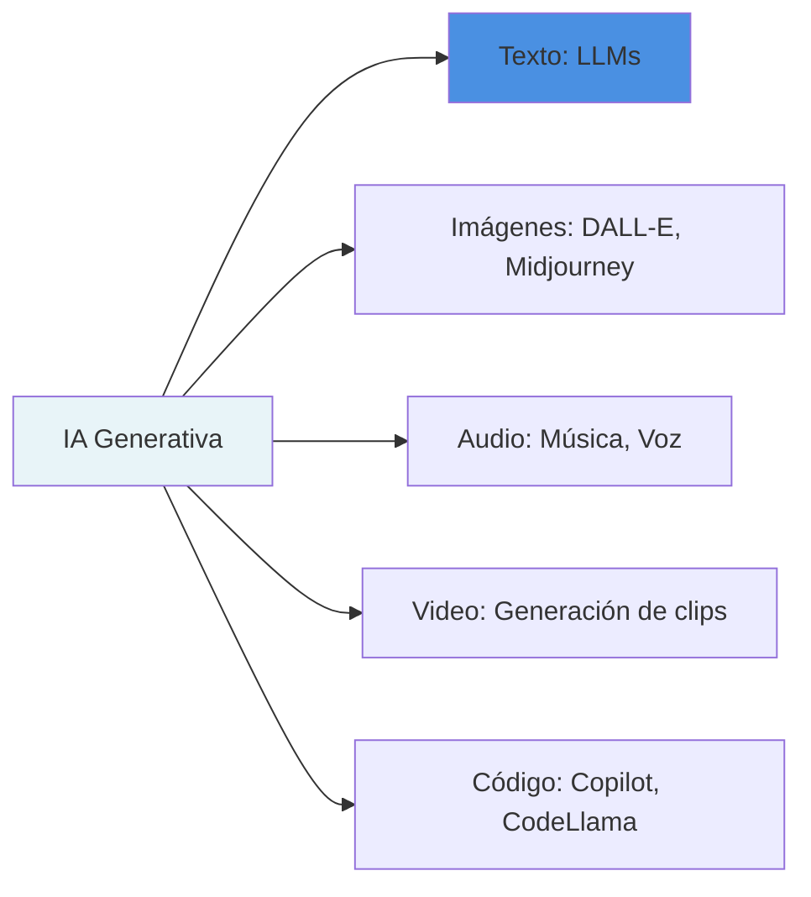
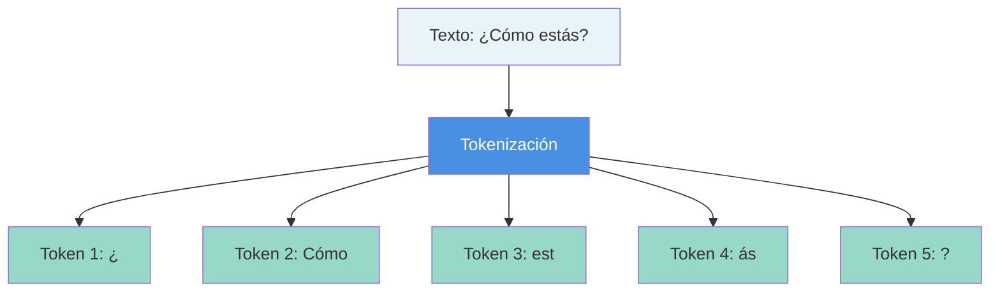
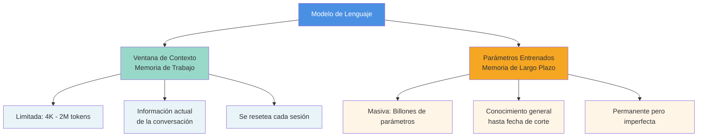
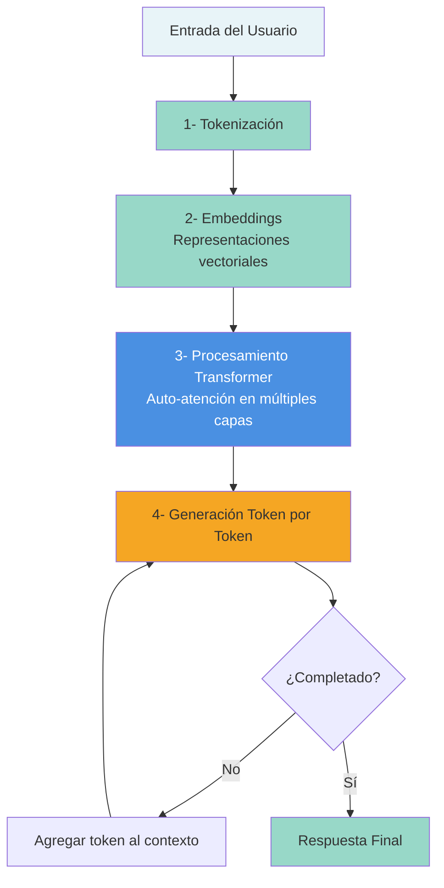
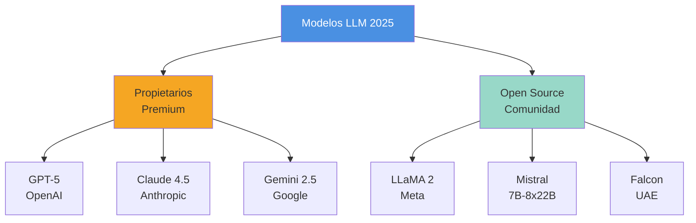

# Capítulo 1: Fundamentos de la IA Generativa

Hasta hace apenas unos años, hablar de inteligencia artificial (IA) era casi sinónimo de ciencia ficción.  Hoy, en cambio, la IA ha comenzado a infiltrarse en nuestra vida cotidiana: forma parte de nuestras conversaciones, de lo que escribimos, influye en lo que vemos en redes sociales e incluso en los memes que compartimos. ¿Qué ha pasado para que “esa cosa de los robots” se haya vuelto tan omnipresente?

Una de las claves está en el auge de los modelos generativos, especialmente los modelos de lenguaje de gran tamaño (Large Language Models, LLM), presentes en chatbots como ChatGPT, DeepSeek o LeChat, entre otros. Estos sistemas son capaces de predecir la siguiente palabra en casi cualquier contexto, generando textos extensos, coherentes y, en muchos casos, indistinguibles de los escritos por una persona [(Achiam et al. 2024)](https://www.zotero.org/google-docs/?SWGmZX).

Esta capacidad de generar contenido (razón por la cual también se les conoce como IA generativa), les ha permitido también resolver una amplia gama de pruebas de referencia estandarizadas [(Bengio et al. 2025; Maslej 2025)](https://www.zotero.org/google-docs/?LCOFOp). Dichas pruebas consisten en desafíos académicos o técnicos que ponen a prueba habilidades de razonamiento, comprensión y resolución de problemas. En algunos casos, estos modelos han alcanzado tasas de éxito superiores al 80%  y en campos como la visión por computadora, el reconocimiento de voz, las matemáticas o la informática, su desempeño iguala e incluso supera al humano [(Bengio et al. 2025; Google DeepMind 2025a, 2025b; Maslej 2025; Trinh et al. 2024)](https://www.zotero.org/google-docs/?WyAu7I).

Este impacto creciente también está transformando la manera en que abordamos la investigación académica. Por ello, para adentrarnos con confianza en el nuevo panorama de la investigación académica asistida por IA generativa, es indispensable comenzar por lo fundamental: comprender qué es esta tecnología y cómo funciona. 

Este capítulo sienta las bases conceptuales necesarias para ello. No buscamos ofrecer una exposición técnica exhaustiva, sino proporcionar un marco de referencia claro y práctico para estudiantes, docentes e investigadores. A continuación analizaremos desde la definición de la [[09-Glosario#IA Generativa|IA generativa]] y los modelos que la hacen posible, hasta los conceptos clave que determinan sus capacidades y limitaciones. Apropiarse de estos fundamentos resulta esencial para aprovechar al máximo estas herramientas y saber cuándo y cómo integrarlas en nuestros proyectos de investigación.

---

## 1.1 ¿Qué es la IA Generativa?

La IA generativa es un subcampo de la inteligencia artificial (ver Figura) que usa modelos capaces de producir contenido nuevo (texto, imágenes, audio, video o código) a partir de patrones aprendidos en enormes volúmenes de datos [(Chang et al. 2024; Raschka 2024a; Xiao y Zhu 2025)](https://www.zotero.org/google-docs/?NxDja0). Ese salto fue lo que convirtió a chatbots como ChatGPT, Gemini, Grok, Claude, Meta AI, DeepSeek, Qwen o Le Chat en asistentes versátiles de uso diario. 

En etapas anteriores, los chatbots tradicionales se limitaban a respuestas preestablecidas para un número reducido de preguntas. De forma similar, el aprendizaje automático clásico se orientaba a problemas bien delimitados (clasificación de imágenes, detección de spam, análisis de sentimiento, etc.), de modo que cada tarea requería su propio modelo. No obstante, cuando se trataba de tareas lingüísticas que requerían comprensión profunda y producción de texto (por ejemplo, analizar mensajes largos o generar contenidos originales coherentes y pertinentes al contexto) el desempeño era limitado. En la actualidad, un solo modelo generativo es capaz de adaptarse a una gran variedad de propósitos (por eso también se les conoce como modelos multimodales [(Alammar y Grootendorst 2024; Raschka 2024b)]) sin requerir entrenamientos específicos para cada tarea. Por ejemplo; procesan y traducen información, resumen y elaboran explicaciones didácticas; reescriben textos, “entienden” y proponen ideas creativas; generan código o contenido audiovisual; y describen imágenes o videos, entre muchas otras funciones. De ahí el entusiasmo de que estamos frente a un nuevo paradigma.

Cuando decimos que un modelo generativo (como es el caso de los LLM) “entiende” o “idea”, no hablamos de conciencia, compresión o creatividad humana. Hablamos de que procesa y genera texto coherente y útil en contexto. A veces parece que “razona”, pero lo que hay detrás es una predicción de la palabra más probable que sigue a una secuencia anterior. Si escribes “Las quesadillas van con…”, el modelo calcula estadísticamente cuál palabra tiene mayor probabilidad de aparecer después, por ejemplo, entre las palabras “aguacate”, “cebolla”, ..., o “queso” (ver Figura), sería “queso” la palabra más probable  (la que más aparece en los textos utilizados para entrenar el modelo). Esa simple tarea de predicción, repetida miles de millones de veces, permite construir una representación profunda del lenguaje humano. Por eso, durante su etapa de entrenamiento (fundamental en la construcción de la IA generativa) los modelos ajustan sus parámetros (una especie de “perillas” virtuales) para minimizar los errores de predicción. Así logran captar relaciones complejas, metáforas, ironías y dependencias entre conceptos, aunque sin poseer conciencia ni entendimiento real; es decir, no piensan como un humano [(Mitchell 2025a, 2025b)]. Esa ilusión de “chispas de razonamiento” es, en parte, lo que alimenta el furor actual en torno a estas tecnologías.

## 1.1 ¿Cómo se construyen la IA generativa?

La construcción de la IA generativa (por ejemplo, los LLM) se divide en dos grandes etapas: entrenamiento y postentrenamiento [(Karpathy 2025; Raschka 2024a)](https://www.zotero.org/google-docs/?T3tZR2). En la primera, el modelo se alimenta de enormes cantidades de texto (libros, artículos, foros, sitios web) para aprender las estructuras básicas del lenguaje: gramática, vocabulario y relaciones entre palabras. Y se le pide la tarea aparentemente trivial pero fundamental: adivinar cuál es la siguiente palabra en una oración. El resultado es un modelo base capaz de producir texto (es decir, recitar “todo” el internet) pero aún sin “comportarse” como un asistente conversacional. Por eso se realiza una segunda etapa, el postentrenamiento, que comienza con el ajuste fino supervisado (SFT). Aquí, el modelo se entrena con conjuntos de datos más pequeños pero de alta calidad (conversaciones cuidadosamente diseñadas), donde miles de etiquetadores humanos (o la misma IA generativa) crean pares de pregunta–respuesta siguiendo instrucciones detalladas. Por ejemplo [(Penedo et al. 2024)](https://www.zotero.org/google-docs/?HDcv4U):

> Pregunta: ¿En qué se diferencia el trastorno bipolar de la depresión unipolar o la depresión común? 

> Respuesta: Tanto el trastorno bipolar como la depresión mayor suelen estar asociados a episodios depresivos. Por lo tanto, ambas enfermedades se acompañan de depresión. La diferencia radica en que en el trastorno bipolar las personas también presentan períodos de euforia o irritabilidad severa. A estos los llamamos episodios maníacos o hipomaníacos. 

De este modo, el modelo aprende no solo a generar texto, sino a comportarse como un asistente conversacional coherente al refinar el modelo base para seguir reglas conversacionales, sociales y lingüísticas aprendidas de humanos [(Ouyang et al. 2022)](https://www.zotero.org/google-docs/?xYonKw).

Sin embargo, este ajuste fino no se limita a la imitación. Suele incorporarse además el aprendizaje por refuerzo con retroalimentación humana (RLHF), donde personas comparan varias respuestas del modelo, por lo que recibe retroalimentación sobre cuáles soluciones funcionan mejor, afinando más la conducta del modelo de la siguiente manera: el modelo generativo produce varias respuestas a la misma indicación (o prompt), personas las ordenan (por ejemplo: “mejor, regular, peor”), y con esas comparaciones se entrena el modelo de recompensa (Reward Model, RM) para puntuar cada salida según qué tanto coincide con lo que los humanos preferirían. Después, el modelo generativo se vuelve a entrenar con aprendizaje por refuerzo para maximizar ese puntaje, en un ciclo análogo a “probar-equivocarse-ajustar” [(Ouyang et al. 2022)](https://www.zotero.org/google-docs/?V5kJPR). A veces, en este proceso, surgen patrones de resolución paso a paso (pasos intermedios, revisiones, comparaciones o autocorrecciones) que simulan razonamiento. Esta conducta, llamada chain-of-thought o “cadena de pensamiento” [(Wei et al. 2023)](https://www.zotero.org/google-docs/?jOuBfk), se ha observado con fuerza en modelos recientes como DeepSeek R1 [(Guo et al. 2025)](https://www.zotero.org/google-docs/?JHPVg6), donde el refuerzo favorece secuencias largas y estructuradas que mejoran la precisión en problemas complejos. El modelo genera múltiples soluciones a un mismo problema y refuerza aquellas que conducen a buenos resultados. 

Una vez construidos los modelos generativos, estos se integran en sistemas, comúnmente en chatbots conversacionales capaces de mantener diálogos, simular procesos de razonamiento, procesar millones de tokens (fragmentos de texto) en segundos y generar textos con un nivel de coherencia que hace apenas unos años resultaba impensable. Sin embargo, detrás de esa aparente “magia” se encuentran la estadística, las matemáticas y la computación.

## 1.1 ¿Qué es un Sistema de IA Generativa?

Un sistema de IA generativa es una aplicación que combina uno o varios modelos generativos con otros componentes de software para ofrecer un servicio útil a las personas, como los chatbots conversacionales, asistentes para generación de códigos o plataformas de creación de imágenes. Por ejemplo, ChatGPT integra el modelo GPT (actualmente GPT-5) y Gemini emplea modelos como gemini-2.5 pro. Estos sistemas reciben prompt, es decir, una instrucción o consulta textual y generan respuestas, imágenes o código en función de dicha entrada (ver Figura 2).

En el caso de sistemas cerrados como ChatGPT o Gemini, sus modelos funcionan como una caja negra: no se conoce con exactitud qué datos fueron utilizados durante el entrenamiento ni los procesos aplicados en el postentrenamiento. Lo único que se sabe con certeza es que el usuario ingresa un prompt y recibe una respuesta a cambio.

Aunque es posible seleccionar la versión del modelo o modificar algunas configuraciones, el acceso al interior del modelo es restringido y no está disponible para el usuario. Esto ha dado origen a la ingeniería de prompts, que es tanto un arte como una ciencia dedicada a diseñar y perfeccionar las instrucciones con el fin de guiar al modelo hacia respuestas precisas y útiles (Boonstra 2025; Federiakin et al. 2024; Giray 2023; Lee et al. 2025; White et al. 2023). Cuanto más claro, contextualizado y específico sea el prompt, más acertadas y relevantes serán las respuestas obtenidas (ver Figura 3). En otras palabras, no interactuamos directamente con los modelos en sí, sino que aprendemos a comunicarnos eficazmente con ellos desarrollando prompts que hablen su idioma.
Esta aproximación es crucial para aprovechar al máximo las capacidades de inteligencia artificial conversacional moderna, donde la clave está en la calidad y precisión de la interacción a través del lenguaje.

En esencia, reciben un prompt y devuelven un resultado (ver Figura 2). Para sistemas cerrados como ChatGPT o Gemini, sus modelos son una caja negra, se desconoce exactamente qué datos se usaron para el entrenamiento y el postentrenamiento, lo único que sabemos es que ingresamos un prompt y obtenemos algo a cambio. Si bien se puede elegir la versión del modelo o cambiar algunas configuraciones, no se puede acceder a su interior. De ahí que tengamos la ingeniería de prompts, el arte (y la ciencia) de diseñar y perfeccionar instrucciones para guiar al modelo hacia los resultados deseados [(Boonstra 2025; Federiakin et al. 2024; Giray 2023; Lee et al. 2025; White et al. 2023)](https://www.zotero.org/google-docs/?UPbAQ5). Cuanto más claro, contextual y específico sea el prompt, más precisas serán las respuestas (ver Figura 3). En otras palabras, no tocamos los modelos, pero sí aprendemos a hablar su idioma.

Se puede pensar en la ingeniería de prompts como elaborar una receta. Así como un chef combina cuidadosamente ingredientes y pasos para lograr un platillo delicioso, un buen prompt combina contexto, tono, ejemplos y formato para obtener la mejor salida posible del modelo [(Amatriain 2024; Sahoo et al. 2025)](https://www.zotero.org/google-docs/?JUv3yU) (ver Figura 4).

## 1.1 Algunos puntos críticos de la IA

Por supuesto, los LLM no son infalibles. Una limitación conocida son las “alucinaciones”: respuestas inventadas que suenan plausibles pero son falsas [(Ji et al. 2023)](https://www.zotero.org/google-docs/?Jx3VN6). Esto ocurre porque el modelo, al haber sido entrenado para “responder siempre”, tiende a completar patrones lingüísticos incluso cuando no tiene información suficiente. Las empresas han reducido este problema incluyendo ejemplos donde la respuesta correcta es “no lo sé” y, en versiones más avanzadas, permitiendo que el modelo use herramientas externas (como motores de búsqueda o intérpretes de código) para consultar información o realizar cálculos exactos. De esta forma, los modelos modernos combinan memoria interna (información a partir de su entrenamiento) con memoria de trabajo (el contexto o información nueva que se le proporciona) y con acceso a herramientas externas, acercándose cada vez más a lo que pareciera una inteligencia funcional e híbrida.

Todo este proceso de entrenamiento requiere recursos colosales: miles de unidades de procesamiento gráfico (GPU) trabajando durante semanas o meses, datasets filtrados y depurados y una ingeniería cuidadosa [(Goodfellow, Bengio, y Courville 2016)](https://www.zotero.org/google-docs/?MvTYzM). Si bien, se ha visto que la curación de datos  [(Penedo et al. 2024)](https://www.zotero.org/google-docs/?tpoxlc), la cual combina procesos automáticos (deduplicación, detección de idioma, filtros de calidad/toxicidad) con auditorías y criterios humanos (licencias, sesgos, remociones), eleva de forma notable el rendimiento y responsabilidad de modelos comparables. Igualmente, las decisiones de hardware (aceleradores eficientes, centros de datos con energía baja en carbono) pueden reducir hasta cierto punto la huella de carbono sin sacrificar desempeño [(Patterson et al. 2021)](https://www.zotero.org/google-docs/?w5nWiZ).  Si bien el escalamiento de los modelos trae costos energéticos y de carbono, estos deben medirse y transparentarse [(Strubell, Ganesh, y McCallum 2019)](https://www.zotero.org/google-docs/?NemeLu). Así mismo, la IA sin gobernanza puede magnificar sesgos y salidas dañinas como lenguaje de odio, aumentar la opacidad y concentrar poder; por ello, se recomiendan documentación rigurosa de datos y modelos, evaluaciones de riesgo y mecanismos de rendición de cuentas [(Bender et al. 2021; Bengio et al. 2025)](https://www.zotero.org/google-docs/?ziCl9s). De ahí que sea importante la alfabetización crítica, para conocer lo que los modelos hacen y no hacen, insistir en mantener humanos en el bucle de su creación para verificar, contextualizar y decidir, así como empoderar a más personas (docentes, estudiantes, periodistas, funcionariado y ciudadanía) para entender y usar la IA con juicio informado y responsable [(Mitchell 2019; Mitchell y Krakauer 2023)](https://www.zotero.org/google-docs/?4Iphgm).

## la democratización de la IA

La democratización de la IA exige, como parte de un conjunto más amplio, cuatro compromisos inmediatos: (1) construir capacidades mediante formación que permita usar de manera crítica la IA (alfabetización algorítmica para docentes, estudiantes, investigadores, ONG, pymes y periodistas) de modo que distintos públicos evalúen limitaciones, riesgos y calidad de las salidas [(Bender et al. 2021)](https://www.zotero.org/google-docs/?X2I18g); (2) abrir la participación y la gobernanza con consultas públicas, auditorías y evaluaciones de impacto que obliguen a los sistemas a rendir cuentas ante quienes afectan [(Benajmin 2019)](https://www.zotero.org/google-docs/?9VOENV); (3) promover la apertura del conocimiento como punto de partida (alineada con los principios de ciencia abierta), favoreciendo el acceso universal a publicaciones, datos, documentación y artifacts técnicos (cuando sea legal y seguro), así como la reproducibilidad y la trazabilidad de decisiones [(Kramer y Bosman 2016; Leonelli y Tempini 2020; McKiernan et al. 2016)](https://www.zotero.org/google-docs/?XcNeE4) (McKiernan et al., 2016; Leonelli & Tempini, 2020; Kramer & Bosman, 2018); y (4) desarrollar tecnología propia de IA (potenciar infraestructura y talento locales, promover open source y estándares abiertos, cultivar datos y modelos en dominios relevantes (educación, salud, comunicación), y articular colaboración entre academia, ciudadanía y pequeñas empresas para reducir dependencia, fortalecer la innovación y asegurar pertinencia contextual [(Birhane 2020; Scao et al. 2023)](https://www.zotero.org/google-docs/?glT0o1).

## 1.1 El Ascenso de la IA de Generativa

Las capacidades de la [[09-Glosario#IA Generativa|IA Generativa]], han avanzado de forma sorprendente durante los últimos años y han mostrado progresos particularmente notables. En diversas pruebas de referencia estandarizadas (_benchmarks_), las cuales consisten en una serie de acertijos académicos o desafíos de ingeniería de software, los modelos actuales de IA generativa ya logran resolver una gran proporción de los problemas presentados (ver [[#^fig1|Figura 1]]), alcanzando más del 80% en algunos casos recientes [[08-Referencias#(Maslej et al., 2025|(Maslej et al., 2025)]].

 **Figura 1.** Descripción detallada de la imagen
^fig1

Además, en pruebas aplicadas en diferentes áreas como el procesamiento del lenguaje natural, la visión por computadora, el reconocimiento de voz y las matemáticas, han alcanzado e incluso superado el desempeño humano. Por ejemplo, apenas unas semanas atrás, los modelos más avanzados obtuvieron un rendimiento de medalla de oro en la Olimpiada Internacional de Matemáticas 2025 [[08-Referencias#(Maslej et al., 2025|(Maslej et al., 2025)]].

> [!WARNING] Cautela en las Comparaciones 
> Como ha señalado el matemático Terence Tao, esto debe manejarse con cautela, ya que sin una metodología de evaluación controlada y previa para ambos bandos, hay que desconfiar de las comparaciones simplistas entre el desempeño de los modelos de IA en competiciones como la IMO y el de los concursantes humanos, pues los sistemas pueden beneficiarse de recursos (más tiempo de cómputo, reformulación de enunciados, selección de las mejores salidas, etc.) que no están disponibles para los estudiantes [[08-Referencias#(Tao, 2025)|(Tao, 2025)]].

### ¿Por qué este progreso acelerado?

Estas mejoras tienen principalmente dos razones fundamentales:

**1. Escalamiento:** Ahora se usan computadoras mucho más potentes y se le proporciona mucha más información para aprender. Es como si se le diera un "cerebro más grande" y más libros (más imágenes, audios o videos) para estudiar. Este fenómeno de _scaling_ ha demostrado que simplemente aumentar los recursos computacionales y los datos de entrenamiento produce mejoras consistentes en el desempeño.

**2. Mejores Métodos de Razonamiento:** Se han desarrollado técnicas más sofisticadas para resolver problemas complejos:

- **Cadena de pensamiento (_[[09-Glosario#Cadena de Pensamiento|Chain of Thought]]_)**: La IA puede ahora dividir un desafío complejo en pequeños pasos, pensando cuidadosamente uno por uno antes de responder. Es como cuando resuelves un problema de matemáticas paso a paso, "pensando en voz alta" y mostrando tu razonamiento gradualmente.
- **Aprendizaje por refuerzo**: Mediante un método similar al ensayo y error, el modelo prueba diferentes soluciones (a veces muy detalladas) y aprende a preferir aquellas que conducen a respuestas correctas.

### Capacidades Sorprendentes en 2025

Gracias a estos avances técnicos, la IA de propósito general puede hacer cosas que hasta hace poco parecían de ciencia ficción. Hace cinco años, los principales modelos de IA de propósito general rara vez podían producir un párrafo coherente de texto. Hoy podemos:

- Mantener **conversaciones naturales** con ella
- Pedirle que escriba **programas de ingeniería de software** de tamaño pequeño a mediano
- Solicitar **traducciones precisas** entre varios idiomas
- Resolver **problemas de libros de texto** de matemáticas y ciencias a nivel de posgrado
- Encontrar y **resumir información relevante** en documentos extensos
- **Generar imágenes** a partir de texto que son difíciles de distinguir de fotografías reales
- **Generar vídeos** cortos
- **Describir o transcribir** lo que observa en fotos o videos
- Trabajar **simultáneamente con múltiples entradas**: texto, imágenes, audio y video

> [!SUCCESS] Adopción Masiva 
> El impacto y la rapidez con que estas herramientas han llegado al público son notables. Un ejemplo es ChatGPT de OpenAI: tras su lanzamiento a finales de 2022, consiguió más de un millón de usuarios en apenas cinco días y alcanzó los 100 millones en solo dos meses. Esto lo convierte en una de las tecnologías que más rápido se ha adoptado en la historia.

Esta nueva y sorprendente versatilidad ha provocado que la IA se integre rápidamente en nuestra vida diaria. La encontramos potenciando herramientas que usamos constantemente: desde los motores de búsqueda de Google [[08-Referencias#(Reid, 2024)|(Reid, 2024)]] y Microsoft [[08-Referencias#(The Bing Team, 2025)|(The Bing Team, 2025)]] hasta software creativo como Adobe Creative Cloud (Photoshop, Illustrator, Express) [[08-Referencias#(Adobe, 2024)|(Adobe, 2024)]], pasando por plataformas de asistencia legal y sistemas que ayudan a los médicos a tomar decisiones.

Mirando hacia adelante, el potencial es aún mayor. Entre las perspectivas más prometedoras se encuentra su aplicación para revolucionar la educación haciéndola más personalizada, para transformar la medicina con diagnósticos más precisos y el descubrimiento acelerado de fármacos, y para impulsar la investigación científica en áreas como la química, biología y física.

---

## 1.2 ¿Qué es la IA Generativa y los Grandes Modelos de Lenguaje?

La **IA generativa** se refiere a sistemas de inteligencia artificial capaces de _generar contenido nuevo_ (texto, imágenes, audio, código, etc.) a partir de patrones aprendidos, en lugar de solo realizar tareas de clasificación o predicción. Un caso particular y fascinante son los **[[09-Glosario#Grandes Modelos de Lenguaje|Grandes Modelos de Lenguaje]]** ([[09-Glosario#LLM|LLM]], por sus siglas en inglés), que son modelos de _aprendizaje profundo_ de gran escala entrenados con enormes cantidades de texto para producir lenguaje natural coherente [[08-Referencias#(Amazon Web Services, s. f.)|(Amazon Web Services, s. f.)]].

Estos modelos pueden responder preguntas, mantener conversaciones, traducir, programar y mucho más, adaptándose a multitud de tareas sin reentrenamiento específico. En esencia, un LLM aprende la probabilidad de continuación de secuencias de texto: **genera palabra por palabra (en realidad, _[[09-Glosario#Tokens|token]]_ por token) el contenido más probable** dado un contexto previo.

### La Arquitectura Transformer: El Motor de los LLMs

Gracias a arquitecturas modernas, especialmente los _[[09-Glosario#Transformers|Transformers]]_, los LLM aprenden las relaciones entre palabras y conceptos en el lenguaje de forma no secuencial sino _paralela_, capturando dependencias de largo alcance en un texto [[08-Referencias#(Amazon Web Services, s. f.)|(Amazon Web Services, s. f.)]]. Esto les permite _entender el contexto global_ de una entrada y producir respuestas más coherentes.

> [!TIP]+ Pre-entrenamiento y Ajuste Fino
> La mayoría de LLM actuales son **modelos generativos pre-entrenados** (_Generative Pre-trained Transformers_, de ahí nombres como GPT):
>
> 1. **[[09-Glosario#Pre-entrenamiento|Pre-entrenamiento]]**: Se entrenan en un corpus gigantesco de texto mediante aprendizaje autosupervisado (prediciendo la siguiente palabra)
> 2. **[[09-Glosario#Ajuste fino|Ajuste fino]]** (_fine-tuning_): Se refinan con técnicas adicionales para tareas concretas o para seguir instrucciones humanas (p.ej. afinación con refuerzo y feedback humano, _[[09-Glosario#RLHF|RLHF]]_)

Un aspecto clave es que los LLM son extremadamente flexibles: con _las mismas neuronas_ pueden redactar un ensayo, escribir código o responder una pregunta factual simplemente cambiando la _instrucción o prompt_ que reciben. Esto representa un cambio de paradigma frente a modelos más pequeños o específicos, y ha potenciado aplicaciones como asistentes virtuales avanzados, herramientas de resumen automático y generadores de código natural [[08-Referencias#(Amazon Web Services, s. f.)|(Amazon Web Services, s. f.)]].

> [!WARNING] Limitaciones Importantes
> Los LLM también presentan limitaciones significativas:
>
> - No siempre "entienden" como un humano
> - Pueden generar información incorrecta (fenómeno de _[[09-Glosario#Alucinaciones|alucinación]]_)
> - Su rendimiento depende de la calidad y amplitud de su entrenamiento
> - Pueden reproducir sesgos presentes en sus datos de entrenamiento

---

## 1.3 Conceptos Indispensables: Tokens, Ventana de Contexto y Memoria del Modelo

Para comprender el funcionamiento de los LLM y cómo interactuamos con ellos, debemos conocer conceptos fundamentales que a menudo se comparan con la **memoria humana**: la _memoria de trabajo_ (de corto plazo) del modelo versus la _memoria de entrenamiento_ (conocimiento de largo plazo). Estas nociones se materializan en la **[[09-Glosario#Ventana de Contexto|ventana de contexto]]** y los **parámetros entrenados** del modelo, respectivamente.

### 1.3.1 Tokens: La Unidad Básica de Procesamiento

Los LLM no leen palabras individualmente sino que las descomponen en piezas más pequeñas llamadas **_[[09-Glosario#Tokens|tokens]]_**. Un token puede ser una palabra entera, un fragmento de palabra o un símbolo de puntuación.

> [!EXAMPLE]+ Ejemplo de Tokenización 
> La frase _"¿Cómo estás?"_ en español puede descomponerse en 5 tokens [[08-Referencias#(Robles, 2025)|(Robles, 2025)]]:
> 
> - `¿`
> - `Cómo`
> - `est`
> - `ás`
> - `?`

Cada modelo tiene su forma de tokenizar el texto (OpenAI, Google, Meta, etc., usan algoritmos de tokenización distintos), pero en promedio **1 token equivale a aproximadamente 3-4 caracteres** (aunque varía según el idioma; en inglés ~0.75 palabras por token, en español un token suele representar algo menos que una palabra entera) [[08-Referencias#(Robles, 2025)|(Robles, 2025)]].

Esto es importante porque tanto la entrada que proporcionamos al modelo como la salida que genera se miden en número de tokens.

### 1.3.2 Ventana de Contexto: La Memoria de Trabajo

La **ventana de contexto** es la cantidad máxima de tokens que el modelo puede "tener en mente" o procesar a la vez en una interacción. Es análoga a la **memoria de corto plazo** humana: limita cuánta información previa el modelo puede recordar durante la generación de una respuesta [[08-Referencias#(Robles, 2025)|(Robles, 2025)]].

> [!INFO]- ¿Qué Incluye la Ventana de Contexto? 
> En aplicaciones conversacionales, la ventana de contexto incluye:
> 
> - **Instrucciones del sistema**: Prompts ocultos que guían estilo y comportamiento
> - **Historial de la conversación**: Todos los mensajes previos recientes
> - **Datos recuperados**: De bases de conocimiento (en enfoques RAG)
> - **Tu pregunta actual**: El nuevo mensaje del usuario
> - **La respuesta generada**: Los tokens que el modelo produce
> - **Marcas especiales de formato**: Delimitadores y metadatos
> 
> Todos estos elementos compiten por espacio en la ventana de contexto finita [[08-Referencias#(Robles, 2025)|(Robles, 2025)]].

Por ejemplo, un modelo con ventana de 4,000 tokens puede considerar unos 4K tokens combinando la pregunta del usuario y la respuesta que genere. Si se excede ese límite, el modelo no procesará el texto adicional (o lo truncará), resultando en pérdidas de información.

> [!EXAMPLE] Ejemplo Práctico 
> Esto explica por qué no podemos simplemente darle _el texto completo de "Don Quijote" a ChatGPT-3.5_ (con ~4K tokens de contexto) y pedir un resumen — **superaría su ventana y no podría ni leerlo** [[08-Referencias#(Codificando Bits, 2023)|(Codificando Bits, 2023)]].

Ha surgido la **ingeniería de contexto** como disciplina: decidir estratégicamente qué información incluir o resumir en el prompt para aprovechar al máximo la ventana limitada.

### 1.3.3 Memoria de Entrenamiento: El Conocimiento a Largo Plazo

A diferencia de la memoria de trabajo acotada por la ventana de contexto, un LLM posee una suerte de _memoria implícita de largo plazo_ en sus **parámetros entrenados**. Durante el pre-entrenamiento, el modelo ajustó miles de millones (hasta _cientos de miles de millones_ en los LLM más grandes) de parámetros para absorber patrones del lenguaje y hechos del mundo a partir de textos masivos (libros, artículos, páginas web, código, etc.).

Esto significa que _gran parte del conocimiento está almacenado en el modelo_ tras el entrenamiento, análogo a conocimientos que un humano almacena en su memoria a largo plazo. Por ejemplo, GPT-3 se entrenó con ~45 terabytes de texto y alcanzó 175 mil millones de parámetros, incorporando así enormes cantidades de información general (datos hasta ~2021) en sus "pesos" [[08-Referencias#(Amazon Web Services, s. f.)|(Amazon Web Services, s. f.)]].

> [!WARNING]+ No es una memoria perfecta 
> Esta memoria de entrenamiento **no es perfecta ni organizada**:
> 
> - Los LLM no recuerdan datos concretos como una base de datos
> - Generan respuestas basadas en patrones estadísticos
> - A veces "recuerdan" con exactitud sorprendente (definiciones, código conocido, citas)
> - Otras veces confabulan detalles incorrectos si no "memorizaron" ese dato con fidelidad

Investigaciones muestran que los transformadores pueden llegar a memorizar trozos exactos de sus datos de entrenamiento, especialmente aquellos únicos o repetitivos [[08-Referencias#(Zia, 2025)|(Zia, 2025)]]. Esto plantea riesgos: **un modelo puede sin querer revelar información sensible** presente en sus datos de entrenamiento (p. ej., fragmentos de código propietario o información personal) si se le induce correctamente [[08-Referencias#(Zia, 2025)|(Zia, 2025)]].

> [!TIP] Diferencia Clave 
> **Ventana de contexto** = Lo que el modelo puede ver y recordar _en este instante_  
> **Conocimiento entrenado** = Todo lo que _"ha aprendido" antes_ (hasta su fecha de corte de entrenamiento)

### ¿Por qué importan tanto estos límites?

Porque determinan _lo que el modelo puede y no puede hacer_ con la información:

- Si nuestra pregunta requiere más contexto del que cabe en su ventana, tendremos que **resumir o partir la tarea**
- Si preguntamos sobre hechos posteriores a la fecha de entrenamiento, el modelo posiblemente **no lo sepa** a menos que se lo proporcionemos en el prompt
- Muchos sistemas actuales **combinan LLMs con herramientas externas** (búsquedas en internet, bases de conocimiento actualizadas) para recuperar datos frescos

---

## 1.4 Funcionamiento General de los LLM: De la Entrada a la Salida

¿Cómo logra un LLM producir una respuesta coherente a una pregunta? Comprender este proceso nos ayuda a formular mejores prompts y entender sus limitaciones.

### 1.4.1 Tokenización de la Entrada

El texto de entrada (prompt del usuario + contexto adicional como instrucciones del sistema o historial) se convierte en tokens numéricos. Gracias a las _incrustaciones_ ([[09-Glosario#Embeddings|embeddings]]), el modelo representa cada token como un vector en un espacio matemático, de forma que tokens con significados relacionados quedan cercanos en ese espacio [[08-Referencias#(Amazon Web Services, s. f.)|(Amazon Web Services, s. f.)]]. Esto permite captar similitudes semánticas más allá de coincidencias exactas de palabras.

### 1.4.2 Procesamiento mediante la Arquitectura Transformer

Los _Transformers_ revolucionaron los modelos de lenguaje al introducir el mecanismo de **auto-atención**. En cada capa del modelo, cada token "presta atención" a todos los demás tokens en la secuencia para calcular qué tan relevantes son entre sí.

> [!EXAMPLE] Auto-atención en Acción 
> En la frase "El perro persigue al gato porque **es** travieso", la auto-atención adecuada ayuda a inferir que "es" se refiere al gato y no al perro.

Al procesar los tokens en _paralelo_ y con múltiples _cabezas de atención_, el modelo construye representaciones internas ricas en contexto para cada posición de la secuencia. El gran tamaño (muchas capas, muchas neuronas) le da capacidad de expresar funciones complejas del lenguaje.

### 1.4.3 Generación Token por Token

Una vez procesada la entrada, el modelo produce un token de salida a la vez (cada nuevo token se incorpora al contexto y el proceso se repite). En cada paso escoge el token más probable según la distribución aprendida, **aunque a menudo se introduce aleatoriedad controlada** (temperatura, top-k, etc.) para que las respuestas no sean siempre mecánicamente iguales. Este proceso continúa hasta completar la respuesta o alcanzar el límite de la ventana de contexto.

> [!INFO] Importante Destacar 
> El modelo _no "entiende" en el sentido humano_, sino que sigue patrones estadísticos. Sin embargo, la inmensa cantidad de datos y parámetros le permiten _aproximar comprensión_ de manera funcional. Por ejemplo, un LLM puede traducir de un idioma a otro no porque sepa reglas gramaticales explícitamente, sino porque ha inferido un inmenso mapa de correspondencias y usos del lenguaje durante su entrenamiento.

### 1.4.4 Ajuste Fino y Alineación

Tras el pre-entrenamiento, muchos LLMs pasan por etapas adicionales de refinamiento:

- **Ajuste fino instructivo**: Se alimentan ejemplos de instrucciones humanas y respuestas deseadas
- **Aprendizaje por refuerzo con feedback humano (RLHF)**: Evaluadores humanos guían el modelo para que sus respuestas sean útiles y seguras

Esto los convierte en asistentes más alineados a lo que espera un usuario típico al interactuar (por ejemplo, rechazar solicitudes inapropiadas, seguir el tono pedido, etc.). Aun con estas técnicas, los modelos pueden producir sesgos o contenidos objetables, lo que subraya que _siguen sin comprender plenamente las implicaciones de sus respuestas_ – simplemente han ajustado sus probabilidades de salida.

---

## 1.5 Evolución Reciente de los LLM: Modelos Destacados y Sus Capacidades en 2025

El campo de los LLM avanza rápidamente. A continuación, presentamos una **comparativa funcional** de algunos de los modelos generativos más recientes (2024-2025) y líderes del mercado. El objetivo no es ser exhaustivo con cada detalle técnico, sino dar un panorama de _hasta dónde han llegado_ estos modelos en términos de capacidad, tamaño, ventana de contexto y enfoques diferenciadores.

### 1.5.1 GPT-5 (OpenAI)

Lanzado por OpenAI en agosto de 2025, GPT-5 se presenta como _su modelo de lenguaje unificado más avanzado hasta la fecha_ [[08-Referencias#(OpenAI, 2025)|(OpenAI, 2025)]].

**Características Principales:**

- **Razonamiento Modular**: Integra varios "modos" de razonamiento en un solo sistema, con un enrutador inteligente que decide si una consulta se responde de forma rápida con un sub-modelo eficiente o si activa un modo de _pensamiento profundo_ para preguntas complejas [[08-Referencias#(OpenAI, 2025)|(OpenAI, 2025)]].
    
- **Variantes Disponibles**:
    
    - **GPT-5 estándar**: Para uso general
    - **GPT-5 Pro**: Para suscriptores, con capacidades de razonamiento extendido más potentes
    - **GPT-5-mini y GPT-5-nano**: Para diferentes velocidades/costos [[08-Referencias#(Kargwal, 2025)|(Kargwal, 2025)]]
- **[[09-Glosario#Multimodalidad|Multimodalidad]] Nativa**: Habilidades de visión y voz integradas. Puede analizar imágenes, diagramas, reconocer comandos de voz o generar respuestas habladas.
    

> [!SUCCESS]+ Ventana de Contexto Masiva 
> GPT-5 maneja hasta **~400,000 tokens de contexto** en ciertas configuraciones [[08-Referencias#(Cogni Down Under, 2025)|(Cogni Down Under, 2025)]], equivalente a cientos de páginas de texto. Esto representa un salto enorme respecto a GPT-4 (8K-32K) y GPT-3.5 (4K).

**Mejoras en Fiabilidad:**

- Reducción significativa de alucinaciones
- Mayor fidelidad al seguir instrucciones
- Mejor desempeño en programación, matemáticas avanzadas y redacción creativa [[08-Referencias#(OpenAI, 2025)|(OpenAI, 2025)]]

**Conocimiento actualizado hasta**: Finales de 2024

### 1.5.2 Claude 4.5 (Anthropic)

Claude es la familia de modelos desarrollada por Anthropic, un laboratorio enfocado en IA responsable. **Claude 4.5** (nombre código _Claude Sonnet 4.5_) se posiciona como **el modelo puntero orientado a tareas complejas de razonamiento y coding** [[08-Referencias#(Anthropic, 2025)|(Anthropic, 2025)]].

**Características Principales:**

- **Excelencia en Codificación**: Anthropic lo describe como "el mejor modelo de codificación del mundo" en su lanzamiento, destacando su capacidad para manejar proyectos de programación de larga duración con mínima intervención humana [[08-Referencias#(Anthropic, 2025)|(Anthropic, 2025)]].
    
- **Agente Autónomo**: Especialmente bueno planificando y ejecutando secuencias de acciones (navegar herramientas, escribir y depurar código, manejar múltiples pasos en tareas de investigación) manteniendo contexto en horizontes amplios.
    
- **Enfoque en Seguridad**: Incorpora mejoras para evitar respuestas tóxicas o no éticas, siendo su modelo "más alineado" hasta la fecha [[08-Referencias#(Anthropic, 2025)|(Anthropic, 2025)]].
    

**Ventana de Contexto:**

- **Oficial**: 200,000 tokens (equivalente a ~150,000 palabras)
- **Experimental**: Hasta 1 millón de tokens en entornos empresariales selectos [[08-Referencias#(Cogni Down Under, 2025)|(Cogni Down Under, 2025)]]

**Variantes Disponibles:**

|Variante|Propósito|Características|
|---|---|---|
|**Claude Sonnet 4.5**|Razonamiento intenso|Versión completa, ideal para tareas complejas|
|**Claude Haiku 4.5**|Velocidad y costo|Optimizada para respuesta en tiempo real, ofrecida gratuitamente por tiempo limitado [[08-Referencias#(Nuñez, 2025)|

> [!TIP] Fortaleza Principal 
> Claude 4.5 se destaca por **fiabilidad en tareas de larga duración, seguridad en las respuestas y manejo de contextos masivos**. Ha liderado el ranking **SWE-bench** de tareas de programación de extremo a extremo [[08-Referencias#(Anthropic, 2025)|(Anthropic, 2025)]].

**Multimodalidad**: Soporte visual básico (procesamiento de imágenes para asistir en programación visual o lectura de documentos escaneados), pero su fortaleza principal sigue siendo texto y código.

### 1.5.3 Gemini 2.5 (Google DeepMind)

Google, tras fusionar su equipo de investigación Brain con DeepMind, introdujo la saga de modelos **Gemini**. **Gemini 2.5**, lanzado a inicios-mediados de 2025, se posiciona como _el modelo más inteligente de Google hasta la fecha_ [[08-Referencias#(Google, 2025)|(Google, 2025)]].

**Características Principales:**

- **Modelos con Pensamiento**: Incorpora de forma nativa técnicas de _chain-of-thought_. Gemini 2.5 puede "pensar" varios pasos internamente antes de dar una respuesta, emulando un razonamiento deliberativo [[08-Referencias#(Google, 2025)|(Google, 2025)]].

**Variantes Disponibles:**

|Variante|Capacidad|Ventana de Contexto|
|---|---|---|
|**Gemini 2.5 Pro**|Máxima, para tareas complejas|1,000,000 tokens (planea extender a 2M)|
|**Gemini 2.5 Flash**|Optimizada para rapidez y escala|-|

> [!SUCCESS]+ Ventana de Contexto Récord 
> Gemini 2.5 Pro soporta hasta **1,000,000 de tokens de contexto**, equivalente a aproximadamente **1,500 páginas de texto o 30,000 líneas de código** [[08-Referencias#(Google, 2025)|(Google, 2025)]]. Google planea extenderla a _2 millones_ en futuras actualizaciones [[08-Referencias#(Google, 2025)|(Google, 2025)]].

**Multimodalidad Completa**: Gemini es nativamente multimodal, aceptando _texto, imágenes, audio e incluso video como entrada_. Puede analizar el contenido de una imagen, transcribir y analizar un audio, o describir un video corto en la misma sesión.

**Seguridad**: Incorpora avanzadas protecciones contra _prompt injections_ y contenido malicioso, apuntando al uso empresarial seguro [[08-Referencias#(Google, 2025)|(Google, 2025)]].

**Acceso**: Disponible a través de **Vertex AI** en Google Cloud y **Google AI Studio** para investigadores.

> [!WARNING] Desafíos de Contexto Extremo 
> A pesar de su gran contexto, manejar coherencia en 1M de tokens es desafiante y a veces "olvida" partes remotas del contexto [[08-Referencias#(Cogni Down Under, 2025)|(Cogni Down Under, 2025)]].

### 1.5.4 Otros Modelos y Panorama General

El ecosistema de LLM en 2025 incluye otros actores notables que amplían las opciones disponibles para investigadores:

**LLaMA 2 y el Ecosistema Open Source (Meta)**

Meta abrió en 2023 la puerta de los _LLM de código abierto_ con **LLaMA 2**, un modelo de hasta 70 mil millones de parámetros disponible para uso tanto investigador como comercial [[08-Referencias#(Bergmann, 2023)|(Bergmann, 2023)]]. Características:

- Ventana de contexto: 4K tokens (doble que LLaMA 1)
- Demostró que comunidades abiertas pueden afinar y mejorar modelos sustanciales
- Inspiró multitud de variantes open-source: Mistral 7B, Falcon, etc.

**Otros Jugadores Emergentes:**

- **xAI Grok**: Conectado en tiempo real a la web para respuestas con información actualizada
- **Amazon Bedrock**: Plataforma que ofrece acceso a Claude, Titan (propio de AWS) y otros modelos
- **DeepSeek**: Modelos open-source con enfoque en eficiencia

> [!INFO]+ Tamaños y Eficiencia 
> En cuanto a _parámetros_, los tamaños siguen en aumento pero con matices:
> 
> - GPT-5 se rumorea que puede tener del orden del trillón de parámetros (no confirmado)
> - Claude 4.5 no reveló su tamaño exacto, se asume en cientos de miles de millones
> - Gemini 2.5 Pro está en la liga de los cientos de miles de millones
> 
> Sin embargo, la eficacia no es solo cuestión de cantidad de parámetros, sino de _calidad de entrenamiento_ y _novedades arquitectónicas_. Modelos abiertos más pequeños (6B-20B parámetros) finamente ajustados pueden superar a modelos enormes genéricos en tareas particulares.

### 1.5.5 Tabla Comparativa Resumida

| Modelo                | Organización    | Ventana de Contexto        | Fortalezas                                       | Multimodal                         |
| --------------------- | --------------- | -------------------------- | ------------------------------------------------ | ---------------------------------- |
| **GPT-5**             | OpenAI          | ~400K tokens               | Razonamiento modular, reducción de alucinaciones | ✅ (visión + voz)                   |
| **Claude 4.5 Sonnet** | Anthropic       | 200K (1M experimental)     | Codificación, seguridad, contexto largo          | ⚠️ (básico visual)                 |
| **Gemini 2.5 Pro**    | Google DeepMind | 1M tokens (2M planificado) | Pensamiento estructurado, contexto masivo        | ✅ (texto + imagen + audio + video) |
| **LLaMA 2**           | Meta            | 4K tokens                  | Open source, personalizable                      | ❌                                  |

---

## 1.6 Conclusión: Fundamentos para la Investigación Académica

Los fundamentos de los LLM abarcan entender cómo manejan contexto y conocimiento, y apreciar las diferencias entre las principales ofertas actuales. Hemos visto que:

1. **Conceptos clave** como la ventana de contexto definen la memoria activa del modelo, mientras que el entrenamiento define su memoria duradera.
    
2. **Modelos líderes** como GPT-5, Claude 4.5 y Gemini 2.5 empujan los límites en diferentes direcciones:
    - Unificación de modos de razonamiento
    - Contextos masivos para procesamiento de documentos extensos
    - Multimodalidad profunda para análisis de diferentes tipos de datos
    - Especialización en codificación y agentes autónomos
3. **Limitaciones inherentes**: A pesar de sus impresionantes capacidades, estos modelos aún no "comprenden" como humanos, pueden alucinar información y requieren prompts cuidadosamente diseñados.
    

Esta base conceptual nos servirá para entender _por qué_ ciertas técnicas funcionan y _cómo_ sacar el mayor provecho de la IA generativa en nuestros workflows científicos. A lo largo de este libro exploraremos:

- **Ingeniería de Prompts** (Capítulo 2): Cómo _formular mejores instrucciones_ para obtener respuestas precisas y relevantes
- **Ingeniería de Contexto** (Capítulo 3): Cómo _estructurar contextos_ y gestionar información dentro de la ventana limitada
- **Herramientas especializadas** (Capítulos 4-6): Cómo combinar modelos con fuentes de información y flujos de trabajo integrados
- **Consideraciones éticas** (Capítulo 7): Una mirada crítica a las implicaciones del uso de IA en investigación

> [!TIP] Próximo Paso 
> Ahora que comprendemos los fundamentos técnicos, estamos listos para aprender el arte de comunicarnos eficazmente con estos sistemas. En el siguiente capítulo abordaremos la **Ingeniería de Prompts**: la habilidad clave para transformar nuestras ideas en resultados precisos mediante instrucciones bien diseñadas.

---

