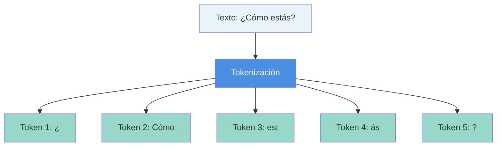
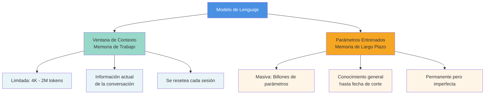

# Capítulo 1: Fundamentos de la IA Generativa

Hasta hace pocos años, hablar de inteligencia artificial (IA) era casi sinónimo de ciencia ficción. Hoy, en cambio, la IA se ha infiltrado en nuestra vida cotidiana: forma parte de nuestras conversaciones, influye en lo que vemos en redes sociales e incluso en los memes que compartimos. ¿Qué ha pasado para que "esa cosa de los robots" se haya vuelto tan omnipresente?

Una de las claves está en el auge de los modelos generativos, especialmente los modelos de lenguaje de gran tamaño (Large Language Models, LLM) presentes en chatbots como ChatGPT, DeepSeek, LeChat, entre otros. Estos sistemas son capaces de predecir la siguiente palabra en casi cualquier contexto, generando textos extensos, coherentes y, en muchos casos, indistinguibles de los escritos por personas [[08-Referencias#(Achiam et al., 2024)|(Achiam et al., 2024)]].

Esta capacidad de generar contenido (razón por la cual también se les conoce como IA generativa), les ha permitido también resolver una amplia gama de pruebas de referencia estandarizadas [[08-Referencias#(Bengio et al., 2025)|(Bengio et al., 2025)]]; [[08-Referencias#(Maslej, 2025)|(Maslej, 2025)]]. Dichas pruebas consisten en desafíos académicos o técnicos que ponen a prueba habilidades de razonamiento, "comprensión" y resolución de problemas. En algunos casos, estos modelos han alcanzado tasas de éxito superiores al 80%  y en campos como la visión por computadora, el reconocimiento de voz, las matemáticas o la informática, su desempeño iguala e incluso supera al humano [[08-Referencias#(Bengio et al., 2025)|(Bengio et al., 2025)]]; [[08-Referencias#(Google DeepMind, 2025a)|(Google DeepMind, 2025a)]]; [[08-Referencias#(Google DeepMind, 2025b)|(Google DeepMind, 2025b)]]; [[08-Referencias#(Maslej, 2025)|(Maslej, 2025)]]; [[08-Referencias#(Trinh et al., 2024)|(Trinh et al., 2024)]].

Este avance tecnológico está transformando también el ámbito de la investigación académica. Por lo que, para adentrarnos con confianza en el nuevo panorama de la investigación científica asistida por IA, es fundamental comprender primero qué es esta tecnología y cómo funciona. Este capítulo sienta esas bases conceptuales sin pretender exhaustividad técnica, sino ofrecer un marco claro y práctico para estudiantes, docentes e investigadores.

## 1.1 ¿Qué es la IA Generativa?

La IA generativa es un subcampo de la inteligencia artificial que usa modelos capaces de producir contenido nuevo (texto, imágenes, audio, video o código) a partir de patrones aprendidos en enormes volúmenes de datos [[08-Referencias#(Chang et al., 2024)|(Chang et al., 2024)]]; [[08-Referencias#(Raschka, 2024a)|(Raschka, 2024a)]]; [[08-Referencias#(Xiao y Zhu, 2025)|(Xiao y Zhu, 2025)]]. Ese salto fue lo que convirtió a chatbots como ChatGPT, Gemini, Grok, Claude, Meta AI, DeepSeek, Qwen o Le Chat en asistentes versátiles de uso diario.

En etapas anteriores, los chatbots tradicionales se limitaban a respuestas preestablecidas para un número reducido de preguntas. De forma similar, el aprendizaje automático clásico se orientaba a problemas bien delimitados (clasificación de imágenes, detección de spam, análisis de sentimiento, etc.), de modo que cada tarea requería su propio modelo. No obstante, cuando se trataba de tareas lingüísticas que requerían comprensión profunda y producción de texto (por ejemplo, analizar mensajes largos o generar contenidos originales coherentes y pertinentes al contexto) el desempeño era limitado. En la actualidad, un solo modelo generativo es capaz de adaptarse a una gran variedad de propósitos sin requerir entrenamientos específicos para cada tarea (por eso también se les conoce como modelos multimodales [[08-Referencias#(Alammar y Grootendorst, 2024)|(Alammar y Grootendorst, 2024)]]; [[08-Referencias#(Raschka, 2024b)|(Raschka, 2024b)]]). Por ejemplo; procesan y traducen información, resumen y elaboran explicaciones didácticas; reescriben textos, "entienden" y proponen ideas creativas; generan código o contenido audiovisual; y describen imágenes o videos, entre muchas otras funciones. De ahí el entusiasmo de que estamos frente a un nuevo paradigma.

Cuando decimos que un modelo generativo (como es el caso de los LLM) “entiende” o “idea”, no hablamos de conciencia, compresión o creatividad humana. Hablamos de que procesa y genera texto coherente y útil en contexto. A veces parece que “razona”, pero lo que hay detrás es una predicción de la palabra más probable que sigue a una secuencia anterior. Si escribes “Las quesadillas van con…”, el modelo calcula estadísticamente cuál palabra tiene mayor probabilidad de aparecer después, por ejemplo, entre las palabras “aguacate”, “cebolla”, ..., o “queso”, sería “queso” la palabra más probable  (la que más aparece en los textos utilizados para entrenar el modelo). Esa simple tarea de predicción, repetida miles de millones de veces, permite construir una representación profunda del lenguaje humano. Por eso, durante su etapa de entrenamiento (fundamental en la construcción de la IA generativa) los modelos ajustan sus parámetros (una especie de “perillas” virtuales) para minimizar los errores de predicción. Así logran captar relaciones complejas, metáforas, ironías y dependencias entre conceptos, aunque sin poseer conciencia ni entendimiento real; es decir, no piensan como un humano [[08-Referencias#(Mitchell, 2025a)|(Mitchell, 2025a)]]; [[08-Referencias#(Mitchell, 2025b)|(Mitchell, 2025b)]]. Esa ilusión de "chispas de razonamiento" es, en parte, lo que alimenta el furor actual en torno a estas tecnologías.

## 1.2 ¿Cómo se construye la IA generativa?

La construcción de la IA generativa (para el caso de los LLM) se divide en dos grandes etapas: entrenamiento y postentrenamiento [[08-Referencias#(Karpathy, 2025)|(Karpathy, 2025)]]; [[08-Referencias#(Raschka, 2024a)|(Raschka, 2024a)]]. En la primera, el modelo se alimenta de enormes cantidades de texto (libros, artículos, foros, sitios web) para aprender las estructuras básicas del lenguaje: gramática, vocabulario y relaciones entre palabras. Y se le pide la tarea aparentemente trivial pero fundamental: adivinar cuál es la siguiente palabra en una oración. El resultado es un modelo base capaz de producir texto (es decir, recitar “todo” el internet) pero aún sin “comportarse” como un asistente conversacional. Por eso se realiza una segunda etapa, el postentrenamiento, que comienza con el ajuste fino supervisado (SFT). Aquí, el modelo se entrena con conjuntos de datos más pequeños pero de alta calidad (conversaciones cuidadosamente diseñadas), donde miles de etiquetadores humanos (o la misma IA generativa) crean pares de pregunta–respuesta siguiendo instrucciones detalladas. Por ejemplo [[08-Referencias#(Penedo et al., 2024)|(Penedo et al., 2024)]]:

> Pregunta: ¿En qué se diferencia el trastorno bipolar de la depresión unipolar o la depresión común? 

> Respuesta: Tanto el trastorno bipolar como la depresión mayor suelen estar asociados a episodios depresivos. Por lo tanto, ambas enfermedades se acompañan de depresión. La diferencia radica en que en el trastorno bipolar las personas también presentan períodos de euforia o irritabilidad severa. A estos los llamamos episodios maníacos o hipomaníacos. 

De este modo, el modelo aprende no solo a generar texto, sino a comportarse como un asistente conversacional coherente al refinar el modelo base para seguir reglas conversacionales, sociales y lingüísticas aprendidas de humanos [[08-Referencias#(Ouyang et al., 2022)|(Ouyang et al., 2022)]].

Sin embargo, este ajuste fino no se limita a la imitación. Suele incorporarse además el aprendizaje por refuerzo con retroalimentación humana (RLHF), donde personas comparan varias respuestas del modelo, por lo que recibe retroalimentación sobre cuáles soluciones funcionan mejor, afinando más la conducta del modelo de la siguiente manera: el modelo generativo produce varias respuestas a la misma indicación (o prompt), personas las ordenan (por ejemplo: “mejor, regular, peor”), y con esas comparaciones se entrena el modelo de recompensa (Reward Model, RM) para puntuar cada salida según qué tanto coincide con lo que los humanos preferirían. Después, el modelo generativo se vuelve a entrenar con aprendizaje por refuerzo para maximizar ese puntaje, en un ciclo análogo a “probar-equivocarse-ajustar” [[08-Referencias#(Ouyang et al., 2022)|(Ouyang et al., 2022)]]. A veces, en este proceso, surgen patrones de resolución paso a paso (pasos intermedios, revisiones, comparaciones o autocorrecciones) que simulan razonamiento. Esta conducta, llamada chain-of-thought o “cadena de pensamiento” [[08-Referencias#(Wei et al., 2023)|(Wei et al., 2023)]], se ha observado con fuerza en modelos recientes como DeepSeek R1 [[08-Referencias#(Guo et al., 2025)|(Guo et al., 2025)]], donde el refuerzo favorece secuencias largas y estructuradas que mejoran la precisión en problemas complejos. El modelo genera múltiples soluciones a un mismo problema y refuerza aquellas que conducen a buenos resultados. 

Todo este proceso de entrenamiento requiere recursos colosales: miles de unidades de procesamiento gráfico (GPU) trabajando durante semanas o meses, datasets filtrados y depurados y una ingeniería cuidadosa [[08-Referencias#(Goodfellow et al., 2016)|(Goodfellow et al., 2016)]]. 

Una vez construidos los modelos generativos, estos se integran en sistemas, comúnmente en chatbots conversacionales capaces de mantener diálogos, simular procesos de razonamiento, procesar millones de _tokens_ (fragmentos de texto) en segundos y generar textos con un nivel de coherencia que hace apenas unos años resultaba impensable. Sin embargo, detrás de esa aparente “magia” hay estadística, matemáticas y computación.

## 1.3 ¿Qué es un sistema de IA generativa?

Un Sistema de IA generativa es un entorno de software que articula interfaces, algoritmos y datos, combinando uno o varios modelos generativos para ofrecer servicios útiles como chatbots conversacionales, buscadores que proporcionan respuestas resumidas, asistentes para generación de código o plataformas de creación de imágenes. Por ejemplo, ChatGPT es un chatbots que integra una interfaz conversacional con diferentes modelos GPT (actualmente GPT-5, GPT-5 Thinking o GPT-5 Pro), los cuales reciben un _prompt_ (una instrucción o consulta textual) y generan respuestas, imágenes o código en función de esa entrada.

En sistemas cerrados como ChatGPT, Gemini o Grok, los modelos funcionan como cajas negras: no se conoce con exactitud qué datos fueron utilizados durante el entrenamiento ni los procesos aplicados en el postentrenamiento. Aunque es posible seleccionar la versión del modelo o modificar algunas configuraciones, el acceso al interior del modelo es restringido. Lo único que el usuario controla es la entrada (el prompt) y lo que recibe es la salida (la respuesta).

Esta limitación dio origen a la _ingeniería de prompts_ (ver capítulo siguiente): el arte de diseñar y perfeccionar instrucciones para guiar al modelo hacia respuestas precisas y útiles (Boonstra 2025; Federiakin et al. 2024; Giray 2023; Lee et al. 2025; White et al. 2023). Así que, sin acceso directo a los modelos, aprender a formular prompts efectivos se convierte en la estrategia clave para comunicarnos con ellos y aprovechar al máximo sus capacidades.

## 1.4 Otros conceptos indispensables: Tokens, Ventana de Contexto y Memoria del Modelo

Para comprender un poco más sobre el funcionamiento de los modelos generativos (LLM) y cómo interactuamos con ellos, debemos conocer conceptos fundamentales que a menudo se comparan con la memoria humana: la _memoria de trabajo_ (de corto plazo) del modelo versus la _memoria de entrenamiento_ (conocimiento de largo plazo). Estas nociones se materializan en lo que se llama **ventana de contexto** y los parámetros entrenados del modelo, respectivamente.

### 1.4.1 Tokens: La unidad básica de procesamiento

Los modelos generativos (LLM) no leen palabras individualmente sino que las descomponen en piezas más pequeñas llamadas **_tokens_**. Un token puede ser una palabra entera, un fragmento de palabra o un símbolo de puntuación.

> [!EXAMPLE]+ Ejemplo de Tokenización 
> La frase _"¿Cómo estás?"_ en español puede descomponerse en 5 tokens [[08-Referencias#(Robles, 2025)|(Robles, 2025)]]:
> 
> - `¿`
> - `Cómo`
> - `est`
> - `ás`
> - `?`

Cada modelo tiene su forma de tokenizar el texto (OpenAI, Google, Meta, etc., usan algoritmos de tokenización distintos), pero en promedio 1 token equivale a aproximadamente 3-4 caracteres (aunque varía según el idioma; en inglés ~0.75 palabras por token, en español un token suele representar algo menos que una palabra entera) [[08-Referencias#(Robles, 2025)|(Robles, 2025)]].

Esto es importante porque tanto la entrada que proporcionamos al modelo como la salida que genera se miden en número de tokens.

### 1.4.2 Ventana de Contexto: La Memoria de Trabajo

La ventana de contexto es la cantidad máxima de tokens que el modelo puede "tener en mente" o procesar a la vez en una interacción. Es análoga a la memoria de corto plazo humana: limita cuánta información previa el modelo puede recordar durante la generación de una respuesta [[08-Referencias#(Robles, 2025)|(Robles, 2025)]].

> [!INFO]- ¿Qué Incluye la Ventana de Contexto? 
> En aplicaciones conversacionales, la ventana de contexto incluye:
> 
> - **Instrucciones del sistema**: Prompts ocultos que guían estilo y comportamiento
> - **Historial de la conversación**: Todos los mensajes previos recientes
> - **Datos recuperados**: De bases de conocimiento (en enfoques RAG)
> - **Tu pregunta actual**: El nuevo mensaje del usuario
> - **La respuesta generada**: Los tokens que el modelo produce
> - **Marcas especiales de formato**: Delimitadores y metadatos
> 
> Todos estos elementos compiten por espacio en la ventana de contexto finita [[08-Referencias#(Robles, 2025)|(Robles, 2025)]].

Por ejemplo, un modelo con ventana de contexto de 4 mil tokens solo puede procesar esa cantidad entre la entrada del usuario y la respuesta generada. Si el contenido excede ese límite, el modelo truncará o ignorará el texto adicional, lo que resulta en pérdida de información.

> [!EXAMPLE] Ejemplo Práctico 
> Esto explica por qué no podemos simplemente darle _el texto completo de "Don Quijote" a ChatGPT-3.5_ (con ~4 mil tokens de contexto) y pedir un resumen, ya que superaría su ventana y no podría ni leerlo [[08-Referencias#(Codificando Bits, 2023)|(Codificando Bits, 2023)]].

Debido a estas limitaciones, también ha surgido la _ingeniería de contexto_ como disciplina (como veremos más adelante): decidir estratégicamente qué información incluir o resumir en el prompt para aprovechar al máximo la ventana limitada.

### 1.4.3 Memoria del Modelo (o de Entrenamiento): el Conocimiento a Largo Plazo

A diferencia de la memoria de trabajo acotada por la ventana de contexto, un modelo generativo posee una suerte de _memoria implícita de largo plazo_ derivada de su entrenamiento. Durante este proceso, el modelo ajusta miles de millones (o cientos de miles de millones en los modelos más grandes) de parámetros para codificar patrones lingüísticos y estructuras de pensamiento extraídos de vastos corpus textuales: libros, artículos científicos, entre otros.

Esto significa que gran parte del conocimiento está almacenado en el modelo tras el entrenamiento, análogo a conocimientos que un humano almacena en su memoria a largo plazo. Por ejemplo, GPT-3 se entrenó con ~45 terabytes de texto y alcanzó 175 mil millones de parámetros, incorporando así enormes cantidades de información general en sus "pesos"(datos hasta ~2021)  [[08-Referencias#(Amazon Web Services, s. f.)|(Amazon Web Services, s. f.)]].

> [!WARNING]+ No es una memoria perfecta 
> Esta memoria de entrenamiento no es perfecta ni organizada:
> 
> - Los modelos generativos no recuerdan datos concretos
> - Generan respuestas basadas en patrones estadísticos
> - A veces "recuerdan" con exactitud sorprendente (definiciones, código conocido, citas)
> - Otras veces confabulan detalles incorrectos si no "memorizaron" ese dato con fidelidad

Investigaciones muestran que los modelos pueden llegar a memorizar trozos exactos de sus datos de entrenamiento, especialmente aquellos únicos o repetitivos [[08-Referencias#(Zia, 2025)|(Zia, 2025)]]. Esto plantea riesgos: un modelo puede sin querer revelar información sensible presente en sus datos de entrenamiento (por ejemplo, fragmentos de código propietario o información personal) si se le induce correctamente [[08-Referencias#(Zia, 2025)|(Zia, 2025)]].

> [!TIP] Diferencia Clave 
> **Ventana de contexto** = Lo que el modelo puede ver y recordar _en este instante_  
> **Conocimiento entrenado** = Todo lo que aprendió (hasta su fecha de corte de entrenamiento)

### 1.4.4 ¿Por qué importan tanto estos límites?

Porque determinan lo que el modelo puede y no puede hacer con la información:

- Si nuestra pregunta requiere más contexto del que cabe en su ventana, tendremos que resumir o partir la tarea.
- Si preguntamos sobre hechos posteriores a la fecha de entrenamiento, el modelo posiblemente no lo sepa a menos que se lo proporcionemos en el prompt.
- Muchos sistemas actuales combinan modelos generativos con herramientas externas (búsquedas en internet, bases de conocimiento actualizadas) para recuperar datos frescos.

## 1.5 Algunos puntos críticos de la IA

Por supuesto, los LLM no son infalibles. Una limitación conocida son las “alucinaciones”: respuestas inventadas que suenan plausibles pero son falsas [[08-Referencias#(Ji et al., 2023)|(Ji et al., 2023)]]. Esto ocurre porque el modelo, al haber sido entrenado para “responder siempre”, tiende a completar patrones lingüísticos incluso cuando no tiene información suficiente. Las empresas han tratado de reducir este problema incluyendo ejemplos donde la respuesta correcta es “no lo sé” y, en versiones más avanzadas, permitiendo que el modelo use herramientas externas (como motores de búsqueda o intérpretes de código) para consultar información o realizar cálculos exactos. De esta forma, los modelos modernos combinan memoria de entrenamiento con memoria de trabajo y acceso a herramientas externas, acercándose cada vez más a lo que pareciera una inteligencia funcional e híbrida.

También están los sesgos, que no sólo reflejan prejuicios existentes en los datos de entrenamiento, sino que pueden amplificarse a través de los propios sistemas. Un estudio reciente en _Nature_ (8 de octubre de 2025) muestra que, en casi 1.4 millones de imágenes y videos de la web y en nueve modelos de lenguaje, las mujeres tienden a ser representadas o inferidas por los modelos como más jóvenes que los hombres; la brecha es mayor en ocupaciones de mayor estatus e ingresos.  Este trabajo también documenta “amplificación algorítmica”: al buscar imágenes de ocupaciones en Google, aumentan los sesgos edad-género en las creencias y preferencias de contratación de las personas, y al generar/evaluar currículums, ChatGPT asume con mayor frecuencia que las mujeres son más jóvenes y menos experimentadas, valorando mejor a varones de mayor edad https://www.nature.com/articles/s41586-025-09581-z?s=08.

 Por lo tanto, una IA sin gobernanza puede magnificar estos sesgos y salidas dañinas como lenguaje de odio, aumentar la opacidad y concentrar poder; por ello, se recomiendan documentación rigurosa de datos y modelos, evaluaciones de riesgo y mecanismos de rendición de cuentas [[08-Referencias#(Bender et al., 2021)|(Bender et al., 2021)]]; [[08-Referencias#(Bengio et al., 2025)|(Bengio et al., 2025)]]. De ahí que sea importante la alfabetización crítica, para conocer lo que los modelos hacen y no hacen, insistir en mantener humanos en el proceso de su creación para verificar, contextualizar y decidir, así como empoderar a más personas (docentes, estudiantes, periodistas, funcionariado y ciudadanía) para entender y usar la IA con juicio informado y responsable [[08-Referencias#(Mitchell, 2019)|(Mitchell, 2019)]]; [[08-Referencias#(Mitchell y Krakauer, 2023)|(Mitchell y Krakauer, 2023)]].

 (ver [[#^fig1|Figura 1]])

 **Figura 1.** Descripción detallada de la imagen
^fig1

> [!TIP] Próximo Paso 
> Ahora que comprendemos los fundamentos técnicos, estamos listos para aprender el arte de comunicarnos eficazmente con estos sistemas. En el siguiente capítulo abordaremos la **Ingeniería de Prompts**: la habilidad clave para transformar nuestras ideas en resultados precisos mediante instrucciones bien diseñadas.

---

**🧭 Navegación:** [[00-Prefacio|⬅️ Prefacio]] | [[02-Ingeniería-Prompts|Siguiente: Capítulo 2 ➡️]]

---

  
  

