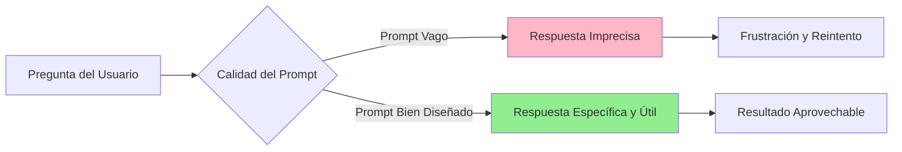
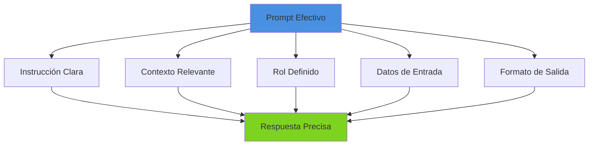
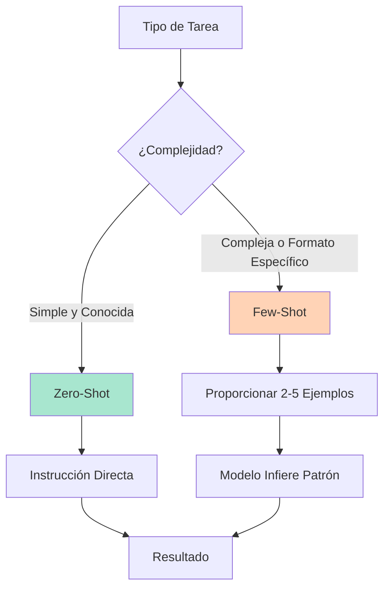
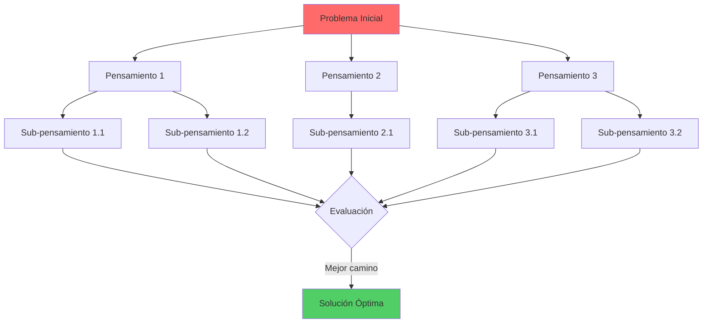
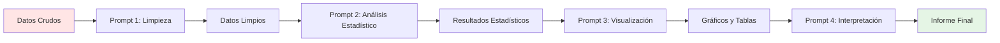
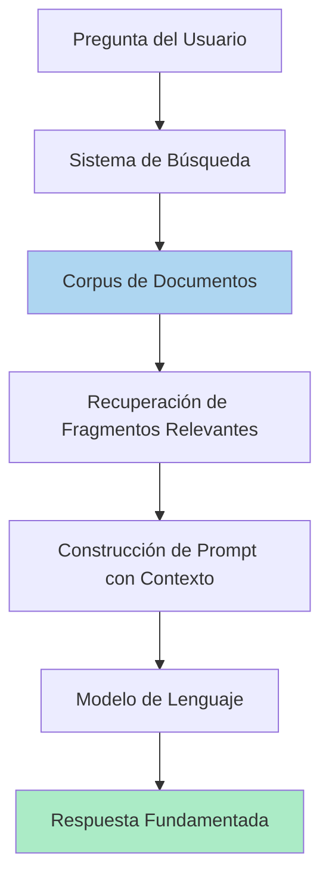
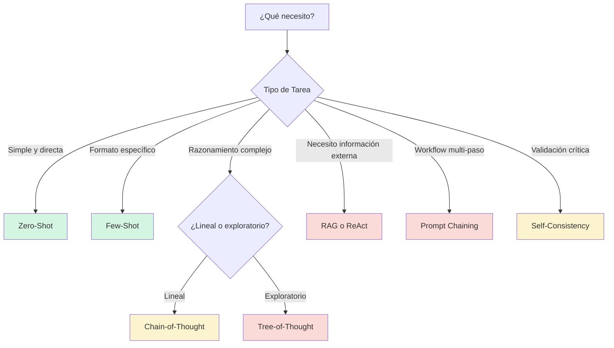

# Capítulo 2: Ingeniería de Prompts

En la era de la IA, la habilidad más valiosa para un investigador no es dominar lenguajes de programación complejos, sino saber preguntar o hacer "mejores" prompts. Esta afirmación, que puede parecer sorprendente a primera vista, refleja una realidad fundamental: los modelos generativos actuales son extraordinariamente capaces, pero su efectividad depende críticamente de cómo nos comunicamos con ellos.

La **ingeniería de prompts** emerge como la disciplina que estudia y perfecciona este arte de la comunicación con la IA generativa. Se trata de una práctica relativamente nueva, enfocada en el diseño y optimización de **prompts** (las instrucciones o indicaciones que proporcionamos a los LLM) para utilizarlos de forma eficiente y obtener los mejores resultados posibles [[08-Referencias#(DAIR.AI, 2024)|(DAIR.AI, 2024)]

## 2.1 ¿Qué es la ingeniería de Prompts?

Antes de responder la pregunta, es importante responder primero ¿Qué es un _Prompt_?

 Un _Prompt_ es, en esencia, la instrucción que le proporcionamos a un modelo generativo. Puede manifestarse como:

> - Una simple pregunta directa
> - Una orden o comando específico
> - Un párrafo descriptivo con contexto
> - Un texto completo para analizar
> - Una combinación estructurada de todos los anteriores
> 
> Es el punto de partida de toda interacción con un modelo generativo.

¿Y la _Ingeniería de Prompts_?

La _Ingeniería de Prompts_ va más allá de simplemente escribir instrucciones. Es el proceso estratégico de diseñar y refinar esas instrucciones de manera que guíen al modelo hacia el resultado deseado. No se trata solo _qué pedimos_, sino fundamentalmente _cómo lo pedimos_.

## 2.2 La importancia crítica del diseño de _Prompts_

La calidad de un _Prompt_ es un factor determinante en la utilidad de las respuestas que obtenemos de un modelo de IA. Como señalan [[08-Referencias#(Federiakin et al., 2024)|(Federiakin et al., 2024)]], una ligera modificación en la redacción puede marcar la diferencia entre que la IA generativa malinterprete completamente una instrucción o supere nuestras expectativas en la respuesta generada.



La _Ingeniería de Prompts_ se reconoce hoy como una habilidad clave para cualquier persona que quiera interactuar con los modelos de IA generativa. Es definida como la destreza de articular claramente un problema, su contexto y las restricciones de la solución deseada, de modo que un Chatbot responda de forma rápida y precisa [[08-Referencias#(Federiakin et al., 2024)|(Federiakin et al., 2024)]].

### 2.2.1 Aplicaciones en la investigación académica

En el contexto académico y científico, dominar la _Ingeniería de Prompts_ permite aprovechar al máximo herramientas de IA generativa para tareas esenciales como:

- **Síntesis de literatura**: Condensar grandes volúmenes de información bibliográfica
- **Resolución de problemas complejos**: Abordar desafíos metodológicos o conceptuales
- **Generación de código**: Crear scripts para análisis de datos o automatización
- **Análisis de datos**: Interpretar resultados estadísticos y patrones
- **Redacción académica**: Estructurar argumentos y refinar la escritura científica

> [!quote] _"El Prompt actúa como puente entre la intención del usuario y la comprensión del modelo"_ — Por ello, dominar su elaboración es crítico para obtener resultados relevantes y confiables.

| **_Prompt_ básico**             | **_Ingeniería de Prompts_**                                                                                                                                                                                                                                               |
| ------------------------------- | ------------------------------------------------------------------------------------------------------------------------------------------------------------------------------------------------------------------------------------------------------------------------- |
| Es la entrada directa al modelo | Es el diseño estratégico de la entrada                                                                                                                                                                                                                                    |
| Cualquiera puede escribir uno   | Dominarla requiere práctica y conocimiento                                                                                                                                                                                                                                |
| _"Escribe algo sobre Marte"_    | _"Actúa como un astrobiólogo de la NASA y escribe un análisis técnico de 400 palabras sobre por qué Marte representa el próximo gran objetivo para la exploración espacial humana, considerando viabilidad atmosférica, recursos hídricos y protección contra radiación"_ |

## 2.3 Anatomía de un Prompt efectivo

Un _Prompt_ puede ser tan simple como una pregunta directa, pero incluso los _Prompts_ más básicos contienen componentes fundamentales que conviene comprender y dominar. Según [[08-Referencias#(DAIR.AI, 2024)|(DAIR.AI, 2024)]], los elementos estructurales de un _Prompt_ efectivo son:

> [!example]+ **Componentes Básicos de un Prompt**
> 
> ### 1. Instrucción (el verbo de acción)
> 
> **¿Qué quieres que haga la IA?**
> 
> Define la tarea o indicación específica de manera clara y directa. Utiliza verbos en imperativo que no dejen lugar a ambigüedades.
> 
> **Ejemplo:**
> 
> > `Analiza` las principales causas del conflicto social en América Latina durante el siglo XX.
> 
> ### 2. Contexto (la información clave)
> 
> **¿Qué información de fondo necesita el modelo?**
> 
> Proporciona información adicional o contexto externo que ayude a guiar la respuesta del modelo. Puede incluir datos de antecedentes, definiciones, un escenario específico o el marco teórico relevante.
> 
> **Ejemplo:**
> 
> > Considera las perspectivas de teóricos como Gino Germani y Pablo González Casanova, así como factores estructurales como la desigualdad económica y la intervención extranjera.
> 
> ### 3. Rol (la perspectiva)
> 
> **¿Desde qué punto de vista debe responder?**
> 
> Especifica el rol, tono o perspectiva desde la cual deseas que el modelo aborde la tarea. Esto ancla el estilo y profundidad de la respuesta.
> 
> **Ejemplo:**
> 
> > `Responde como si fueras un sociólogo` especializado en teoría del conflicto.
> 
> ### 4. Datos de entrada (el input)
> 
> **¿Cuál es el contenido a procesar?**
> 
> El material principal sobre el cual el modelo debe operar. Puede ser una pregunta, un fragmento de texto, datos tabulares, código, etc.
> 
> **Ejemplo:**
> 
> > Texto: _"La inteligencia artificial se ha utilizado extensivamente en..."_
> 
> ### 5. Formato de salida (la estructura)
> 
> **¿Cómo quieres que se presente la respuesta?**
> 
> Define la extensión, el estilo, la estructura y el formato deseado de la respuesta.
> 
> **Ejemplo:**
> 
> > Redacta un ensayo breve de `300-400 palabras` con introducción, desarrollo y conclusión. Utiliza formato académico con referencias.



> [!warning] **Consideración importante: La Ventana de Contexto** 
> No todos los componentes son siempre necesarios. El prompt óptimo depende de la naturaleza de la tarea. Sin embargo, debemos tener en cuenta que la longitud total del prompt (sumada al resto de la conversación o contexto proporcionado) está limitada por la ventana de contexto del modelo, es decir, la cantidad máxima de tokens que el modelo puede procesar de una vez.
> 
> Por ello, es crucial ser estratégicos en qué información incluir, priorizando los detalles más relevantes para no exceder ese límite.

## 2.4 Técnicas fundamentales de _Ingeniería de Prompts_

La base de la _Ingeniería de Prompts_ moderna se encuentra en el prompting basado en ejemplos (_shot-based prompting_), una forma de Aprendizaje en Contexto (_In-Context Learning_, ICL) donde el número de ejemplos proporcionados en el _Prompt_ guía el comportamiento del modelo [[08-Referencias#(Chen et al., 2025)|(Chen et al., 2025)]].

### 2.4.1 Prompting Zero-Shot: La instrucción directa

> [!abstract]+ **Definición**
> El **prompting zero-shot** es la forma más simple de interactuar con un modelo de lenguaje. Consiste en solicitar directamente la tarea sin proveer ningún ejemplo de referencia. El modelo debe responder basándose únicamente en su conocimiento de entrenamiento.

Esta técnica es la entrada más básica y natural para los usuarios. Muchos modelos de lenguaje modernos son capaces de manejar indicaciones zero-shot para tareas variadas, aunque la calidad puede variar según la complejidad de la tarea.

> [!example]- **Ejemplo en Investigación**
> 
> ```
> "Resume los hallazgos clave del artículo de investigación adjunto en una lista con viñetas."
> ```
> 
> Otro ejemplo académico:
> 
> ```
> "Explica la teoría de la relatividad general en términos accesibles para estudiantes de licenciatura en física."
> ```

**¿Cuándo usar zero-shot?**

Es ideal para:

- Tareas simples y bien definidas
- Consultas generales de conocimiento
- Clasificaciones básicas
- Casos donde el modelo tiene fuerte conocimiento previo sobre el tema

### 2.4.2 Prompting Few-Shot: Guiar por ejemplos

> [!abstract]+ **Definición**
> El **prompting few-shot** implica proporcionar uno (_one-shot_) o varios (_few-shot_) ejemplos de referencia dentro del prompt para guiar al modelo sobre cómo debe responder. Estos ejemplos actúan como _demostraciones en contexto_, ayudando al modelo a inferir el patrón deseado.

Esta técnica aprovecha la capacidad de _aprendizaje en contexto_ de los LLMs, es decir, su habilidad para extrapolar la tarea a partir de unos pocos casos ilustrativos proporcionados en el mismo prompt.

> [!example]- **Ejemplo: Extracción de Datos de Investigación**
> 
> ```
> Extrae la metodología y el tamaño de la muestra de los siguientes resúmenes.
> 
> Resumen 1: 'Realizamos un ensayo controlado aleatorizado con 250 participantes 
> para evaluar la eficacia de una intervención educativa en diabetes tipo 2...'
> Metodología: Ensayo controlado aleatorizado
> Tamaño de la muestra: 250
> 
> Resumen 2: 'Este estudio cualitativo implicó entrevistas en profundidad con 
> 15 gerentes de hospitales públicos para explorar las barreras en la 
> implementación de sistemas de información clínica...'
> Metodología: Entrevistas cualitativas en profundidad
> Tamaño de la muestra: 15
> 
> Resumen 3: 'Empleamos un diseño longitudinal de cohorte, siguiendo a 
> 1,200 adultos mayores durante cinco años para investigar los factores 
> de riesgo cardiovascular...'
> Metodología: 
> Tamaño de la muestra: 
> ```

**¿Cuándo usar few-shot?**

- Tareas complejas que requieren un formato específico
- Clasificaciones con matices o categorías particulares
- Cuando se necesita un formato de salida preciso
- Para establecer el tono y estilo deseado
- En extracción estructurada de información



> [!tip] **Principio de Iteración** 
> Un principio fundamental en ambas técnicas es la **iteración**: comenzar con un prompt sencillo e ir ajustándolo según la respuesta del modelo. Si la respuesta inicial no es satisfactoria, el prompt se puede refinar agregando detalles, reformulando la instrucción o incorporando ejemplos. Esta experimentación forma parte esencial de la ingeniería de prompts.

## 2.5 Técnicas avanzadas para razonamiento complejo

A medida que profundizamos en el uso de modelos de lenguaje, emergen técnicas más sofisticadas que permiten explotar mejor sus capacidades para tareas complejas de investigación. Estas técnicas son especialmente valiosas cuando necesitamos que el modelo realice razonamientos de múltiples pasos, explore alternativas o sintetice información compleja.

### 2.5.1 Cadena de Pensamiento (Chain-of-Thought, CoT)

> [!abstract]+ **Definición**
> La técnica de **Cadena de Pensamiento** consiste en incentivar al modelo a desglosar su razonamiento en pasos intermedios antes de dar la respuesta final. Se le pide explícitamente que "piense paso a paso" o se le proporciona un ejemplo donde se muestran los pasos lógicos para resolver un problema.

Esta técnica ha demostrado mejorar significativamente el rendimiento en tareas que requieren razonamiento matemático, lógico o de múltiples pasos, ya que ayuda al modelo a organizar su proceso cognitivo antes de concluir [[08-Referencias#(Chen et al., 2025)|(Chen et al., 2025)]].

> [!example]- **Ejemplo: Cálculo en Investigación**
> 
> ```
> Tengo un conjunto de datos de 500 registros clínicos. El 20% de los pacientes 
> tiene la Condición A. De aquellos con Condición A, el 40% está recibiendo el 
> Medicamento B como tratamiento.
> 
> ¿Cuántos pacientes tienen la Condición A Y están tomando el Medicamento B?
> 
> Pensemos paso a paso.
> ```
> 
> **Respuesta esperada del modelo:**
> 
> ```
> Paso 1: Calcular cuántos pacientes tienen la Condición A
> 500 × 0.20 = 100 pacientes con Condición A
> 
> Paso 2: De esos 100, calcular cuántos toman el Medicamento B
> 100 × 0.40 = 40 pacientes
> 
> Respuesta final: 40 pacientes tienen la Condición A y toman el Medicamento B
> ```

**Aplicaciones en investigación:**

- Resolución de problemas cuantitativos
- Deducciones lógicas complejas
- Análisis estadísticos paso a paso
- Diseño de protocolos experimentales
- Interpretación de resultados multi-factorial

> [!note] Aunque la técnica CoT es muy útil, su valor puede disminuir en los modelos más avanzados (como GPT-5, Claude 4.5, o Gemini 2.5 pro), que ya incorporan capacidades de razonamiento robustas de forma nativa.

### 2.5.2 Árbol de Pensamientos (Tree-of-Thought, ToT)

> [!abstract]+ **Definición**
> El **Árbol de Pensamientos** es un marco avanzado que permite al modelo explorar múltiples caminos de razonamiento simultáneamente en una estructura de árbol. El modelo puede autoevaluar diferentes "pensamientos", avanzar por las ramas más prometedoras o retroceder (_backtracking_) según sea necesario para encontrar la mejor solución.

A diferencia de la Cadena de Pensamiento que es lineal y secuencial, ToT permite una exploración no lineal del espacio de problemas, evaluando múltiples alternativas antes de decidir.



**Aplicaciones en investigación:**

- Planificación estratégica de estudios
- Generación y evaluación de hipótesis múltiples
- Diseño experimental con variables alternativas
- Exploración de espacios de problemas complejos
- Toma de decisiones metodológicas

Ha demostrado mejoras significativas sobre CoT en problemas de planificación y tareas que requieren exploración exhaustiva de alternativas.

### 2.5.3 Auto-Consistencia (Self-Consistency)

> [!abstract]+ **Definición**
> La técnica de **auto-consistencia** implica muestrear múltiples y diversos caminos de razonamiento (generalmente usando CoT) y luego seleccionar la respuesta más consistente a través de un voto mayoritario o análisis de consenso [[08-Referencias#(Chen et al., 2025)|(Chen et al., 2025)]].

**Principio fundamental:**

Al explorar diferentes formas de llegar a una respuesta, es menos probable que el modelo se desvíe por un único paso de razonamiento defectuoso. La respuesta de consenso tiene mayor probabilidad de ser robusta y correcta.

**Proceso:**

1. Generar múltiples respuestas al mismo prompt (variando parámetros de temperatura)
2. Analizar las diferentes cadenas de razonamiento
3. Identificar la respuesta que aparece con mayor frecuencia
4. Validar la consistencia lógica entre las respuestas convergentes

**Aplicación práctica en investigación:**

En la validación de resultados numéricos o interpretaciones críticas, ejecutar el mismo prompt varias veces independientes y comparar las respuestas proporciona mayor confianza en la fiabilidad del resultado.

---

## 2.6 Técnicas para mejorar la flexibilidad cognitiva y precisión

Estas técnicas buscan optimizar cómo el modelo enmarca un problema y accede a su conocimiento interno, mejorando tanto la comprensión como la calidad de las respuestas.

### 2.6.1 Prompting de Paso Atrás (Step-Back Prompting)

> [!abstract]+ **Definición**
> Esta técnica anima al modelo a "dar un paso atrás" de una pregunta específica para derivar primero conceptos de más alto nivel o primeros principios. Luego, utiliza esta abstracción para razonar sobre la pregunta original con mayor contexto y precisión.

En lugar de responder directamente una pregunta muy específica, el modelo primero establece el marco conceptual general, lo que conduce a respuestas más fundamentadas y fiables.

> [!example]- **Ejemplo en Investigación**
> 
> **Pregunta directa (menos efectiva):**
> 
> > _¿Utilizó el autor Martinez el método de análisis de contenido cualitativo en su publicación de 2020 sobre migración?_
> 
> **Pregunta de paso atrás (más efectiva):**
> 
> > _¿Cuál es el historial de publicaciones del autor Martinez y qué metodologías ha empleado tradicionalmente en sus investigaciones sobre migración? Luego, basándote en este contexto, determina si empleó análisis de contenido cualitativo en 2020._
> 
> Este enfoque recupera un contexto más amplio, haciendo la respuesta específica mucho más confiable.

### 2.6.2 Rephrase and Respond (RaR)

> [!abstract]+ **Definición**
> En esta técnica, se instruye al modelo para que primero reformule y expanda la pregunta del usuario antes de responderla. Este paso intermedio ayuda a resolver ambigüedades y alinea la interpretación del modelo con la verdadera intención del usuario.

> [!example]- **Ejemplo Práctico**
> 
> ```
> Pregunta original: "¿Cuáles son las implicaciones de los resultados?"
> 
> Prompt RaR:
> "Primero, reformula y expande la siguiente pregunta para clarificar su 
> significado, y luego responde de manera completa: 
> ¿Cuáles son las implicaciones de los resultados?"
> ```
> 
> **Reformulación del modelo:**
> 
> ```
> Pregunta expandida: "¿Cuáles son las implicaciones teóricas, metodológicas 
> y prácticas de los resultados obtenidos en este estudio para el campo de 
> investigación, para estudios futuros y para la aplicación en contextos 
> reales?"
> ```

Esta técnica es especialmente útil cuando:

- Las preguntas son ambiguas o pueden tener múltiples interpretaciones
- Se necesita clarificar el alcance de una consulta
- El contexto de la pregunta no está completamente explícito

### 2.6.3 Prompting de Conocimiento Generado

> [!abstract]+ **Definición**
>  En esta técnica, primero se le pide al modelo que genere un conjunto de hechos o "conocimientos" relevantes sobre un tema antes de pedirle que complete la tarea final. Este conocimiento generado se integra luego explícitamente en el prompt para la respuesta definitiva.

**Proceso en dos fases:**

1. **Fase 1 - Generación de conocimiento:**
    
    ```
    "Lista los 10 conceptos más importantes sobre metabolismo celular que 
    serían relevantes para explicar el ciclo de Krebs a estudiantes de 
    bioquímica."
    ```
    
2. **Fase 2 - Tarea con conocimiento integrado:**
    
    ```
    "Utilizando los conceptos que acabas de listar, explica el ciclo de 
    Krebs de manera didáctica en 500 palabras."
    ```
    

**Beneficios principales:**

- Muy eficaz para tareas de escritura académica
- Ayuda al modelo a fundamentar sus respuestas en hechos específicos
- Mejora la coherencia y profundidad del contenido generado
- Reduce alucinaciones al establecer una base de conocimiento explícita

---

## 2.7 Técnicas Avanzadas de Integración

### 2.7.1 Encadenamiento de Prompts (Prompt Chaining)

> [!abstract]+ **Definición**
> En lugar de un único prompt monolítico, se diseña un flujo de múltiples prompts encadenados donde la salida de un paso alimenta el siguiente. Esta técnica permite manejar tareas complejas dividiéndolas estratégicamente en sub-tareas manejables.

**Ejemplo de pipeline de análisis de datos:**



**Aplicaciones en investigación:**

- Análisis de literatura: búsqueda → extracción → síntesis → redacción
- Procesamiento de datos: limpieza → análisis → visualización → interpretación
- Desarrollo de código: diseño → implementación → pruebas → documentación

### 2.7.2 Generación Aumentada por Recuperación (RAG)

> [!abstract]+ **Definición**
> La técnica RAG (_Retrieval-Augmented Generation_) se centra en incorporar información externa recuperada dinámicamente al prompt para suplir deficiencias de conocimiento del modelo. Se busca en un corpus de documentos relevantes (como papers académicos) y se incluyen fragmentos pertinentes en el contexto del prompt.

**Flujo de trabajo RAG:**



**Ventajas en investigación académica:**

- Acceso a conocimiento actualizado más allá del entrenamiento del modelo
- Respuestas basadas en literatura específica de tu campo
- Mayor precisión al citar fuentes reales
- Capacidad de trabajar con **documentos propietarios** o especializados

En el contexto de investigación, RAG permite preguntar al modelo sobre datos que no están en su entrenamiento pero sí en literatura reciente, integrando capacidades de búsqueda bibliográfica con el poder analítico del LLM.

### 2.7.3 ReAct: Razonamiento y Acción

> [!abstract]+ **Definición**
> ReAct (_Reasoning and Acting_) combina indicaciones de razonamiento con capacidades de acción, permitiendo al modelo interactuar con herramientas externas como motores de búsqueda, calculadoras, bases de datos o APIs.

El modelo alterna entre "pensar" (generar una cadena de razonamiento) y "actuar" (producir una consulta o instrucción para usar una herramienta externa) de forma iterativa hasta llegar a la respuesta final.

**Ejemplo de flujo ReAct:**

1. **Pensamiento:** "Necesito conocer la tasa de inflación actual para responder"
2. **Acción:** `búsqueda_web ("tasa de inflación México 2025")`
3. **Observación:** [Resultados de la búsqueda]
4. **Pensamiento:** "Con esta información puedo calcular el ajuste necesario"
5. **Acción:** `calculadora("100 * 1.045")`
6. **Observación:** [Resultado: 104.5]
7. **Pensamiento:** "Ahora puedo formular la respuesta final"
8. **Respuesta:** [Respuesta completa al usuario]

---

## 2.8 Consejos prácticos

La experiencia práctica en ingeniería de prompts ha revelado patrones y principios que mejoran consistentemente la calidad de las interacciones con modelos generativos. A continuación, presentamos algunas recomendaciones específicas:

> [!tip]+ **Especificidad y Claridad** 
> **Sé específico y claro en tus instrucciones**
> 
> - ❌ **Evitar:** _"Analiza este artículo"_
> - ✅ **Mejor:** _"Identifica y resume en 200 palabras: (1) la pregunta de investigación principal, (2) la metodología empleada, (3) los hallazgos clave, y (4) las limitaciones reconocidas del estudio"_
> 
> La especificidad elimina ambigüedad y produce resultados más alineados con tus necesidades.

> [!tip]+ **Instrucciones Positivas** 
> **Di lo que quieres que haga, no lo que no quieres**
> 
> Diversos estudios han demostrado que los modelos responden mejor a instrucciones formuladas en positivo:
> 
> - ❌ **Evitar:** _"No uses lenguaje técnico complejo"_
> - ✅ **Mejor:** _"Utiliza un lenguaje claro y accesible, explicando cualquier término técnico necesario"_
> 
> Las instrucciones positivas guían al modelo hacia comportamientos deseados en lugar de simplemente prohibir los no deseados.

> [!tip]+ **Uso de Delimitadores** 
> **Utiliza delimitadores claros para estructurar el input**
> 
> Separar diferentes secciones del prompt con delimitadores visuales mejora la comprensión del modelo:
> 
> ```
> Contexto:
> """
> [Tu contexto aquí]
> """
> 
> Texto a analizar:
> ```
> [Tu texto aquí]
> ```
> 
> Instrucciones:
> - Punto 1
> - Punto 2
> - Punto 3
> ```
> 
> Los delimitadores comunes incluyen: `"""`, ` ``` `, `---`, `###`, `[ ]`

> [!tip]+ **Descomposición de Tareas** 
> **Divide tareas complejas en pasos más simples**
> 
> Para tareas multi-facéticas, descompón el proceso:
> 
> ```
> Realiza las siguientes tareas en orden:
> 
> 1. Lee el resumen del artículo adjunto
> 2. Identifica las variables dependientes e independientes
> 3. Clasifica el diseño de investigación (experimental, correlacional, etc.)
> 4. Evalúa la validez interna y externa del diseño
> 5. Resume tus hallazgos en una tabla estructurada
> ```

> [!tip]+ **Ejemplos y Patrones** 
> **Proporciona ejemplos del formato o estilo deseado**
> 
> Como vimos en few-shot prompting, los ejemplos son extremadamente efectivos:
> 
> ```
> Extrae información bibliográfica en el siguiente formato:
> 
> Ejemplo:
> Autor(es): García-López, M., & Rodríguez, J.
> Año: 2023
> Título: Metodologías innovadoras en investigación social
> Revista: Journal of Social Research
> DOI: 10.1234/jsr.2023.001
> 
> Ahora extrae la misma información de: [texto a procesar]
> ```

> [!tip]+ **Longitud y Formato de Salida**
>  **Especifica la longitud y formato esperado**
> 
> Sé explícito sobre tus expectativas:
> 
> - "Responde en exactamente 3 párrafos de 100 palabras cada uno"
> - "Proporciona una lista numerada con máximo 7 puntos"
> - "Genera una tabla con las columnas: Variable, Tipo, Descripción"
> - "Escribe un abstract de máximo 250 palabras"

> [!tip]+ **Iteración y Refinamiento** 
> **Refina progresivamente tus prompts**
> 
> La ingeniería de prompts es un proceso iterativo:
> 
> 1. Comienza con un prompt básico
> 2. Evalúa la respuesta
> 3. Identifica qué falta o está incorrecto
> 4. Ajusta el prompt agregando especificaciones
> 5. Repite hasta obtener resultados satisfactorios
> 
> Guarda los prompts efectivos para reutilizarlos como plantillas.

> [!tip]+ **Contextualización Apropiada** 
> **Proporciona el contexto justo y necesario**
> 
> - ✅ Incluye contexto relevante que el modelo necesita
> - ❌ No sobrecargues con información tangencial
> - ⚠️ Considera el límite de la ventana de contexto
> 
> Encuentra el equilibrio entre suficiente contexto y eficiencia.

> [!warning] **Verificación de Resultados** 
> **Siempre verifica la información crítica**
> 
> Los modelos generativos pueden generar contenido plausible pero incorrecto ("alucinaciones"). Para investigación académica:
> 
> - Verifica datos estadísticos con fuentes originales
> - Confirma citas y referencias bibliográficas
- Valida resultados numéricos con cálculos independientes
- Revisa críticamente interpretaciones y conclusiones

---

## 2.9 Tabla Comparativa de Técnicas de Razonamiento

Para facilitar la selección de la técnica más apropiada según el contexto de investigación, presentamos esta tabla comparativa:

| **Técnica** | **Principio Central** | **Mejor Caso de Uso en Investigación** | **Diferenciador Clave** | **Complejidad** |
| --- | --- | --- | --- | --- |
| **Zero-Shot** | Instrucción directa sin ejemplos | Tareas simples con conocimiento común | Simplicidad y rapidez | ⭐ |
| **Few-Shot** | Aprendizaje por ejemplos en contexto | Tareas con formato específico o matices | Guía por demostración | ⭐⭐ |
| **Cadena de Pensamiento (CoT)** | Descomposición lineal, paso a paso | Problemas cuantitativos, deducciones lógicas | Razonamiento secuencial explícito | ⭐⭐⭐ |
| **Árbol de Pensamientos (ToT)** | Exploración de múltiples ramas simultáneas | Planificación estratégica, generación de hipótesis | Exploración no lineal con backtracking | ⭐⭐⭐⭐ |
| **Auto-consistencia** | Votación mayoritaria entre múltiples intentos | Validación de resultados críticos | Fiabilidad por consenso | ⭐⭐⭐ |
| **Step-Back Prompting** | Razonamiento desde principios de alto nivel | Preguntas complejas con muchos detalles | Abstracción antes del razonamiento | ⭐⭐⭐ |
| **Rephrase & Respond** | Clarificación por reformulación | Consultas ambiguas o multi-interpretables | Alineación de intención | ⭐⭐ |
| **Conocimiento Generado** | Establecer base factual antes de responder | Tareas de escritura fundamentadas | Reducción de alucinaciones | ⭐⭐⭐ |
| **Prompt Chaining** | Secuencia de prompts interdependientes | Workflows complejos multi-etapa | Modularización del proceso | ⭐⭐⭐⭐ |
| **RAG** | Integración de información externa | Preguntas sobre literatura específica | Conocimiento actualizado y específico | ⭐⭐⭐⭐⭐ |
| **ReAct** | Alternancia entre razonamiento y acción | Tareas que requieren herramientas externas | Interacción con entorno | ⭐⭐⭐⭐⭐ |



---

## 2.10 Conclusión

La ingeniería de prompts representa una nueva frontera en la intersección entre la comunicación humana y la IA generativa. Lo que comenzó como un arte empírico de prueba y error ha evolucionado hacia una disciplina con principios claros, técnicas documentadas y mejores prácticas establecidas.

Para estudiantes, docentes e investigadores, dominar estas técnicas no es simplemente una habilidad técnica adicional, es una competencia fundamental que puede multiplicar la capacidad de análisis, síntesis y creación de conocimiento. Los modelos generativos son herramientas extraordinariamente poderosas, pero su efectividad depende críticamente de nuestra capacidad para comunicarnos con esos modelos de manera precisa y estratégica.

> [!quote] **Reflexión Final** _La ingeniería de prompts no trata de hacer que las máquinas ”piensen” como humanos, sino de aprender a comunicarnos efectivamente con una tecnología que puede asistirnos en multiples maneras._

Las técnicas presentadas en este capítulo — desde el basic zero-shot hasta los sofisticados sistemas RAG y ReAct forman un caja de herramientas conceptual que debe adaptarse a las necesidades específicas de cada estudiante, docente e investigador y cada contexto. No existe una "mejor técnica" universal; existe la técnica más apropiada para cada situación.

**Principios para recordar:**

1. **Claridad sobre complejidad**: Un prompt simple y claro suele superar a uno elaborado y ambiguo
2. **Iteración sobre perfección**: El refinamiento progresivo es más efectivo que buscar el prompt perfecto en el primer intento.
3. **Contexto apropiado**: Proporciona la información justa que el modelo necesita, ni más ni menos.
4. **Verificación crítica**: Los resultados de la IA son punto de partida, no verdades absolutas.
5. **Experimentación continua**: Los modelos evolucionan y las técnicas efectivas también.

A medida que los modelos generativos continúan avanzando, las técnicas de ingeniería de prompts también evolucionarán. Lo que permanecerá constante es la necesidad de un diálogo reflexivo y estratégico entre el estudiante, docente e investigador humano y sus herramientas de IA generativas, un diálogo que, bien ejecutado, amplifica dramáticamente las capacidades de ambos.


> [!TIP] Próximo Paso 
> En los siguientes capítulos exploraremos cómo estas técnicas se aplican específicamente en contextos de investigación académica, incluyendo la revisión de literatura, el análisis de datos, y la integración de múltiples herramientas de IA en workflows de investigación completos.

---

**🧭 Navegación:** [[01-Fundamentos-IA-Generativa|⬅️ Capítulo 1]] | [[03-Ingeniería-Contexto|Siguiente: Capítulo 3 ➡️]]

---
<div align="center">
  
  
</div>

