# Capítulo 3: Ingeniería de Contexto - Arquitectura para la Inteligencia Artificial

> [!abstract] Introducción al capítulo
> En este capítulo exploraremos la **[[09-Glosario#Ingeniería de Contexto|ingeniería de contexto]]**, una disciplina emergente que ha transformado la forma en que diseñamos e implementamos sistemas de IA. A diferencia de la ingeniería de prompts, que se enfoca en optimizar instrucciones individuales, la ingeniería de contexto nos invita a pensar en todo el ecosistema informativo que rodea al modelo. Aprenderemos cómo construir ese "mundo mental" en el que operan los LLMs para maximizar su efectividad en tareas de investigación académica.

---

## 3.1 ¿Qué es la Ingeniería de Contexto?

La **ingeniería de contexto** es la disciplina que diseña, selecciona y gestiona deliberadamente la información que rodea a un modelo de lenguaje durante su ejecución. En lugar de enfocarse solo en redactar un buen prompt (instrucción), la ingeniería de contexto se ocupa de **optimizar todo el entorno informativo** que recibe el modelo, para guiar su comportamiento de forma eficaz [[08-Referencias#(Mei et al., 2025)|(Mei et al., 2025)]].

> [!note] Definición Formal
> La ingeniería de contexto es "_el delicado arte y ciencia de llenar la [[09-Glosario#Ventana de Contexto|ventana de contexto]] con la información justa y necesaria para el siguiente paso_". No se limita al prompt inmediato, sino que abarca el diseño de todo el "mundo mental" en el que opera el modelo.

Dicho de otro modo, no se trata únicamente de _qué_ le decimos a la IA, sino:

- **Qué datos** le proporcionamos
- **Cómo** se los presentamos
- **Cuándo** se los entregamos
- Bajo **qué condiciones** los procesa

Esta práctica trasciende el simple diseño de prompts y abarca la **orquestación sistemática del contenido** que entra en la ventana de [[09-Glosario#Contexto|contexto]] del modelo.

### La Analogía de Karpathy

Andrej Karpathy, uno de los pioneros en el campo de la IA, resumió esta idea con una analogía reveladora: _"el LLM es la CPU y la ventana de contexto es la RAM"_. En otras palabras, la IA solo "recuerda" aquello que cargamos en su contexto en cada momento. Bajo esta analogía, la **ingeniería de contexto actuaría como el sistema operativo** que decide qué datos cargar en la memoria (contexto) y cuándo, asegurando que el modelo siempre tenga a mano la información necesaria para la tarea en cuestión.

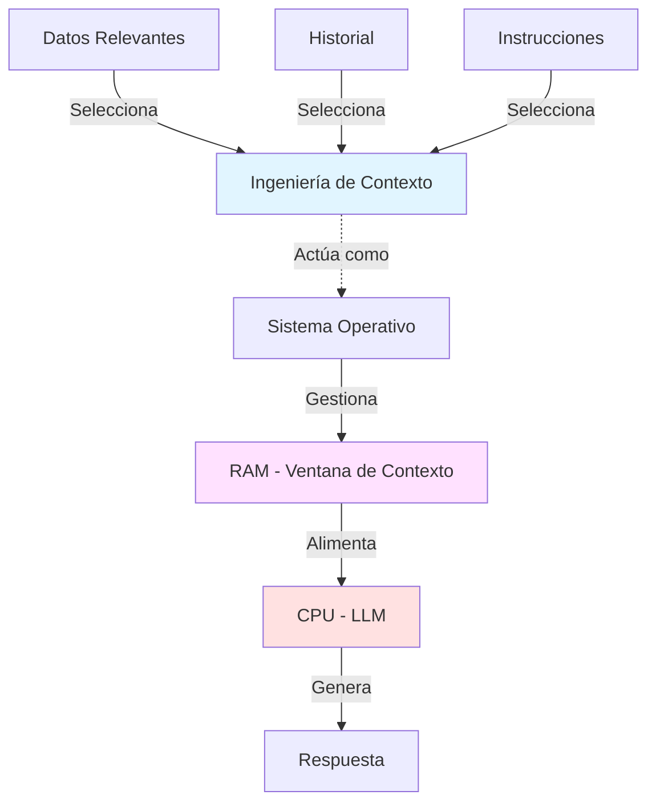

En términos simples, la ingeniería de contexto implica crear un **entorno informativo estructurado** para la IA. Esto abarca no solo el texto del prompt en sí, sino también condiciones, reglas, datos adicionales, definiciones de herramientas o funciones que puede usar, el rol que debe asumir, y cualquier otro detalle relevante para que el modelo **comprenda mejor la situación y produzca respuestas más pertinentes**.

---

## 3.2 Ingeniería de Prompt vs Ingeniería de Contexto

Es importante distinguir entre **ingeniería de prompt** e **ingeniería de contexto**, ya que ambas son complementarias pero operan a diferentes niveles.
### Ingeniería de Prompt

La **ingeniería de prompt** se enfoca en optimizar la redacción de una instrucción específica: elegir las palabras, el tono y la estructura de un prompt para inducir la mejor respuesta posible del modelo. Esto fue crucial en los primeros años de los LLM (2020–2021), donde se descubrió que reformulando cuidadosamente las peticiones (incluso proporcionando ejemplos en el prompt) se mejoraba notablemente el resultado.

> [!tip] Características del Prompt Engineering
> 
> - **Alcance limitado**: Una instrucción a la vez
> - **Enfoque**: _Qué_ le pedimos al modelo
> - **Objetivo**: Optimizar la redacción y estructura
> - **Ejemplo**: "Resume el artículo X y destaca sus hallazgos principales"

### Ingeniería de Contexto

Por otro lado, la **ingeniería de contexto** abarca _todo lo que rodea al prompt_. No solo considera la instrucción en sí, sino también la **información adicional y el estado** que acompaña a esa instrucción. Incluye:

- La historia previa de la conversación
- Datos o documentos proporcionados al modelo
- Las instrucciones del sistema (rol que debe jugar, reglas a seguir)
- Las preferencias del usuario
- Resultados de herramientas externas consultadas

Mientras el prompt es una sola pregunta o indicación, el contexto es **todo el paquete de información** que el modelo "lee" en su ventana de entrada antes de generar una respuesta.

> [!example]- Comparación Práctica **Solo con Ingeniería de Prompt:**
> 
> ```
> Resume el artículo X y destaca sus hallazgos principales
> ```
> 
> **Con Ingeniería de Contexto:**
> 
> 1. **Instrucciones del sistema**: "Eres un asistente de investigación académica especializado en ciencias sociales"
> 2. **Datos del artículo**: Texto completo del artículo X
> 3. **Metadatos**: Referencia bibliográfica, revista, año de publicación
> 4. **Especificaciones de formato**: "Responde en 3 párrafos, tono formal, estilo APA"
> 5. **Historial**: Conversaciones previas sobre temas relacionados
> 6. **Prompt del usuario**: "Resume el artículo X y destaca sus hallazgos principales"

### La Diferencia Fundamental

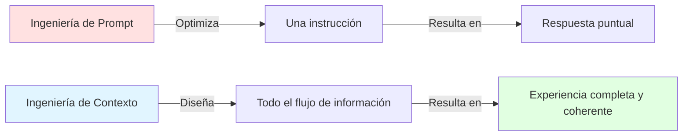

La diferencia fundamental es de **alcance**: la ingeniería de prompt optimiza _qué_ le pedimos al modelo en un único turno, mientras que la ingeniería de contexto diseña _todo el flujo de información_ que alimenta al modelo a lo largo de una interacción.

> [!important] Complementariedad 
> **Ambas disciplinas siguen siendo necesarias**. Un prompt claro y bien formulado sigue siendo crucial, pero a medida que las aplicaciones con IA se vuelven más dinámicas y de múltiples pasos, confiar solo en un buen prompt es insuficiente. La ingeniería de contexto viene a llenar ese vacío, asegurando que el modelo tenga la información correcta en cada paso.

Una analogía útil es que _"un prompt es una frase, pero un contexto es una experiencia completa y estructurada"_.

---

## 3.3 ¿Por qué es importante la Ingeniería de Contexto?

La ingeniería de contexto ha cobrado protagonismo porque aborda varios **desafíos críticos** en el uso de modelos de lenguaje avanzados, especialmente relevantes para la investigación académica.

### 3.3.1 Limitaciones de la Memoria del Modelo

Los LLM como GPT, Claude o Llama **no tienen memoria permanente de la conversación**; solo consideran lo que cabe en su ventana de contexto en cada turno. Este es uno de los tres problemas fundamentales identificados en la literatura:

> [!warning] Tres Debilidades Críticas de los LLMs
> 
> 1. **Falta de Estado (Statelessness)**: Los LLM no "recuerdan" información entre interacciones
> 2. **Alucinaciones**: Pueden generar información incorrecta o inventada
> 3. **Fragilidad (Brittleness)**: Los enfoques basados únicamente en prompts no escalan bien

Si la conversación es larga o la tarea requiere muchos datos, el modelo puede "olvidar" información importante de los primeros turnos. Aunque ampliar la ventana de contexto ayuda (algunos modelos recientes aceptan 250k tokens o más), estudios han mostrado que **el rendimiento del modelo comienza a degradarse** cuando se le sobrecarga con demasiado contexto irrelevante, incluso antes de alcanzar el máximo teórico de la ventana.

Por lo tanto, es vital **gestionar inteligentemente qué entra y qué no entra en ese espacio limitado**. La ingeniería de contexto se encarga de mantener solo lo más relevante y útil dentro de la ventana del modelo en cada momento, mitigando el riesgo de que "pierda el hilo" de la tarea.

### 3.3.2 Calidad de las Respuestas y Reducción de Alucinaciones

Un modelo de lenguaje, por muy avanzado que sea, puede dar respuestas mediocres o incorrectas si no se le proporciona el contexto adecuado. De hecho, muchos fallos en aplicaciones de IA _no_ se deben a falta de capacidad del modelo en sí, sino a que **no recibió los datos o instrucciones necesarios para tomar una buena decisión**.

> [!tip] El Poder del Contexto 
> Un mismo modelo puede pasar de ofrecer una respuesta vaga a una respuesta precisa simplemente cambiando el contexto en el que se formula la pregunta.

Proporcionar datos verídicos y relevantes (por ejemplo, pasajes de textos científicos en una pregunta técnica) ayuda a **[[09-Glosario#Grounding|anclar]]** (_grounding_) las respuestas del modelo en información real, reduciendo la probabilidad de invenciones o errores factuales. La **[[09-Glosario#RAG|Generación Aumentada por Recuperación]] (RAG)** es una de las técnicas clave para lograr este anclaje, como veremos más adelante.

**Ejemplo en investigación académica:**

- _Sin contexto_: El modelo podría "imaginar" resultados inexistentes de un estudio
- _Con contexto_: Al incorporar el texto del estudio en la ventana de contexto, el modelo citará y resumirá correctamente porque dicho estudio fue incluido en su contexto

### 3.3.3 Tareas complejas y de múltiples pasos

A medida que usamos IA para tareas más sofisticadas (investigación científica, resolución de problemas, toma de decisiones), crece la necesidad de que el modelo **razone sobre múltiples piezas de información** y mantenga coherencia a lo largo de varios pasos.

La ingeniería de contexto permite estructurar ese flujo de información:

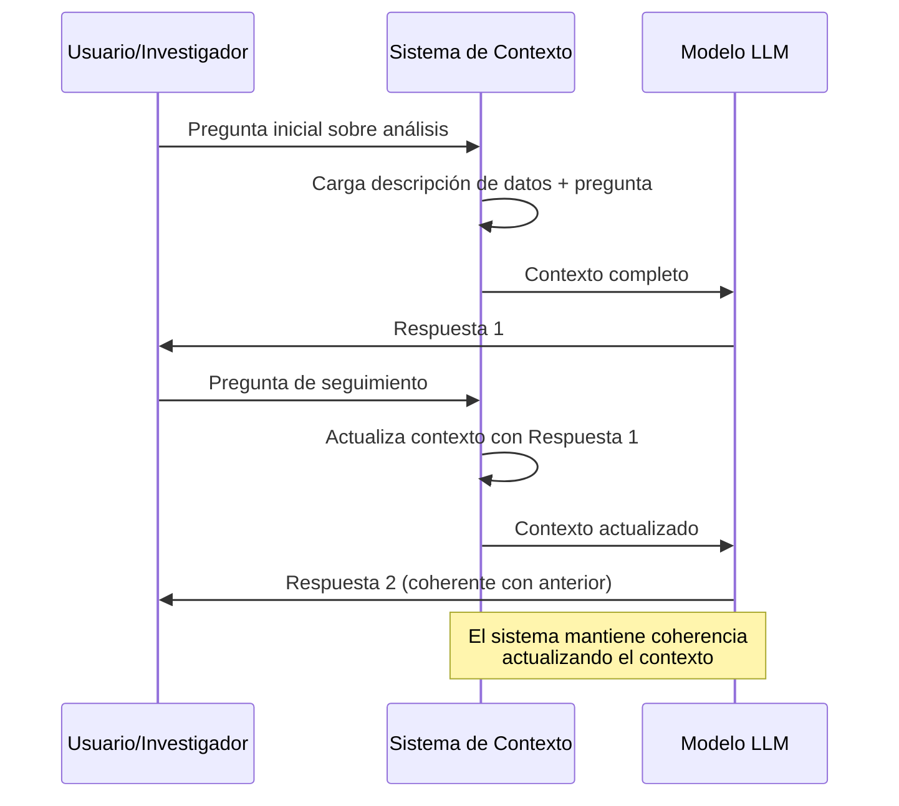

Sin este enfoque, el modelo trataría cada pregunta de forma aislada y perdería la continuidad. Con un contexto diseñado adecuadamente, la IA **"recuerda" el progreso** y puede profundizar en siguientes pasos sin partir de cero en cada turno.

### 3.3.4 Adaptabilidad y Personalización

La ingeniería de contexto también permite que los modelos se **adapten al usuario o dominio específico** en cada situación, sin necesidad de re-entrenamiento.

> [!example]- Ejemplo: Especialización Dinámica 
> Un mismo modelo base (GPT-4 o Claude) puede actuar como:
> 
> - **Tutor de matemáticas**: Con contexto de fórmulas y ejemplos pedagógicos
> - **Asesor jurídico**: Con contexto de leyes y casos relevantes
> - **Asistente de investigación en biología molecular**: Con contexto de papers especializados y terminología técnica
> 
> Todo esto **sin reentrenar el modelo**, solo cambiando el contexto.

Este enfoque contextual hace posible personalizar la IA para diferentes usos al vuelo. En el ámbito de la investigación, eso significa que un modelo general puede volverse _especialista_ en cualquier área durante una conversación, siempre y cuando le entreguemos los papers, definiciones de términos técnicos y demás información de contexto que necesita para desenvolverse en ese campo.

### El Nuevo Paradigma

Numerosos expertos señalan que el _cuello de botella_ en el rendimiento de la IA ya no está tanto en el tamaño del modelo, sino en la **calidad del contexto** con el que lo alimentamos. De hecho, se pronostica que la ingeniería de contexto será cada vez más importante; empresas como Gartner han llegado a sugerir que **la ingeniería de contexto _suplantará_ a la ingeniería de prompt** como la habilidad clave para desarrollar soluciones de IA exitosas en los próximos años [[08-Referencias#(IntuitionLabs, 2025)|(IntuitionLabs, 2025)]].

> [!quote] Reflexión Clave 
> "El desempeño de un modelo de lenguaje está **fundamentalmente determinado por la información contextual** que se le proporciona durante la inferencia" [[08-Referencias#(Mei et al., 2025)|(Mei et al., 2025)]].

Para el académico o investigadora, entender esta importancia significa reconocer que para obtener lo mejor de las herramientas de IA, hay que dedicar esfuerzo no solo a pedir _qué_ queremos, sino a **preparar el contenido y las condiciones adecuadas** en las que hacemos la petición.

---

## 3.4 La Anatomía de la Ventana de Contexto

La ventana de contexto es una **carga útil cuidadosamente ensamblada** que puede incluir diversos componentes. Comprender su anatomía es fundamental para dominar la ingeniería de contexto.

### Componentes Principales

> [!info] Elementos de la Ventana de Contexto
> 
> 1. **Prompt de Sistema/Instrucción**: Establece el objetivo general, la persona y las restricciones
> 2. **Entrada del Usuario**: La pregunta o solicitud inmediata
> 3. **Memoria a Corto Plazo / Historial de Chat**: Proporciona contexto sobre la conversación en curso
> 4. **Datos Recuperados (de RAG)**: Documentos externos para anclar la respuesta del modelo
> 5. **Datos Estructurados**: Esquemas (ej. JSON) que definen un formato de salida requerido
> 6. **Definiciones de Herramientas**: Descripciones de herramientas externas o API que el modelo puede usar

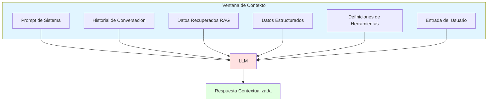

### Optimización de la Ventana

La ingeniería de contexto no solo se trata de _qué_ incluir, sino también de:

- **Cuándo** incluir cada componente
- **Cómo** estructurar la información para máxima claridad
- **Cuánto** de cada tipo de información es óptimo
- **Qué** información descartar para evitar sobrecarga

> [!warning] Sobrecarga de Contexto 
> Incluir demasiada información irrelevante puede ser tan perjudicial como no incluir información suficiente. La clave está en la **relevancia** y la **estructuración** del contenido.

---

## 3.5 Componentes y Pilares de la Ingeniería de Contexto

Diseñar el contexto ideal para un modelo requiere atender a varios **componentes fundamentales**. A continuación, se presentan los pilares o etapas clave en la construcción de un contexto eficaz [[08-Referencias#(Dhaliwal, 2025)|(Dhaliwal, 2025)]]:

### 3.5.1 Construcción de Contexto (Context Construction)

Este pilar se refiere a cómo **preparamos y estructuramos la información** antes de presentarla al modelo. Incluye:

- **Recuperación de información relevante**: Identificar qué datos o documentos son pertinentes para la consulta actual
- **Formato y estructuración**: Organizar la información de manera que el modelo la pueda procesar eficientemente
- **Enriquecimiento**: Agregar metadatos, etiquetas o anotaciones que ayuden al modelo a interpretar correctamente los datos

> [!example] Ejemplo en Investigación Al analizar un conjunto de artículos sobre cambio climático:
> 
> - **Recuperación**: Seleccionar solo los 5 papers más relevantes para la pregunta específica
> - **Formato**: Estructurar cada paper con su título, abstract, metodología y conclusiones principales
> - **Enriquecimiento**: Agregar año de publicación, factor de impacto, y número de citas

### 3.5.2 Compresión de Contexto (Context Compression)

A medida que las conversaciones se extienden o se acumula información, la ventana de contexto puede llenarse rápidamente. La **compresión de contexto** busca reducir el tamaño del contexto sin perder información crítica.

**Técnicas de compresión:**

- **Summarización**: Resumir información antigua o menos relevante
- **Eliminación de redundancias**: Detectar y eliminar información duplicada
- **Priorización**: Mantener solo los elementos más importantes basándose en relevancia

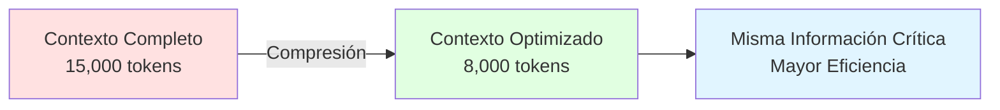

> [!tip] Cuándo Comprimir
> 
> - Cuando la conversación supera el 70% de la ventana de contexto
> - Al cambiar de tema o fase en la investigación
> - Antes de tareas que requieren mucho espacio de contexto adicional

### 3.5.3 Gestión de Contexto (Context Management)

La gestión de contexto implica **mantener, actualizar y organizar el contexto a lo largo del tiempo**, especialmente en conversaciones largas o sistemas multi-agente.

**Aspectos clave:**

- **Memoria a corto plazo**: Gestión del historial de la conversación actual
- **Memoria a largo plazo**: Información compartida entre conversaciones (preferencias del usuario, conocimiento persistente)
- **Actualización dinámica**: Incorporar nueva información relevante y descartar información obsoleta

> [!info] Arquitecturas de Memoria
> 
> - **Memoria a Corto Plazo**: Se refiere al historial de la conversación actual. Su gestión es clave para evitar la "sobrecarga de contexto"
> - **Memoria a Largo Plazo**: Información compartida _entre_ conversaciones, proporcionando al LLM un conocimiento persistente sobre un usuario o proyecto

**Ejemplo práctico:** En una sesión de análisis de literatura que dura varios días:

- _Memoria a corto plazo_: Los últimos 10 papers discutidos hoy
- _Memoria a largo plazo_: El campo de investigación del usuario, su estilo de citación preferido, papers ya revisados en sesiones anteriores

### 3.5.4 Optimización de Contexto (Context Optimization)

La optimización busca **mejorar continuamente la calidad y eficiencia del contexto** mediante la evaluación y refinamiento.

**Estrategias de optimización:**

- **Evaluación de relevancia**: Usar métricas para determinar qué información es más útil
- **Experimentación**: Probar diferentes configuraciones de contexto y medir resultados
- **Aprendizaje iterativo**: Ajustar el contexto basándose en el desempeño observado

> [!example]- Proceso de Optimización
> 
> 1. **Establecer línea base**: Medir el rendimiento con el contexto actual
> 2. **Identificar cuellos de botella**: ¿Qué información falta? ¿Qué sobra?
> 3. **Implementar cambios**: Ajustar la construcción del contexto
> 4. **Medir impacto**: Evaluar si las respuestas mejoraron
> 5. **Iterar**: Refinar basándose en los resultados

---

## 3.6 Generación Aumentada por Recuperación (RAG)

La **Generación Aumentada por Recuperación** (RAG, por sus siglas en inglés) es uno de los patrones arquitectónicos más importantes en la ingeniería de contexto y constituye una solución directa al problema de las alucinaciones.

> [!note] Definición: RAG 
> RAG es un patrón arquitectónico que obtiene datos de un sistema de recuperación de información (como una base de datos vectorial) y los proporciona a un LLM como contexto para **anclar** (_grounding_) y mejorar sus respuestas.

### 3.6.1 El Pipeline de RAG

El proceso RAG se compone de tres etapas fundamentales:

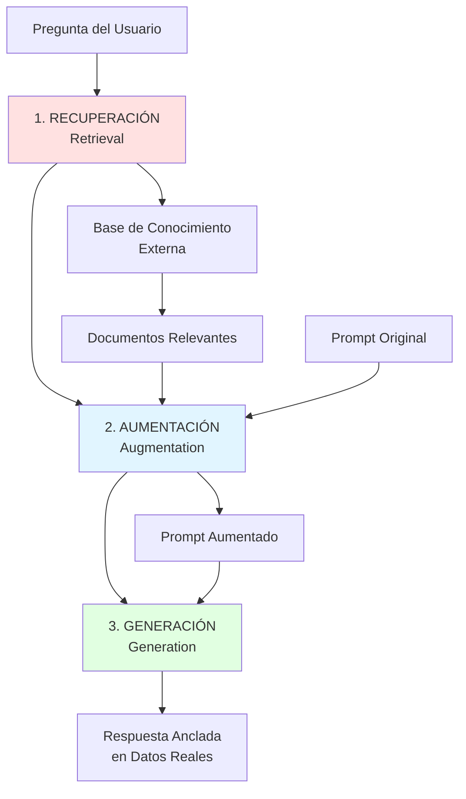

**1. [[09-Glosario#Retrieval|Recuperación]] (Retrieval):**

- Obtiene información relevante de una base de conocimiento externa
- Utiliza [[09-Glosario#Búsqueda Semántica|búsqueda semántica]] para encontrar los documentos o fragmentos más pertinentes
- Puede incluir múltiples fuentes: bases de datos, documentos, papers académicos

**2. [[09-Glosario#Aumentación|Aumentación]] (Augmentation):**

- Mejora el prompt del usuario añadiendo la información recuperada como contexto
- Estructura la información de manera que el modelo la pueda procesar efectivamente
- Combina la consulta original con los datos recuperados

**3. [[09-Glosario#Generación|Generación]] (Generation):**

- El LLM genera una respuesta final utilizando su conocimiento interno combinado con el contexto aumentado
- La respuesta está "anclada" en datos reales, reduciendo alucinaciones
- Puede incluir citas o referencias a las fuentes utilizadas

### 3.6.2 Por Qué RAG es Crucial para la Investigación

RAG es especialmente relevante para la investigación académica por varias razones:

> [!tip] Beneficios de RAG en Investigación
> 
> - **Mitigación de alucinaciones**: Ancla las respuestas en documentos reales y verificables
> - **Conocimiento actualizado**: Permite incorporar información reciente sin reentrenar el modelo
> - **Conocimiento especializado**: Acceso a literatura académica específica del dominio
> - **Trazabilidad**: Las respuestas pueden citarse y verificarse contra las fuentes originales
> - **Escalabilidad**: Se pueden agregar nuevos documentos sin modificar el modelo

**Ejemplo práctico:** Un investigador pregunta: _"¿Cuáles son los métodos más recientes para detectar fake news usando deep learning?"_

- **Sin RAG**: El modelo respondería basándose solo en su entrenamiento, posiblemente con información desactualizada o inventada
- **Con RAG**: El sistema recupera papers recientes sobre el tema, y el modelo genera una respuesta citando estudios específicos de 2024-2025

---

## 3.7 Construyendo un Sistema RAG Efectivo

Para implementar RAG exitosamente en investigación académica, debemos dominar varios componentes técnicos clave.

### 3.7.1 Fragmentación de Documentos (Chunking)

La **[[09-Glosario#Fragmentación|fragmentación]]** (_chunking_) es posiblemente **la decisión más crítica** en un sistema RAG. Una mala fragmentación destruye el significado y contextualización de la información.

> [!warning] La Importancia del Chunking 
> El chunking determina cómo se divide un documento largo en fragmentos más pequeños que pueden ser recuperados y proporcionados al modelo. Si los fragmentos son muy pequeños, pierden contexto; si son muy grandes, incluyen información irrelevante.

**Estrategias de fragmentación:**

1. **Tamaño Fijo**
    
    - Divide el texto en fragmentos de N tokens (ej. 512 tokens)
    - _Ventaja_: Simple de implementar
    - _Desventaja_: Puede cortar en medio de ideas importantes, ignorando estructura natural del texto
2. **Fragmentación Recursiva**
    
    - Respeta límites naturales como párrafos, secciones, capítulos
    - Intenta dividir primero por separadores más grandes (secciones), luego más pequeños (párrafos)
    - _Ventaja_: Mantiene coherencia semántica
    - _Desventaja_: Puede resultar en fragmentos de tamaños muy dispares
3. **Fragmentación Semántica**
    
    - Crea fragmentos basados en el **significado**, no en tamaño o estructura
    - Agrupa oraciones que tratan el mismo tema
    - _Ventaja_: Supera a menudo a otras estrategias en calidad de recuperación
    - _Desventaja_: Más complejo computacionalmente

> [!example]- Ejemplo: Fragmentando un Paper Académico 
> **Paper de 15 páginas sobre aprendizaje automático:**
> 
> **Opción 1 - Tamaño Fijo (1000 tokens cada uno):**
> 
> - Chunk 1: Introducción completa + mitad de Marco Teórico
> - Chunk 2: Segunda mitad de Marco Teórico + inicio de Metodología
> - ❌ Problema: El Chunk 2 mezcla dos temas diferentes
> 
> **Opción 2 - Recursiva:**
> 
> - Chunk 1: Introducción
> - Chunk 2: Marco Teórico
> - Chunk 3: Metodología
> - Chunk 4: Resultados
> - ✅ Cada chunk tiene significado completo
> 
> **Opción 3 - Semántica:**
> 
> - Chunk 1: Introducción + Pregunta de investigación
> - Chunk 2: Revisión de literatura sobre redes neuronales
> - Chunk 3: Revisión de literatura sobre procesamiento de lenguaje natural
> - Chunk 4: Descripción del dataset
> - ✅ Agrupa contenido por tema, no por estructura

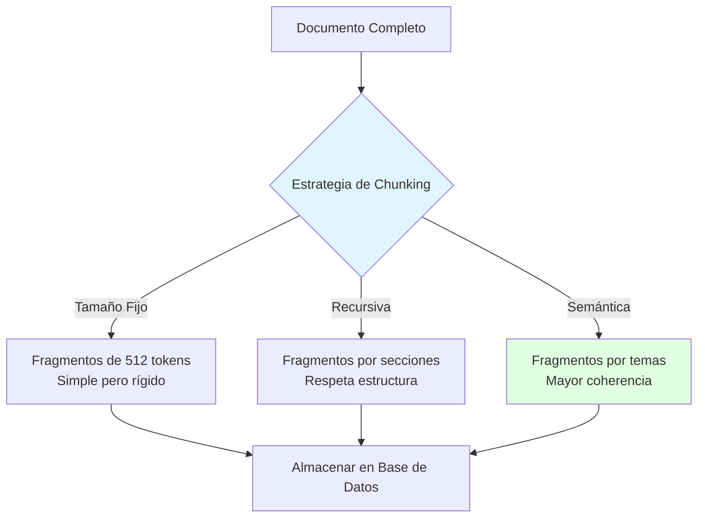

### 3.7.2 Embeddings Vectoriales y Búsqueda Semántica

Los **[[09-Glosario#Embeddings|embeddings]]** son la tecnología que hace posible la búsqueda semántica en sistemas RAG.

> [!info] ¿Qué son los Embeddings?
> Los embeddings transforman fragmentos de texto en **vectores numéricos** (listas de números) que capturan su esencia semántica. Textos con significado similar tendrán vectores cercanos en el espacio matemático.

**El proceso:**

1. **Creación de embeddings**: Cada fragmento de texto se convierte en un vector de alta dimensionalidad (ej. 768 o 1536 dimensiones)
2. **Almacenamiento**: Los vectores se guardan en una base de datos vectorial
3. **Búsqueda**: Cuando el usuario hace una pregunta, se convierte en un vector y se buscan los vectores más similares
4. **Recuperación**: Se devuelven los fragmentos de texto correspondientes a los vectores más cercanos

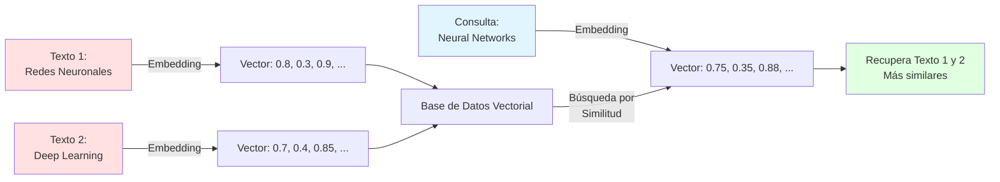

**Ventajas de la búsqueda semántica:**

- Encuentra información relacionada incluso con diferentes palabras
- No depende de coincidencias exactas de palabras clave
- Captura el significado conceptual de la consulta

**Ejemplo:**

- _Búsqueda tradicional_: "neural networks" solo encuentra documentos con esas palabras exactas
- _Búsqueda semántica_: "neural networks" también encuentra documentos sobre "deep learning", "redes neuronales", "artificial neural architectures"

### 3.7.3 Bases de Datos Vectoriales

Las **[[09-Glosario#Base de Datos Vectorial|bases de datos vectoriales]]** son sistemas especializados diseñados para almacenar y consultar vectores de embeddings de manera eficiente a escala.

> [!tip] Bases de Datos Vectoriales Populares
> 
> - **Pinecone**: Servicio gestionado en la nube, fácil de usar
> - **Chroma**: Open source, ideal para desarrollo local
> - **Weaviate**: Open source con búsqueda híbrida (vectorial + palabras clave)
> - **Qdrant**: Alto rendimiento, buena documentación
> - **Milvus**: Escalable para grandes volúmenes de datos

**Características clave:**

- **Búsqueda rápida**: Algoritmos optimizados para encontrar vectores similares (HNSW, IVF)
- **Escalabilidad**: Pueden manejar millones o miles de millones de vectores
- **Metadatos**: Permiten filtrar resultados por características adicionales (fecha, autor, tipo de documento)
- **Actualizaciones**: Fácil agregar, modificar o eliminar vectores

**Flujo completo de un sistema RAG con base de datos vectorial:**

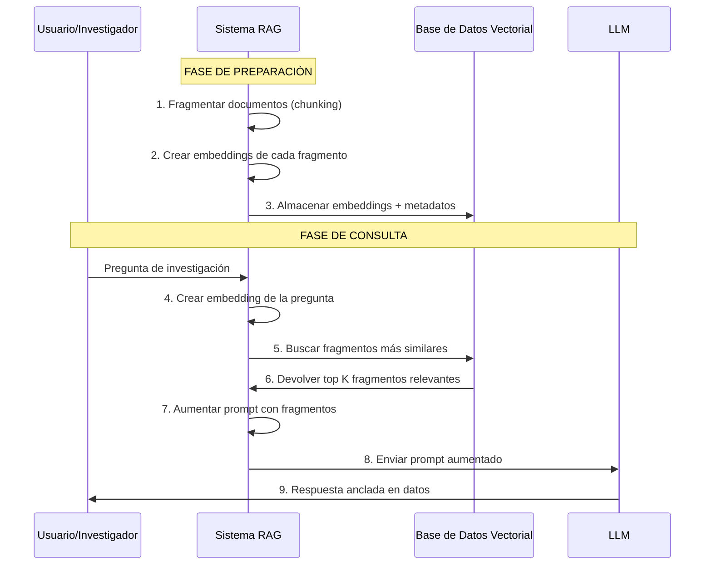

---

## 3.8 Ingeniería de Flujos de Trabajo

La **ingeniería de flujos de trabajo** se centra en la secuencia de llamadas al LLM y pasos no-LLM necesarios para completar una tarea compleja. En lugar de un solo prompt masivo, la tarea se descompone en pasos enfocados, cada uno con su propia ventana de contexto optimizada.

> [!important] Principio Fundamental
>  Las tareas complejas rara vez se resuelven bien con un solo prompt. La descomposición en pasos secuenciales, cada uno con su contexto optimizado, produce resultados superiores.

### 3.8.1 Descomposición de Tareas

**Ventajas de la descomposición:**

- Cada paso tiene un objetivo claro y específico
- El contexto se puede optimizar para cada fase
- Los errores se pueden detectar y corregir en etapas tempranas
- Mayor control sobre el proceso completo
- Resultados intermedios pueden ser validados por el usuario

> [!example]- Ejemplo: Flujo de Trabajo de Revisión de Literatura 
> **Consulta**: "Analiza los 10 artículos adjuntos y produce una revisión de la literatura sobre métodos de machine learning para diagnóstico médico"
> 
> **Descomposición en pasos:**
> 
> **Paso 1 - Resumir (10 llamadas paralelas)**
> 
> - Contexto: Cada artículo individual
> - Tarea: Generar resumen estructurado (objetivo, metodología, resultados, limitaciones)
> - Salida: 10 resúmenes de ~300 palabras cada uno
> 
> **Paso 2 - Sintetizar (1 llamada)**
> 
> - Contexto: Los 10 resúmenes + pregunta de investigación
> - Tarea: Identificar temas comunes, metodologías recurrentes, gaps en la literatura
> - Salida: Documento de síntesis con categorías temáticas
> 
> **Paso 3 - Redactar (1 llamada)**
> 
> - Contexto: Síntesis + lineamientos de formato académico
> - Tarea: Escribir revisión de literatura completa en formato académico
> - Salida: Documento final de 2000-3000 palabras
> 
> **Paso 4 - Validar y Refinar (opcional)**
> 
> - Contexto: Documento final + artículos originales
> - Tarea: Verificar citas, añadir referencias específicas
> - Salida: Versión final con citas precisas

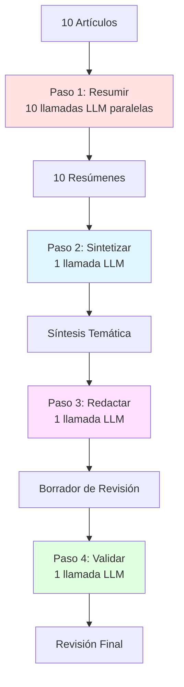

### 3.8.2 Ventajas sobre un Solo Prompt Masivo

Comparemos dos enfoques:

**Enfoque 1: Un Solo Prompt Masivo**

```markdown
Aquí están 10 artículos completos (50,000 palabras total). 
Analízalos y escribe una revisión de literatura.
```

❌ **Problemas:**

- Sobrecarga de contexto (puede exceder límites)
- El modelo debe hacer múltiples tareas simultáneamente
- Difícil identificar dónde falló si el resultado es insatisfactorio
- Sin validación intermedia
- Costoso en tokens si falla

**Enfoque 2: Flujo de Trabajo Estructurado**

```markdown
[Múltiples pasos secuenciales con contextos optimizados]
```

✅ **Ventajas:**

- Contexto optimizado en cada paso
- Validación intermedia posible
- Fácil identificar y corregir errores
- Resultados más consistentes y predecibles
- Más económico (reintenta solo el paso que falló)

> [!tip] Cuándo Usar Flujos de Trabajo
> 
> - Tareas que requieren más de 2-3 operaciones distintas
> - Cuando el resultado final depende de pasos intermedios verificables
> - Tareas que involucran grandes cantidades de documentos
> - Procesos que requieren diferentes "modos" del LLM (resumir, analizar, crear)

---

## 3.9 El Futuro: Hacia Sistemas Agénticos

El campo de la ingeniería de contexto se está moviendo hacia **[[09-Glosario#Sistemas Agénticos|sistemas agénticos]]** que pueden gestionar dinámicamente su propio contexto de forma autónoma.

> [!note] Definición:
> Sistemas Agénticos Los sistemas agénticos son aplicaciones de IA que pueden **tomar decisiones independientes** sobre qué información recuperar, qué mantener en memoria, qué descartar, y cómo optimizar su "presupuesto de atención" en tiempo real.

### 3.9.1 Características de los Sistemas Agénticos

**Autonomía en la gestión de contexto:**

- Deciden por sí mismos qué información recuperar de fuentes externas
- Determinan qué elementos del contexto son más relevantes en cada momento
- Ajustan dinámicamente la ventana de contexto según la tarea
- Pueden solicitar información adicional cuando la necesitan

**Ejemplo práctico:** Un agente de investigación autónomo:

1. Recibe consulta: "Investiga el impacto de la IA en la educación superior"
2. **Decide** buscar papers académicos recientes sobre el tema
3. **Evalúa** cuáles son más relevantes basándose en citas y metodología
4. **Determina** que necesita datos estadísticos adicionales
5. **Busca** en bases de datos educativas
6. **Sintetiza** la información manteniendo solo lo más relevante en contexto
7. **Genera** un informe estructurado

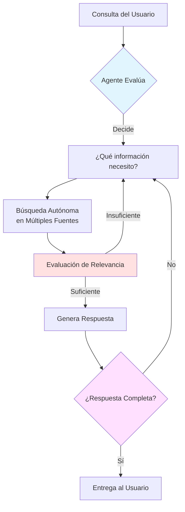

### 3.9.2 Gestión Dinámica del Contexto

Los sistemas agénticos implementan estrategias sofisticadas para optimizar su uso del contexto:

**1. Priorización inteligente:**

- Mantienen información crítica siempre disponible
- Comprimen o descartan información menos relevante
- Ajustan prioridades según el desarrollo de la conversación

**2. Recuperación proactiva:**

- Anticipan qué información podría necesitarse próximamente
- Pre-cargan datos relevantes antes de que se soliciten
- Mantienen índices actualizados de información disponible

**3. Presupuesto de atención:**

- Distribuyen el espacio limitado de contexto de forma óptima
- Balancean entre profundidad (detalle) y amplitud (cobertura)
- Ajustan el balance según la fase de la tarea

> [!important] La Ingeniería de Contexto es Fundamental 
> La ingeniería de contexto es el **requisito fundamental** para que estos sistemas agénticos se mantengan coherentes y efectivos. Sin una gestión robusta del contexto, los agentes autónomos pierden el hilo, se contradicen, o repiten trabajo ya realizado.

### 3.9.3 Aplicaciones en Investigación Académica

Los sistemas agénticos prometen revolucionar la investigación académica:

**Asistentes de investigación autónomos:**

- Realizan revisiones de literatura completas sin supervisión constante
- Identifican gaps en el conocimiento y sugieren direcciones de investigación
- Monitorean continuamente nueva literatura relevante
- Sintetizan hallazgos de múltiples fuentes de forma coherente

**Sistemas de análisis de datos:**

- Exploran datasets de forma autónoma buscando patrones
- Formulan y prueban hipótesis
- Generan visualizaciones relevantes
- Documentan el proceso de análisis

**Gestores de conocimiento:**

- Organizan automáticamente la biblioteca de papers del investigador
- Crean conexiones entre conceptos relacionados
- Sugieren lecturas basándose en el trabajo actual
- Mantienen actualizadas las notas y síntesis

> [!example]- Caso de Uso: Agente de Revisión Continua 
> **Escenario**: Un investigador trabaja en cambio climático y océanos
> 
> **El agente autónomo:**
> 
> 1. Monitorea diariamente nuevas publicaciones en journals relevantes
> 2. Evalúa cuáles son pertinentes al trabajo del investigador
> 3. Lee y resume automáticamente los papers relevantes
> 4. Identifica cómo se relacionan con trabajos previos del investigador
> 5. Actualiza la base de conocimiento con nueva información
> 6. Envía resumen semanal con hallazgos clave
> 7. Sugiere ajustes a hipótesis o metodología basándose en nuevos hallazgos
> 
> Todo esto manteniendo **coherencia contextual** a lo largo de semanas o meses.

---

## 3.10 Mejores Prácticas en Ingeniería de Contexto

Para cerrar este capítulo, presentamos un conjunto de **mejores prácticas** que todo investigador debe considerar al diseñar sistemas que utilicen ingeniería de contexto.

### 3.10.1 Principios Fundamentales

> [!tip] Principios de Diseño
> 
> 1. **Relevancia sobre Volumen**: Más contexto no siempre es mejor; contexto relevante es mejor
> 2. **Estructura Clara**: Organiza la información de forma que el modelo la pueda procesar fácilmente
> 3. **Iteración Constante**: Evalúa y refina continuamente tu estrategia de contexto
> 4. **Documentación**: Mantén registro de qué funciona y qué no
> 5. **Validación**: Verifica que el modelo esté utilizando correctamente el contexto proporcionado

### 3.10.2 Evitando Problemas Comunes

**1. Sobrecarga de Contexto:**

- ❌ Incluir todos los documentos relacionados
- ✅ Seleccionar solo los más relevantes basándose en búsqueda semántica

**2. Falta de Estructura:**

- ❌ Texto sin formato ni organización
- ✅ Usar encabezados, secciones, y marcadores claros

**3. Información Desactualizada:**

- ❌ Mantener en contexto información que ya no es relevante
- ✅ Implementar estrategias de actualización y poda del contexto

**4. Sin Validación:**

- ❌ Asumir que el modelo usa todo el contexto correctamente
- ✅ Probar y verificar que el modelo referencia apropiadamente el contexto

### 3.10.3 Optimización Progresiva

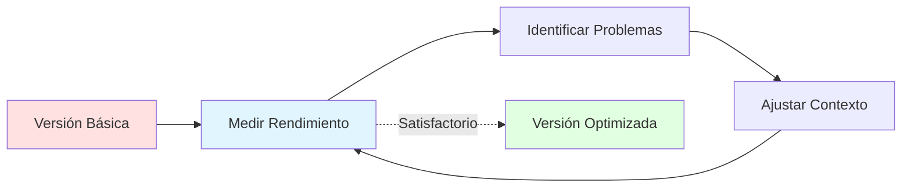

**Proceso de optimización:**

1. **Comenzar simple**: Implementa una versión básica funcional
2. **Medir**: Establece métricas claras (precisión, relevancia, coherencia)
3. **Identificar cuellos de botella**: ¿Dónde está fallando el sistema?
4. **Ajustar progresivamente**: Hacer cambios incrementales
5. **Validar mejoras**: Confirmar que los cambios mejoran el rendimiento
6. **Documentar**: Registrar qué funciona para futuras referencias

---

## 3.11 Conclusión del Capítulo

La **ingeniería de contexto** representa una evolución fundamental en cómo interactuamos con los modelos de lenguaje. Hemos transitado de simplemente formular buenas preguntas (ingeniería de prompts) a diseñar ecosistemas informativos completos que maximizan el potencial de la IA.

> [!success] Puntos Clave del Capítulo
> 
> - La ingeniería de contexto **supera las limitaciones** inherentes de los LLMs: falta de estado, alucinaciones, y fragilidad
> - **RAG** (Generación Aumentada por Recuperación) es fundamental para anclar respuestas en datos verificables
> - La **fragmentación** (chunking) y los **embeddings vectoriales** son tecnologías clave para sistemas RAG efectivos
> - Los **flujos de trabajo estructurados** producen mejores resultados que prompts masivos únicos
> - Los **sistemas agénticos** representan el futuro: IA que gestiona su propio contexto de forma autónoma
> - La calidad del contexto es ahora **más importante** que el tamaño del modelo

Para el investigador académico, dominar la ingeniería de contexto significa:

- Obtener respuestas más precisas y verificables de herramientas de IA
- Reducir significativamente las alucinaciones
- Construir flujos de trabajo reproducibles y escalables
- Aprovechar al máximo las bases de conocimiento existentes
- Prepararse para las herramientas agénticas del futuro

> [!quote] Reflexión Final 
> "La ingeniería de prompts es _lo que se hace dentro_ de la ventana de contexto, mientras que la ingeniería de contexto es _cómo se decide qué llena_ esa ventana".

En el próximo capítulo, exploraremos cómo aplicar estos principios de ingeniería de contexto específicamente a la **revisión de literatura con IA**, una de las tareas más demandantes y valiosas en la investigación académica.

---