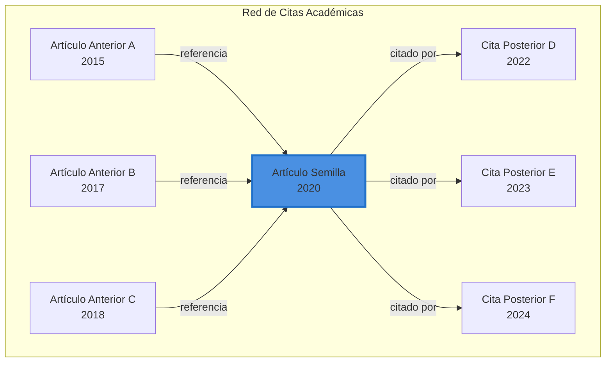
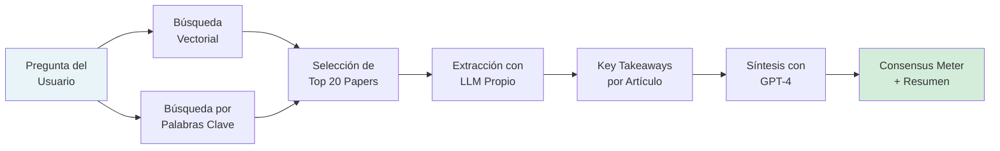
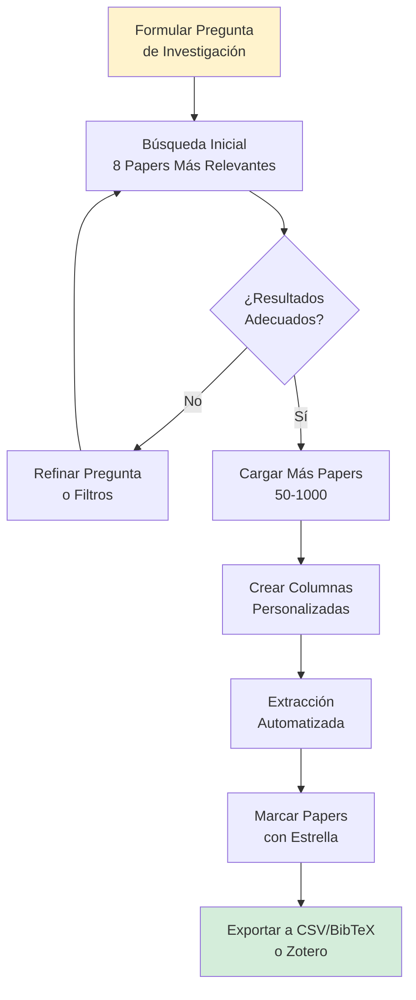
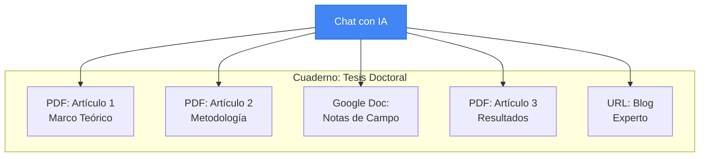
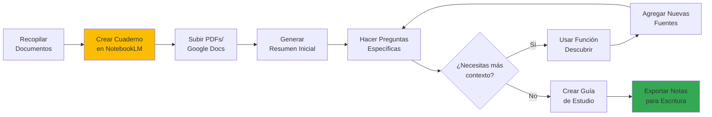
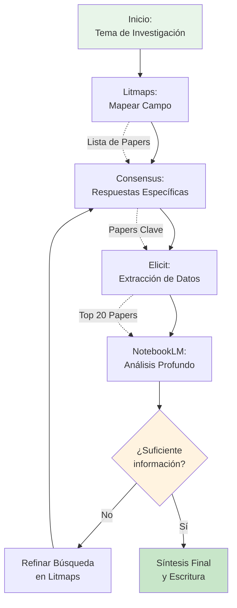

# Capítulo 4: Herramientas de IA para la revisión de literatura

La revisión de la literatura ha sido históricamente uno de los procesos más demandantes en la investigación académica. Identificar artículos relevantes, sintetizar hallazgos clave y mantener el ritmo con las publicaciones emergentes requiere dedicación considerable [[08-Referencias#(Zhang et al., 2023)|(Zhang et al., 2023)]]. Sin embargo, la IA generativa está transformando radicalmente este panorama, introduciendo herramientas que no solo aceleran el proceso, sino que amplían nuestra capacidad de descubrir conexiones y patrones en la literatura científica.

En este capítulo, exploraremos cuatro herramientas fundamentales que, utilizadas en conjunto, crean un ecosistema completo para la revisión de literatura: **Litmaps** para la visualización y descubrimiento del panorama investigativo, **Consensus** para la búsqueda semántica y síntesis de evidencia, **Elicit** para la extracción sistemática de datos, y **NotebookLM** para el análisis profundo de tus propios documentos. Cada una representa una etapa diferente del proceso investigativo, y su integración estratégica puede revolucionar tu flujo de trabajo académico.

## 4.1 Visualización y descubrimiento: **Litmaps**

Uno de los mayores desafíos al iniciar una revisión de literatura es comprender el panorama general del campo de estudio. ¿Cuáles son los trabajos seminales? ¿Qué líneas de investigación están emergiendo? ¿Existen artículos clave que no hemos identificado? **Litmaps** aborda estas preguntas mediante la visualización interactiva de redes de citación.

> [!info] ¿Qué es Litmaps?
> 
> Litmaps es una plataforma de visualización de literatura científica que transforma las relaciones de citación entre artículos en mapas interactivos. Su propósito es ayudar a los investigadores a "descubrir artículos que no sabían que necesitaban conocer" mediante la exploración visual de conexiones académicas [[08-Referencias#(Litmaps, 2024)|(Litmaps, 2024)]].

### 4.1.1 Fundamentos del Mapeo de Citas

La red de citación académica es un grafo complejo donde cada artículo representa un nodo, y las referencias y citaciones forman las aristas que los conectan [[08-Referencias#(Chen, 2006)|(Chen, 2006)]]. Litmaps aprovecha esta estructura para revelar patrones que serían imposibles de detectar mediante búsquedas tradicionales.

### 4.1.2 Flujo de Trabajo en Litmaps

El proceso de descubrimiento en Litmaps sigue un enfoque iterativo y expansivo:

**1. Búsqueda Inicial**

Comienza ingresando términos relacionados con tu tema de investigación o el DOI de un artículo específico. La herramienta accede a bases de datos académicas para identificar trabajos relevantes.

**2. Selección de Artículos Semilla**

Identifica entre 3 y 5 artículos fundamentales para tu investigación. Estos artículos semilla actúan como puntos de anclaje desde los cuales se expandirá tu mapa. Es recomendable seleccionar artículos con un número significativo de citas, ya que esto indica su influencia en el campo.

**3. Generación del Mapa**

Al hacer clic en "Explorar Artículos Relacionados", Litmaps analiza las referencias citadas y las citaciones posteriores de tus artículos semilla, presentando los resultados como nodos interconectados en un espacio visual.

**4. Refinamiento Iterativo**

A medida que exploras el mapa, puedes:

- **Agregar artículos relevantes** con la función "More Like This", lo que refinará las recomendaciones
- **Etiquetar con colores** diferentes subtemas o categorías temáticas
- **Filtrar por año, autor, revista** o métricas de impacto (en versión Pro)
- **Activar monitoreo automático** para recibir alertas cuando se publiquen nuevos trabajos relacionados

> [!tip] Estrategias Avanzadas
> 
> Los usuarios de la versión Pro pueden cambiar el algoritmo de búsqueda para encontrar:
> 
> - **Citas compartidas**: Artículos que referencian los mismos trabajos que tus semillas
> - **Autores comunes**: Publicaciones de investigadores que han trabajado en temas similares
> - **Similitud textual**: Artículos con contenido semántico relacionado
> 
> Además, los filtros avanzados permiten segmentar por H-Index, cuartil SJR y año de publicación para enfocarte en trabajos de alto impacto.

### 4.1.3 Aplicación práctica: Caso de uso

Imagina que investigas sobre "aprendizaje automático aplicado a diagnóstico médico". Comenzarías seleccionando 3-4 artículos seminales como semillas. Litmaps generaría un mapa mostrando:

- **Artículos anteriores** que establecieron las bases teóricas
- **Trabajos contemporáneos** que comparten enfoques metodológicos
- **Publicaciones recientes** que están extendiendo el campo
- **Clusters temáticos** que revelan subdisciplinas emergentes

Este panorama visual te permite identificar no solo qué leer, sino también comprender la evolución temporal del campo y detectar brechas de investigación.

## 4.2 Búsqueda semántica y síntesis: Consensus

Una vez que comprendes el panorama de tu campo, el siguiente paso es obtener respuestas precisas a preguntas específicas. Aquí es donde **Consensus** brilla, transformando la búsqueda de literatura de un proceso de exploración a uno de respuesta directa.

> [!info] ¿Qué es Consensus?
>
> Consensus es un motor de búsqueda académico potenciado por modelos generativos que analiza más de 200 millones de artículos científicos para extraer y sintetizar respuestas directas a preguntas de investigación [[08-Referencias#(Consensus, 2024)|(Consensus, 2024)]]. A diferencia de los buscadores tradicionales que simplemente listan resultados, Consensus interpreta el contenido de los artículos y presenta el consenso científico sobre un tema.

### 4.2.1 Arquitectura de búsqueda

Consensus combina tres tecnologías clave para proporcionar respuestas precisas:

### 4.2.2 Tipos de búsqueda efectiva

La clave para maximizar el valor de Consensus es formular preguntas en lenguaje natural, como si consultaras a un experto en el campo:

**Preguntas de Sí/No**

- _¿La creatina mejora el rendimiento cognitivo?_
- _¿El cambio climático afecta la biodiversidad marina?_

**Relaciones Causales o Correlacionales**

- _¿Cuál es el impacto del microbioma intestinal en la salud mental?_
- _¿Cómo afecta la meditación a la neuroplasticidad?_

**Análisis Comparativos**

- _¿Qué es más efectivo para la ansiedad: terapia cognitivo-conductual o medicación?_

> [!example]- Ejemplo de Búsqueda Avanzada
> 
> **Pregunta**: _¿La inteligencia artificial puede predecir el riesgo cardiovascular mejor que los métodos tradicionales?_
> 
> Consensus analizaría decenas de estudios clínicos y metaanálisis, extrayendo:
> 
> - Los hallazgos específicos de cada estudio
> - Las métricas de rendimiento comparativas
> - Las limitaciones metodológicas
> - El nivel de acuerdo entre investigadores
> 
> Finalmente presentaría un **Consensus Meter** indicando si la mayoría de estudios respaldan la hipótesis, junto con un resumen narrativo de los hallazgos clave.

### 4.2.3 El Consensus Meter: Interpretando el acuerdo científico

Una característica distintiva de Consensus es su indicador visual del nivel de acuerdo en la literatura. Este medidor analiza los resultados de múltiples estudios y muestra:

- **Alto consenso positivo**: La mayoría de estudios respaldan la afirmación
- **Consenso mixto**: Los resultados están divididos o son contradictorios
- **Alto consenso negativo**: La mayoría de estudios refutan la afirmación
- **Evidencia insuficiente**: No hay suficientes estudios para determinar consenso

> [!warning] Consideraciones Críticas
> 
> Si bien Consensus es una herramienta poderosa, es esencial mantener el pensamiento crítico:
> 
> - El consenso científico puede cambiar con nuevas evidencias
> - Los modelos generativos pueden ocasionalmente malinterpretar matices metodológicos
> - Siempre verifica los artículos originales para decisiones cruciales
> - El consenso no equivale a verdad absoluta, especialmente en campos emergentes

---

## 4.3 Extracción sistemática de datos: Elicit

Cuando la revisión de literatura requiere un enfoque más estructurado y cuantitativo, _Elicit_ ofrece capacidades de extracción de datos que van mucho más allá de la simple lectura de artículos.

> [!info] ¿Qué es Elicit?
> 
> Elicit es un asistente de investigación basado en IA generativa que automatiza el proceso de revisión sistemática de literatura [[08-Referencias#(Elicit, 2024)|(Elicit, 2024)]]. A diferencia de herramientas de búsqueda tradicionales, Elicit no solo encuentra artículos relevantes, sino que extrae datos específicos de cada uno, organizándolos en tablas personalizables para análisis comparativo. Con acceso a más de 125 millones de artículos académicos, es especialmente potente para investigaciones empíricas en biomedicina, ciencias sociales y machine learning [[08-Referencias#(Nikolaev, 2024)|(Nikolaev, 2024)]].

### 4.3.1 Capacidades de búsqueda semántica

Elicit utiliza búsqueda semántica en lugar de coincidencia exacta de palabras clave. Esto significa que comprende el significado conceptual de tu pregunta, no solo los términos literales [[08-Referencias#(Academia Insider, 2024)|(Academia Insider, 2024)]]. Por ejemplo:

- **Búsqueda tradicional**: "diabetes treatment efficacy"
- **Búsqueda semántica en Elicit**: _¿Qué intervenciones son más efectivas para controlar la glucosa en pacientes con diabetes tipo 2?_

La herramienta identifica estudios relevantes incluso si utilizan terminología diferente (por ejemplo, "terapias para control glucémico" o "manejo de hiperglucemia").

### Flujo de Trabajo con Elicit

**1. Iniciar búsqueda**

Accede a `elicit.org` y crea tu cuenta. Comienza con la función "Find Papers" e ingresa tu pregunta de investigación en lenguaje natural.

**2. Revisión de resultados iniciales**

Elicit presenta los 8 artículos más relevantes con:

- **Resúmenes generados por IA** que destacan hallazgos clave
- **Puntuación de relevancia** basada en similitud semántica
- **Metadatos** como año, autores, revista y número de citas

**3. Aplicar filtros**

Refina los resultados usando filtros de:

- **Tipo de estudio** (RCT, observacional, metaanálisis, etc.)
- **Año de publicación**
- **Conteo de citas** (para enfocarte en trabajos influyentes)
- **Fuente de acceso** (open access vs. paywall)

**4. Extracción de datos personalizada**

Esta es la característica distintiva de Elicit. Puedes crear columnas personalizadas para extraer información específica de cada artículo:

- **Tamaño de muestra**
- **Metodología utilizada**
- **Principales hallazgos**
- **Limitaciones reportadas**
- **Variables de resultado medidas**

> [!example]+ Ejemplo de Extracción Personalizada
> 
> Imagina que estás investigando _"efectividad de intervenciones digitales para salud mental en adolescentes"_. Podrías crear las siguientes columnas personalizadas:
> 
> |Paper|Tipo de Intervención|Edad de Participantes|Tamaño de Muestra|Duración del Estudio|Medida de Resultado|Mejora Observada|
> |---|---|---|---|---|---|---|
> |Smith et al. 2023|App de mindfulness|13-17 años|N=245|8 semanas|PHQ-9|Reducción 34%|
> |Lee et al. 2024|Chatbot de TCC|15-18 años|N=180|12 semanas|GAD-7|Reducción 28%|
> 
> Elicit extrae automáticamente esta información de los abstracts y, en planes Pro, del texto completo de los artículos.

**5. Validación con citas**

Para cada dato extraído, Elicit proporciona la cita textual del artículo original, permitiéndote verificar la precisión de la extracción [[08-Referencias#(BMC Medical Research, 2025)|(BMC Medical Research, 2025)]]. Esta transparencia es crucial para mantener el rigor académico.

**6. Organización y exportación**

- **Marcar con estrella** los papers más relevantes para revisión posterior
- **Exportar datos** en formato CSV para análisis estadístico
- **Exportar referencias** en formato BibTeX para gestores como Zotero
- **Integración directa** con Zotero para sincronización automática

### 4.3.2 Limitaciones y consideraciones

> [!warning] Aspectos a tener en cuenta
> 
> Si bien Elicit es una herramienta poderosa, presenta limitaciones importantes:
> 
> - **Cobertura de base de datos**: Aunque tiene acceso a 125 millones de artículos, puede no incluir publicaciones muy recientes o de journals especializados [[08-Referencias#(Nikolaev, 2024)|(Nikolaev, 2024)]]
> - **Precisión de extracción**: Un estudio encontró que Elicit identificó solo el 17.6% de estudios incluidos en una revisión sistemática tradicional, aunque también detectó 3 artículos relevantes que habían sido omitidos [[08-Referencias#(BMC Medical Research, 2025)|(BMC Medical Research, 2025)]]
> - **Variabilidad en respuestas**: Formular la misma pregunta con ligeras variaciones puede producir resultados diferentes
> - **Verificación necesaria**: La extracción automatizada requiere validación humana, especialmente para decisiones críticas
> - **Enfoque empírico**: Funciona mejor con investigación cuantitativa que con estudios teóricos o cualitativos

### 4.3.3 Casos de uso óptimos

Elicit es particularmente efectivo para:

- **Revisiones sistemáticas** que requieren extracción de datos estructurados 
- **Metaanálisis** donde necesitas compilar estadísticas de múltiples estudios 
- **Análisis de tendencias** investigativas a lo largo del tiempo 
- **Identificación de brechas** metodológicas en la literatura 
- **Screening inicial** de grandes volúmenes de literatura

---

## 4.4 Asistencia personalizada con tus documentos: NotebookLM

Las herramientas anteriores trabajan con bases de datos externas masivas. Pero ¿qué sucede cuando necesitas analizar profundamente tu propia colección de documentos? Aquí es donde _NotebookLM_ se convierte en tu asistente de investigación personal.

> [!info] ¿Qué es NotebookLM?
> 
> _NotebookLM_ es una sistema de IA generativa de Google, diseñada para funcionar exclusivamente con las fuentes que tú proporcionas [[08-Referencias#(Google, 2024)|(Google, 2024)]]. A diferencia de ChatGPT o Claude que tienen conocimiento general, NotebookLM no sabe nada excepto lo que está en tus documentos. Esto lo convierte en un asistente confiable que nunca "alucina" información externa a tus fuentes.

### 4.4.1 Filosofía de diseño: Tu conocimiento, tu asistente

La propuesta de valor de NotebookLM radica en su enfoque de _"source-grounded AI"_ (IA fundamentada en fuentes, o grounding). Cada respuesta que genera está directamente vinculada a fragmentos específicos de tus documentos, lo que permite:

- **Verificación inmediata** de la procedencia de cada afirmación
- **Reducción de alucinaciones** sobre contenido que no existe en tus fuentes
- **Análisis confiable** para trabajos académicos donde la precisión es crucial

### 4.4.2 Estructura de trabajo: Cuadernos y fuentes

NotebookLM organiza tu investigación en _cuadernos_ (_notebooks_), cada uno pudiendo contener hasta 50 fuentes de diversos tipos:

- **PDFs**: Artículos académicos, libros, reportes
- **Google Docs**: Notas de investigación, borradores
- **Google Slides**: Presentaciones de conferencias
- **URLs**: Páginas web, blogs académicos
- **Archivos de texto**: Transcripciones, datos cualitativos
- **Audio** (en versión experimental): Grabaciones de entrevistas

### Funcionalidades Principales

**1. Preguntas y respuestas contextualizadas**

Puedes interrogar a tus documentos de manera natural:

- _"Según el paper de Smith (2021), ¿cuál es la principal limitación metodológica?"_
- _"¿Qué autores coinciden en la definición de resiliencia organizacional?"_
- _"Compara los hallazgos del estudio A y el estudio B sobre X variable"_

Cada respuesta incluye _citas inline_ que vinculan directamente al fragmento específico del documento fuente.

**2. Generación de resúmenes estructurados**

NotebookLM puede crear diferentes tipos de síntesis:

> [!tip]+ Tipos de Resúmenes Disponibles
> 
> - **Resumen General**: Síntesis de todos los documentos del cuaderno
> - **Guía de Estudio**: Conceptos clave organizados por tema con preguntas de repaso
> - **Tabla de Contenidos**: Estructura jerárquica de temas presentes en las fuentes
> - **Cronograma**: Línea temporal de eventos mencionados en los documentos
> - **Briefing Document**: Resumen ejecutivo al estilo periodístico

**3. Mapas mentales y visualizaciones**

La función de generación de notas puede crear esquemas visuales de las relaciones conceptuales presentes en tus fuentes, útiles para:

- Identificar conexiones entre conceptos
- Preparar presentaciones
- Estructurar capítulos de tesis

**4. Podcasts conversacionales (Audio Overviews)**

Una de las características más innovadoras es la capacidad de generar un "podcast" donde dos voces de IA discuten el contenido de tus fuentes en un formato conversacional de 5-10 minutos. Esto es útil para:

- Revisar material mientras haces otras actividades
- Obtener una perspectiva diferente sobre tu investigación
- Compartir resúmenes accesibles con colaboradores no especializados

**5. Función descubrir (Discover)**

NotebookLM puede sugerir fuentes externas adicionales basándose en el contenido de tu cuaderno. Esta función combina tu corpus local con búsqueda en la web para identificar:

- Artículos relacionados que podrías haber omitido
- Autores clave en el campo
- Conceptos emergentes conectados a tu investigación

### 4.4.3 Flujo de Trabajo Integrado

### Caso de uso: Preparación de marco teórico

Imagina que estás escribiendo el marco teórico de tu tesis sobre "adopción de tecnología educativa". Podrías:

1. **Cargar 20-30 artículos clave** sobre modelos de adopción tecnológica (TAM, UTAUT, etc.)
2. **Generar una guía de estudio** que identifique los constructos teóricos principales
3. **Preguntar**: _"¿Cuáles son las diferencias fundamentales entre el modelo TAM y UTAUT según estos artículos?"_
4. **Solicitar**: _"Crea una tabla comparativa de las variables predictoras utilizadas en cada estudio"_
5. **Usar la función Descubrir** para identificar trabajos recientes que extienden estos modelos
6. **Generar un podcast** para repasar los conceptos mientras te trasladas

> [!note] Privacidad de Datos
> 
> Tus fuentes en NotebookLM son privadas por defecto. Google usa el contenido para generar respuestas, pero no para entrenar sus modelos de IA generativa. Sin embargo, siempre verifica las políticas de privacidad antes de subir datos sensibles o confidenciales.

## Integrando el ecosistema: Un flujo de trabajo completo

La verdadera potencia de estas herramientas emerge cuando las usamos de manera integrada, aprovechando las fortalezas únicas de cada una. A continuación, proponemos un _flujo de trabajo completo_ para una revisión de literatura robusta:

### Fase 1: Descubrimiento del panorama (Litmaps)

**Objetivo**: Mapear el campo de investigación e identificar trabajos clave

1. Busca 3-5 artículos seminales sobre tu tema
2. Crea un Litmap para visualizar la red de citación
3. Identifica clusters temáticos y artículos altamente citados
4. Exporta una lista de 30-50 artículos relevantes

**Salida**: Lista de artículos candidatos organizados por subtemas

### Fase 2: Búsqueda de respuestas específicas (Consensus)

**Objetivo**: Obtener síntesis directas sobre preguntas específicas de investigación

1. Formula preguntas concretas basadas en tu marco teórico
2. Usa Consensus para identificar el consenso científico
3. Analiza el Consensus Meter para cada pregunta
4. Toma notas de los key takeaways de artículos individuales

**Salida**: Respuestas fundamentadas con nivel de acuerdo científico

### Fase 3: Extracción sistemática de datos (Elicit)

**Objetivo**: Crear tablas estructuradas con información comparativa

1. Ingresa tu pregunta de investigación en Elicit
2. Refina con filtros (tipo de estudio, años, etc.)
3. Crea columnas personalizadas para datos relevantes
4. Marca con estrella los papers más importantes
5. Exporta la tabla a CSV para análisis

**Salida**: Base de datos estructurada de hallazgos clave

### Fase 4: Análisis profundo de documentos clave (NotebookLM)

**Objetivo**: Analizar detalladamente tus artículos seleccionados

1. Crea un cuaderno temático (ej: "Marco Teórico")
2. Sube los 15-20 artículos más relevantes identificados
3. Genera un resumen general para orientarte
4. Haz preguntas comparativas entre artículos
5. Crea guías de estudio para conceptos complejos
6. Usa la función Descubrir para identificar fuentes adicionales

**Salida**: Comprensión profunda con citas verificables

### Fase 5: Síntesis y escritura

**Objetivo**: Redactar tu revisión de literatura

1. Usa las tablas de Elicit como base para secciones comparativas
2. Cita las síntesis de Consensus para afirmaciones generales
3. Incorpora el mapa de Litmaps para explicar la evolución del campo
4. Consulta NotebookLM para verificar detalles específicos
5. Valida todas las citas con los documentos originales

### Ejemplo Aplicado: Revisión sobre IA en educación

Supongamos que tu pregunta de investigación es: _"¿Cómo están utilizando las universidades la IA generativa para personalizar el aprendizaje?"_

**Con Litmaps**:

- Descubres que hay 3 líneas principales: sistemas de tutoría inteligente, análisis de aprendizaje adaptativo, y chatbots educativos
- Identificas que el 60% de las publicaciones son posteriores a 2020
- Encuentras 5 autores clave que publican constantemente

**Con Consensus**:

- Preguntas: _"¿Los sistemas de IA generativa personalizados mejoran el rendimiento estudiantil?"_
- El Consensus Meter muestra 78% de acuerdo positivo
- Identificas que la mayoría de estudios reportan mejoras de 15-25% en métricas de aprendizaje

**Con Elicit**:

- Extraes datos de 60 estudios sobre: tipo de IA usada, tamaño de muestra, mejora en rendimiento, disciplina académica
- Detectas que la mayoría de estudios se concentran en STEM (70%) vs. humanidades (30%)
- Identificas una brecha: pocos estudios longitudinales (>6 meses)

**Con NotebookLM**:

- Analizas los 15 papers más citados en profundidad
- Preguntas: _"¿Cuáles son las limitaciones éticas mencionadas en estos estudios?"_
- Generas una guía de estudio sobre los modelos de IA más utilizados
- Creas un podcast para repasar antes de escribir

**Resultado**: Una revisión de literatura completa, respaldada por datos estructurados, consenso científico, visualización del campo, y análisis profundo de fuentes clave.

## Consideraciones finales y mejores prácticas

> [!warning] Limitaciones de los sistemas de IA generativa
> 
> Aunque estas sistemas son poderosos, es fundamental mantener una perspectiva crítica:
> 
> - **No reemplazan el juicio académico**: La IA generativa puede identificar patrones, pero el investigador debe interpretar y contextualizar
> - **Sesgos algorítmicos**: Los modelos de búsqueda pueden favorecer ciertos tipos de publicaciones o fuentes
> - **Verificación necesaria**: Siempre valida las citas y afirmaciones con los documentos originales
> - **Actualización constante**: Las bases de datos tienen retrasos, consulta también fuentes tradicionales
> - **Complemento, no sustituto**: Usa estos sistemas junto con métodos tradicionales de revisión

### Principios para el uso ético

1. **Transparencia**: Menciona en tu metodología qué herramientas de IA generativa utilizaste
2. **Verificación**: No confíes ciegamente en las extracciones automatizadas
3. **Diversidad de fuentes**: No dependas exclusivamente de una herramienta
4. **Citación adecuada**: Cita los artículos originales, no las síntesis de la IA generativa
5. **Actualización continua**: Mantén tus búsquedas actualizadas con monitoreo activo

Al integrar estratégicamente Litmaps, Consensus, Elicit y NotebookLM en tu flujo de trabajo, transformas la revisión de literatura de una tarea abrumadora en un proceso sistemático, eficiente y profundo. Estas herramientas no solo te ahorran tiempo, sino que expanden tu capacidad de descubrir conexiones, sintetizar hallazgos y construir sobre el conocimiento existente de manera más sofisticada que nunca.

El futuro de la investigación académica no consiste en que la IA generativa reemplace a estudiantes, docentes e investigador, sino en que estén equipados con IA generativa y puedan lograr descubrimientos que antes eran imposibles [[08-Referencias#(Zhang et al., 2023)|(Zhang et al., 2023)]]. Con las herramientas exploradas en este capítulo, ese futuro ya está aquí.

---

**🧭 Navegación:** [[03-Ingeniería-Contexto|⬅️ Capítulo 3]] | [[05-Sistema-Integracion|Siguiente: Capítulo 5 ➡️]]

---

  
  

