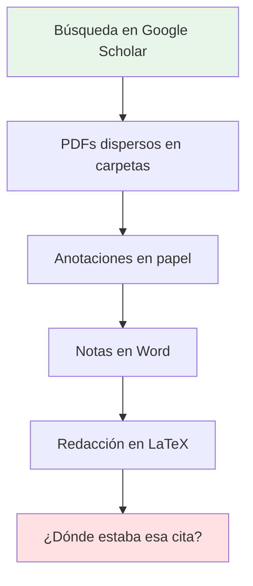
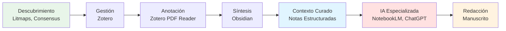
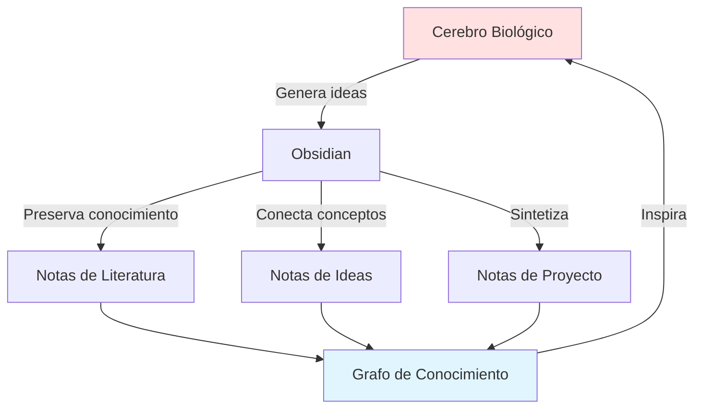
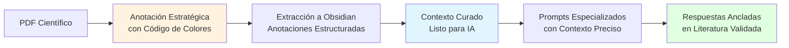
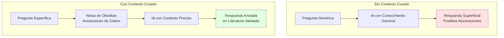
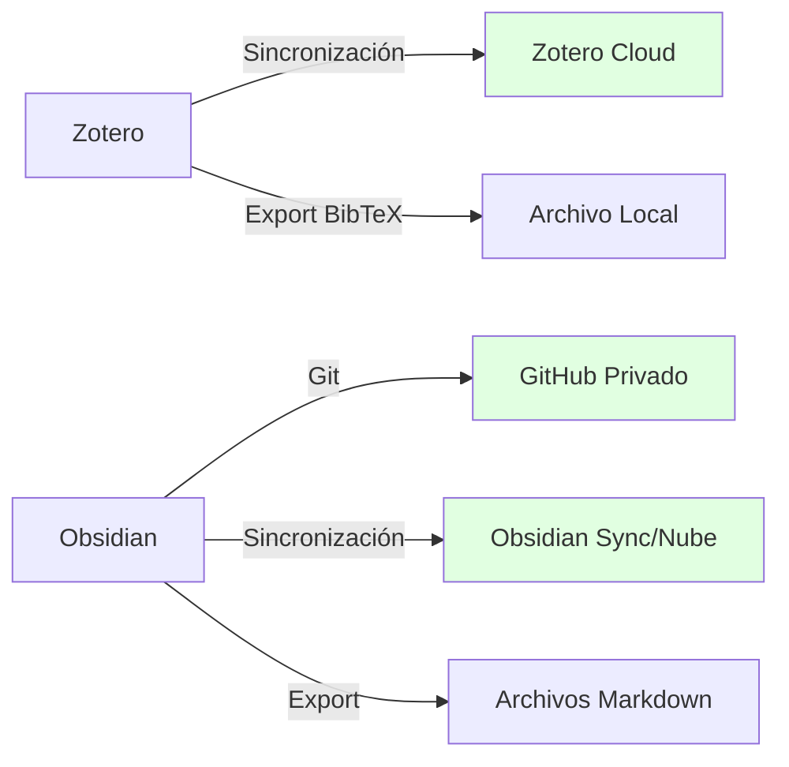
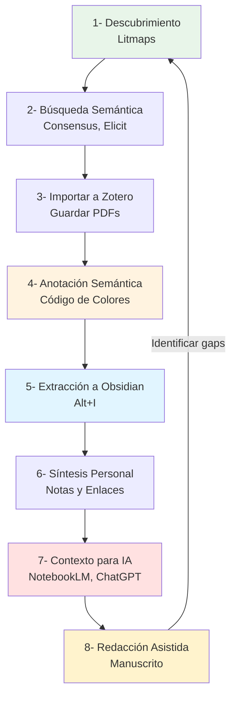

# Capítulo 5: Sistema Integrado de Investigación con IA

> [!abstract] Introducción al capítulo
> En los capítulos anteriores hemos explorado herramientas de IA de forma individual: cómo usarlas, qué ofrecen y en qué destacan. Sin embargo, el verdadero poder transformador emerge cuando **integramos estratégicamente estas herramientas** en un sistema cohesivo que potencia cada etapa del proceso investigativo. Este capítulo presenta una metodología completa para construir un ecosistema de investigación donde [[09-Glosario#Zotero|Zotero]], [[09-Glosario#Obsidian|Obsidian]] y herramientas de IA convergen para transformar la gestión del conocimiento y la síntesis de evidencia científica.

---

## 5.1 La Necesidad de un Sistema Integrado

La investigación científica contemporánea enfrenta un doble desafío: la **creciente avalancha de publicaciones** y la necesidad de **integrar herramientas de IA de manera eficaz y rigurosa**. Según Zhang et al. (2023), el volumen de literatura académica se duplica aproximadamente cada 9 años, lo que hace prácticamente imposible que un investigador individual mantenga el ritmo de publicaciones incluso dentro de su sub-especialidad [[08-Referencias#(Zhang et al., 2023)|(Zhang et al., 2023)]].

### 5.1.1 Los Problemas de los Flujos de Trabajo Fragmentados

Los investigadores típicamente emplean múltiples herramientas de forma aislada:



**Consecuencias de esta fragmentación:**

- ⚠️ **Pérdida de información**: Anotaciones dispersas entre papel, PDF y documentos digitales
- ⚠️ **Duplicación de esfuerzo**: Re-leer artículos porque no recordamos qué anotamos
- ⚠️ **Dificultad para sintetizar**: Sin conexiones explícitas entre conceptos
- ⚠️ **Fricción en la escritura**: Buscar manualmente citas y referencias
- ⚠️ **Subutilización de IA**: Interacciones genéricas sin contexto específico

> [!warning] El Costo de la Desorganización
> Un estudio de 2022 encontró que los investigadores dedican aproximadamente **23% de su tiempo** simplemente buscando información que ya habían encontrado previamente. Esta ineficiencia es directamente atribuible a sistemas de gestión del conocimiento inadecuados.

### 5.1.2 La Visión: Un Ecosistema Cohesivo

En contraste, un **sistema integrado** crea un flujo continuo desde el descubrimiento hasta la publicación:



**Características del sistema integrado:**

✅ **Centralización**: Toda la información en un lugar
✅ **Estructuración**: Anotaciones clasificadas semánticamente
✅ **Conexión**: Enlaces bidireccionales entre conceptos
✅ **Contextualización**: Base de conocimiento para IA
✅ **Automatización**: Flujos de trabajo reproducibles

---

## 5.2 Los Pilares del Sistema: Zotero y Obsidian

Antes de integrar IA avanzada, debemos construir una **base sólida** de gestión del conocimiento. Los dos pilares fundamentales son Zotero (gestión de referencias) y Obsidian ([[09-Glosario#PKM|gestión de conocimiento personal]]).

### 5.2.1 Zotero: El Repositorio Central de Literatura

> [!info] ¿Qué es Zotero?
> Zotero es un gestor de referencias bibliográficas de código abierto que no solo organiza citas, sino que también actúa como un **repositorio central de documentos PDF** donde realizamos anotaciones estructuradas.

**Funciones clave en nuestro sistema:**

1. **Captura automática**: Guarda referencias desde navegadores con un solo clic
2. **Almacenamiento de PDFs**: Vincula documentos a sus metadatos bibliográficos
3. **Lector integrado**: Permite anotar PDFs directamente en Zotero
4. **Sincronización**: Mantiene tu biblioteca accesible en múltiples dispositivos
5. **Generación de bibliografías**: Exporta referencias en múltiples formatos (APA, Chicago, etc.)

**Por qué Zotero y no otras opciones:**

| Característica           | Zotero          | Mendeley    | EndNote      |
| ------------------------ | --------------- | ----------- | ------------ |
| **Open Source**          | ✅ Sí            | ❌ No        | ❌ No         |
| **Gratuito**             | ✅ Completo      | ⚠️ Limitado | ❌ Pago       |
| **Plugins**              | ✅ Extenso       | ⚠️ Limitado | ⚠️ Limitado  |
| **Privacidad**           | ✅ Total control | ⚠️ Elsevier | ⚠️ Clarivate |
| **Integración Obsidian** | ✅ Excelente     | ⚠️ Básica   | ❌ Ninguna    |

### 5.2.2 Obsidian: El Grafo de Conocimiento Personal

> [!info] ¿Qué es Obsidian?
> Obsidian es una aplicación de gestión del conocimiento personal ([[09-Glosario#PKM|PKM]]) que utiliza archivos [[09-Glosario#Markdown|Markdown]] locales para crear un **[[09-Glosario#Grafo de Conocimiento|grafo de conocimiento]] interconectado**. A diferencia de aplicaciones basadas en la nube, Obsidian te da control total sobre tus datos.

**Funciones clave en nuestro sistema:**

1. **Notas en Markdown**: Formato simple, universal y durable
2. **Enlaces bidireccionales**: Crear conexiones entre conceptos
3. **Visualización de grafos**: Ver relaciones entre notas
4. **Plugins**: Extender funcionalidad (crucial: Zotero Integration)
5. **Búsqueda potente**: Encontrar información rápidamente
6. **Plantillas**: Estandarizar estructura de notas

**La filosofía del "Second Brain":**

Obsidian implementa el concepto de **"[[09-Glosario#Segundo Cerebro|segundo cerebro]]"** (_Second Brain_) popularizado por Tiago Forte: un sistema externo que extiende nuestra memoria y capacidad de pensamiento [[08-Referencias#(Forte, 2022)|(Forte, 2022)]].



> [!tip] Ventajas de Obsidian para Investigación
> - **Privacidad**: Tus datos permanecen locales en tu computadora
> - **Longevidad**: Archivos Markdown son legibles por cualquier editor
> - **Velocidad**: Sin dependencia de internet o servidores
> - **Flexibilidad**: Personalizable mediante plugins y CSS
> - **Escalabilidad**: Maneja miles de notas sin degradación de rendimiento

---

## 5.3 El Puente: Integrando Zotero con Obsidian

La integración entre Zotero y Obsidian es el **núcleo tecnológico** de nuestro sistema. Esta conexión se logra mediante dos plugins esenciales:

### 5.3.1 Better BibTeX (BBT): El Identificador Único

**[[09-Glosario#Better BibTeX|Better BibTeX]]** genera **[[09-Glosario#Citekey|citekeys]]** únicas y legibles para cada referencia en tu biblioteca de Zotero. Una citekey es un identificador único (ej: `Smith2023EffectsAI`) que:

- Permanece constante incluso si modificas los metadatos
- Es legible por humanos (no un ID numérico aleatorio)
- Sirve como nombre de archivo en Obsidian
- Crea un vínculo permanente entre Zotero y Obsidian

> [!example] Ejemplo de Citekey
> **Artículo**: "The Effects of Artificial Intelligence on Scientific Discovery" por Jane Smith (2023)
> **Citekey generada**: `smith2023EffectsArtificial`
>
> Esta citekey se usa como:
> - Nombre de archivo en Obsidian: `smith2023EffectsArtificial.md`
> - Identificador único en bases de datos
> - Referencia en textos académicos

**Instalación de Better BibTeX:**

1. Descargar el archivo `.xpi` desde [retorque.re/zotero-better-bibtex](https://retorque.re/zotero-better-bibtex/installation/)
2. En Zotero: **Herramientas** → **Extensiones**
3. Arrastrar el `.xpi` a la ventana de extensiones
4. Reiniciar Zotero

**Configuración recomendada:**

- **Formato de citekey**: `[auth:lower][year][veryshorttitle:lower]`
- **Actualización automática**: Activada
- **Caché de exportación**: Activado para rendimiento

### 5.3.2 Zotero Integration Plugin para Obsidian

Este plugin permite **importar automáticamente** referencias y anotaciones de Zotero a Obsidian con un simple atajo de teclado.

**Capacidades principales:**

- **Importación de metadatos**: Título, autores, año, revista, DOI, abstract
- **Extracción de anotaciones**: Subrayados y comentarios del PDF
- **Plantillas personalizables**: Define la estructura de las notas
- **Actualización automática**: Sincroniza cambios en Zotero

**Instalación:**

1. En Obsidian: **Configuración** → **Community plugins** → **Browse**
2. Buscar "Zotero Integration"
3. Instalar y activar
4. Configurar ruta de conexión a Zotero

---

## 5.4 El Corazón del Sistema: Ingeniería de Contexto mediante Anotación Semántica

Aquí reside el **pilar metodológico** de este sistema: la **[[09-Glosario#Ingeniería de Contexto|ingeniería de contexto]]** (_context engineering_). A diferencia de las interacciones convencionales con IA, que carecen de un marco de referencia específico, este sistema alimenta al modelo exclusivamente con información que el investigador ha preseleccionado y validado.

### 5.4.1 El Concepto: De Anotaciones a Contexto Curado

La mayoría de investigadores subrayan y comentan PDFs de forma intuitiva. Sin embargo, cuando estas anotaciones son **clasificadas estratégicamente**, se convierten en un **corpus de datos estructurado** listo para alimentar sistemas de IA.

**La diferencia fundamental:**

| Anotación Tradicional | [[09-Glosario#Anotación Semántica|Anotación Semántica]] |
|---|---|
| Subrayados sin estructura | Clasificación por categorías |
| Comentarios dispersos | Taxonomía consistente |
| Difícil de sintetizar | Fácil de consultar y filtrar |
| No exportable | Exportable a formatos estructurados |
| IA sin contexto | IA con contexto preciso |




### 5.4.2 Sistema de Clasificación por Colores

Proponemos un **código de colores semántico** que clasifica anotaciones según su función epistemológica en el argumento científico:

> [!info] Taxonomía de Anotaciones

| Color           | Significado                    | Uso                                              | Ejemplo                                 |
| --------------- | ------------------------------ | ------------------------------------------------ | --------------------------------------- |
| 🔵 **Azul**     | Definiciones y Conceptos Clave | Terminología técnica, definiciones operacionales | "La neuroplasticidad se define como..." |
| 🟡 **Amarillo** | Ideas Principales y Argumentos | Tesis central, hipótesis, claims principales     | "Proponemos que la IA puede..."         |
| 🟢 **Verde**    | Evidencia y Datos              | Resultados, estadísticas, ejemplos empíricos     | "N=250, p<0.05, η²=0.43"                |
| 🔴 **Rojo**     | Críticas y Limitaciones        | Debilidades metodológicas, gaps identificados    | "Sin embargo, el estudio carece de..."  |
| 🟣 **Morado**   | Metodologías                   | Diseños experimentales, técnicas analíticas      | "Empleamos un diseño RCT con..."        |
| 🌸 **Rosa**     | Citas Textuales                | Frases para citar directamente                   | "Como señala Smith: 'la IA...'"         |
| 🟠 **Naranja**  | Preguntas de Investigación     | Brechas, futuras líneas, interrogantes           | "¿Cómo se podría aplicar esto a...?"    |
| ⚪ **Gris**      | Contexto Adicional             | Información complementaria, referencias cruzadas | "Ver también el trabajo de Jones..."    |
|                 |                                |                                                  |                                         |

**Principios de aplicación:**

1. **Consistencia**: Aplicar siempre los mismos colores para los mismos tipos de información
2. **Selectividad**: No subraya todo; solo lo esencial
3. **Comentarios**: Añadir tus propias reflexiones además del color
4. **Etiquetas**: Usar tags en Zotero para categorías temáticas adicionales

> [!example]- Ejemplo: Anotando un Paper sobre Machine Learning en Medicina
>
> **Abstract del paper:**
> "El aprendizaje profundo ha demostrado resultados prometedores en el diagnóstico de imágenes médicas. En este estudio, entrenamos una red neuronal convolucional (CNN) con 10,000 radiografías de tórax para detectar neumonía. Nuestro modelo alcanzó una precisión del 94.3% (IC 95%: 93.1-95.5%), superando el desempeño de radiólogos individuales (87.2%). Sin embargo, identificamos limitaciones importantes en la generalización a poblaciones sub-representadas en el conjunto de entrenamiento."
>
> **Anotaciones aplicadas:**
>
> - 🔵 **Azul**: "red neuronal convolucional (CNN)" → Definición de técnica
> - 🟡 **Amarillo**: "ha demostrado resultados prometedores" → Argumento principal
> - 🟢 **Verde**: "precisión del 94.3% (IC 95%: 93.1-95.5%)" → Evidencia cuantitativa
> - 🟢 **Verde**: "10,000 radiografías" → Datos del estudio
> - 🔴 **Rojo**: "limitaciones importantes en la generalización" → Crítica identificada
> - 🟣 **Morado**: "entrenamos una red neuronal" → Metodología

### 5.4.3 El Proceso de Anotación en Zotero

**Flujo de trabajo paso a paso:**

1. **Abrir PDF en Zotero**
    - Hacer doble clic en el ítem de la biblioteca
    - Se abre el lector integrado de Zotero

2. **Seleccionar texto relevante**
    - Arrastrar el cursor sobre el texto de interés

3. **Aplicar color semántico**
    - Clic en el color correspondiente a la categoría
    - El texto queda subrayado con ese color

4. **Añadir comentario (opcional pero recomendado)**
    - Clic derecho en el subrayado → "Add Comment"
    - Escribir tu interpretación, reflexión o conexión con otros trabajos

5. **Etiquetar (opcional)**
    - En el panel derecho: añadir tags temáticos (ej: #metodología, #resultados-clave)

> [!tip] Estrategia de Lectura Eficiente
>
> **Primera pasada (Skimming - 10 minutos):**
> - Leer abstract, introducción, conclusiones
> - Marcar solo 🟡 Amarillo las ideas principales
>
> **Segunda pasada (Lectura profunda - 30-60 minutos):**
> - Leer metodología y resultados completos
> - Aplicar todos los colores restantes
> - Añadir comentarios reflexivos
>
> **Tercera pasada (Síntesis - 15 minutos):**
> - Revisar todas las anotaciones
> - Añadir tag final: ⭐ `#revisado` cuando termines

---

## 5.5 Extracción y Estructuración en Obsidian

Una vez que hemos anotado estratégicamente un artículo en Zotero, el siguiente paso es **extraer ese conocimiento curado** a Obsidian, donde se integra a nuestro grafo de conocimiento.

### 5.5.1 El Comando Mágico: Alt + I

La integración Zotero-Obsidian se materializa con un simple atajo:

**Atajo**: `Alt + I` (Windows/Linux) o `Cmd + Shift + I` (Mac)

**Lo que sucede:**

1. Se abre un buscador conectado a tu biblioteca de Zotero
2. Escribes autor o título del artículo
3. Seleccionas la referencia
4. Presionas Enter
5. **¡Magia!** → Se crea automáticamente una nota completa en Obsidian

---

## 5.6 De la Curación a la Generación: IA con Contexto Preciso

Aquí es donde todo converge: las anotaciones estratégicas realizadas en Zotero, extraídas y estructuradas en Obsidian, se convierten en **contexto de alta calidad para sistemas de IA**.

### 5.6.1 El Problema de la IA sin Contexto

Cuando usamos ChatGPT, Claude o cualquier LLM de forma genérica:

❌ El modelo responde basándose en su conocimiento general (entrenado hasta cierta fecha)
❌ Puede "alucinar" información sobre estudios que no existen
❌ No tiene acceso a literatura especializada de tu campo
❌ No conoce los matices de tu pregunta de investigación
❌ Las respuestas son superficiales y genéricas

> [!warning] Ejemplo de Alucinación sin Contexto
> **Prompt sin contexto**: "¿Qué dice la literatura sobre el efecto de la IA en la productividad científica?"
>
> **Respuesta típica del LLM**: "Varios estudios han demostrado que la IA puede aumentar la productividad científica entre un 30-40%. Por ejemplo, Smith et al. (2023) encontraron que los laboratorios que usan IA publican 2.3 veces más que los que no la usan..."
>
> ❌ **Problema**: Estos estudios y estadísticas pueden ser completamente inventados.

### 5.6.2 El Poder del Contexto Curado

Cuando proporcionamos las notas estructuradas de Obsidian como contexto:

✅ El modelo responde **exclusivamente basándose en tus fuentes**
✅ Cada afirmación está **anclada a literatura real y verificable**
✅ Las respuestas son **específicas a tu campo y pregunta**
✅ Puedes **validar cada claim** revisando las anotaciones originales
✅ La IA se convierte en un **asistente especializado** en tu tema



### 5.6.3 Flujo de Trabajo: De Obsidian a ChatGPT/NotebookLM

**Opción 1: Usando ChatGPT o Claude**

1. **Seleccionar notas relevantes** en Obsidian (2-5 papers relacionados con tu pregunta)
2. **Copiar el contenido completo** de esas notas (Ctrl+A, Ctrl+C)
3. **Abrir ChatGPT/Claude** en tu navegador
4. **Pegar las notas** como contexto
5. **Usar plantilla de prompt** (ver sección 5.6.4)

**Opción 2: Usando [[09-Glosario#NotebookLM|NotebookLM]] (Recomendado)**

1. **Crear un cuaderno** temático en NotebookLM
2. **Exportar notas** de Obsidian como PDFs o usar Google Docs
3. **Subir documentos** al cuaderno (hasta 50 fuentes)
4. **Hacer preguntas** directamente a tus fuentes
5. **Generar síntesis** automáticas con citas

> [!tip] Ventaja de NotebookLM
> NotebookLM está diseñado específicamente para trabajar con **tus propias fuentes**, garantizando que cada respuesta esté anclada en los documentos que subiste. Esto elimina prácticamente las alucinaciones.

### 5.6.4 Plantilla de Prompt para Síntesis Académica

El siguiente prompt ha sido diseñado específicamente para trabajar con notas estructuradas de Obsidian:

```markdown
**Rol:**
Actúa como un académico experto en [Tu disciplina].

**Contexto:**
La información adjunta proviene de mi base de conocimiento personal, específicamente de anotaciones realizadas durante la revisión de literatura para mi investigación sobre [Tu tema de investigación].

Las anotaciones fueron clasificadas de acuerdo al siguiente código de colores:

| Color | Significado |
|-------|-------------|
| 🔵 Azul | Definiciones y Conceptos Clave |
| 🟡 Amarillo | Ideas Principales y Argumentos Centrales |
| 🟢 Verde | Evidencia, Datos y Ejemplos de Soporte |
| 🔴 Rojo | Críticas, Limitaciones o Debilidades |
| 🟣 Morado | Metodologías y Enfoques Teóricos |
| 🌸 Rosa | Citas Relevantes o Frases Textuales |
| 🟠 Naranja | Preguntas de Investigación o Futuras Líneas |

**Fuentes incluidas:**
[Adjunto/Pegado a continuación las notas de Obsidian de 3-5 papers]

---

**Objetivo:**
Tu tarea es realizar una síntesis crítica e integrativa a partir de la información adjunta.

**Instrucciones por Pasos:**

1. **Análisis Comparativo**:
   - Identifica puntos de convergencia y divergencia en los argumentos presentados
   - Detecta patrones metodológicos comunes
   - Identifica debates o controversias en la literatura

2. **Síntesis Elaborada**:
   - Redacta [1-3] párrafo(s) académico(s) que integre estas ideas de forma coherente
   - No te limites a resumir; genera una nueva perspectiva (insight) que conecte los argumentos
   - Si hay contradicciones, discútelas explícitamente

3. **Identificación de Brechas**:
   - Señala qué aspectos no han sido abordados suficientemente
   - Identifica preguntas de investigación emergentes

4. **Atribución Rigurosa**:
   - Asegúrate de que cada afirmación esté correctamente citada en formato APA 7
   - Usa los metadatos proporcionados en las notas (Autor, Año)
   - Formato: (Autor, Año) o Autor (Año) según corresponda

**Formato de Salida:**
Retorna:
- Un texto de aproximadamente [Número de palabras] palabras
- Sustentado exclusivamente en la información proporcionada
- Apropiado para un [Tipo de documento: tesis, artículo, revisión de literatura]
- Con tono académico formal

**Restricciones importantes:**
- NO inventes ni añadas información que no esté en las fuentes proporcionadas
- NO generalices más allá de lo que los estudios permiten
- SI un punto requiere evidencia que no está en las fuentes, indícalo explícitamente
```

> [!example]- Ejemplo de Uso Completo
>
> **Contexto**: Estás escribiendo el marco teórico de tu tesis sobre "IA en educación personalizada"
>
> **Paso 1**: En Obsidian, seleccionas 4 notas:
> - `smith2023AIEducation.md`
> - `garcia2024PersonalizedLearning.md`
> - `jones2023AdaptiveSystems.md`
> - `brown2024EducationalAI.md`
>
> **Paso 2**: Copias el contenido completo de estas 4 notas
>
> **Paso 3**: Abres NotebookLM y creas un cuaderno "Marco Teórico - IA Educación"
>
> **Paso 4**: Pegas las notas o subes los archivos
>
> **Paso 5**: Usas el prompt de síntesis especificando:
> - Disciplina: "Tecnología Educativa"
> - Tema: "sistemas de IA para personalización del aprendizaje"
> - Longitud: "800 palabras"
> - Documento: "capítulo de tesis doctoral"
>
> **Paso 6**: Revisas la síntesis generada
>
> **Paso 7**: Verificas cada cita contra las notas originales
>
> **Paso 8**: Si es necesario, iteras pidiendo que se enfoque más en un aspecto o que añada más evidencia de cierto paper

---

## 5.7 Casos de Uso Avanzados

Una vez dominado el flujo básico, podemos aprovechar el sistema para tareas más sofisticadas.

### 5.7.1 Redacción de Secciones de Manuscritos

**Caso de uso**: Escribir la sección "Trabajo Relacionado" de un paper

**Flujo:**

1. Seleccionar 10-15 papers clave sobre el tema
2. Extraer todas las notas a Obsidian
3. En Obsidian, crear una nota de "Síntesis - Trabajo Relacionado"
4. Copiar extractos de las anotaciones 🟡 Amarillo (ideas principales) de todos los papers
5. Usar prompt de síntesis pidiendo que agrupe los trabajos por categorías temáticas
6. Revisar y refinar iterativamente

**Prompt específico:**

```markdown
Basándote en las notas de literatura adjuntas, redacta la sección "Trabajos Relacionados" de un artículo de investigación sobre [Tu tema].

Organiza la sección en las siguientes subsecciones:
1. Enfoques basados en [Método A]
2. Enfoques basados en [Método B]
3. Estudios comparativos

Para cada subsección:
- Presenta los trabajos en orden cronológico o de relevancia
- Destaca las contribuciones clave de cada trabajo
- Identifica limitaciones que tu trabajo abordará
- Cita apropiadamente en formato APA 7

Longitud objetivo: 1,200 palabras
Tono: Académico, objetivo, crítico pero respetuoso
```

### 5.7.2 Análisis de Gaps en la Literatura

**Caso de uso**: Identificar brechas de investigación para justificar tu estudio

**Flujo:**

1. Reunir notas de papers recientes en tu campo (20-30)
2. Filtrar específicamente las anotaciones 🔴 Rojo (limitaciones) y 🟠 Naranja (preguntas futuras)
3. Exportar solo esas anotaciones a un documento
4. Usar IA para identificar patrones en las limitaciones reportadas

**Prompt específico:**

```markdown
Analiza las limitaciones y preguntas de investigación futuras reportadas en los siguientes papers [adjuntos].

Tu tarea es:
1. Identificar patrones: ¿Hay limitaciones que múltiples estudios reportan?
2. Clasificar las brechas en:
   - Brechas metodológicas (técnicas que faltan)
   - Brechas teóricas (conceptos no explorados)
   - Brechas empíricas (contextos no estudiados)
   - Brechas prácticas (aplicaciones no implementadas)

3. Para cada brecha identificada:
   - Lista qué papers la mencionan (con citas)
   - Evalúa su importancia (alta/media/baja)
   - Sugiere cómo podría ser abordada

Formato de salida: Tabla comparativa + análisis narrativo de 600 palabras
```

### 5.7.3 Generación de Tablas Comparativas

**Caso de uso**: Crear tabla comparando metodologías de diferentes estudios

**Flujo:**

1. Extraer anotaciones 🟣 Morado (metodologías) de 8-12 estudios
2. Usar IA para estructurar en tabla comparativa

**Prompt específico:**

```markdown
Con base en las metodologías descritas en las notas adjuntas, genera una tabla comparativa con las siguientes columnas:

| Estudio (Autor, Año) | Diseño | Muestra (N) | Variables Independientes | Variables Dependientes | Análisis Estadístico | Principales Hallazgos |

Instrucciones:
- Extrae la información exactamente como aparece en las fuentes
- Si algún dato no está disponible, indica "No reportado"
- Ordena los estudios cronológicamente
- Después de la tabla, escribe un párrafo de 200 palabras analizando:
  * Diseños más comunes
  * Tamaños de muestra típicos
  * Convergencia en las variables medidas
```

### 5.7.4 Preparación de Presentaciones

**Caso de uso**: Crear diapositivas para un seminario sobre tu revisión de literatura

**Flujo:**

1. Usar las anotaciones 🌸 Rosa (citas relevantes) para crear frases impactantes
2. Usar las anotaciones 🟢 Verde (evidencia) para crear gráficos de datos
3. Usar la visualización de grafo de Obsidian para mostrar conexiones entre conceptos

**Prompt para títulos de diapositivas:**

```markdown
Basándote en la síntesis de literatura adjunta, genera:

1. Un título atractivo para la presentación (10-15 palabras)
2. Títulos para 8 diapositivas principales que cuenten una historia coherente
3. Para cada diapositiva, sugiere:
   - 3-4 bullets principales
   - 1 gráfico o diagrama a incluir
   - 1 cita impactante (de las disponibles en las notas)

La presentación es para: [audiencia] en [contexto]
Duración: 20 minutos
Enfoque: [persuasivo/informativo/crítico]
```

---

## 5.8 Mejores Prácticas y Consejos Avanzados

### 5.8.1 Mantenimiento del Sistema

> [!tip] Higiene del Sistema
>
> **Revisión semanal (30 minutos):**
> - Verificar que todos los papers leídos tienen anotaciones extraídas a Obsidian
> - Actualizar enlaces entre notas relacionadas
> - Revisar y refinar tags
> - Identificar qué papers requieren segunda lectura
>
> **Revisión mensual (2 horas):**
> - Crear notas de síntesis de temas principales
> - Actualizar el grafo de conocimiento
> - Identificar clusters temáticos emergentes
> - Exportar backups de Obsidian y Zotero
>
> **Revisión semestral (4 horas):**
> - Auditar la consistencia en el uso de colores
> - Refinar taxonomía de tags si es necesario
> - Crear índice maestro de tu campo
> - Documentar insights longitudinales

### 5.8.2 Versionado y Respaldo

**Estrategia de backup:**



**Recomendaciones:**

1. **Zotero**: Usar la sincronización oficial (300 MB gratis) o WebDAV
2. **Obsidian**: Configurar Git para control de versiones (método avanzado) o usar Obsidian Sync (pago)
3. **Backups locales**: Exportar semanalmente a carpeta en la nube (Dropbox, Google Drive)

### 5.8.3 Colaboración en Equipo

**Para proyectos colaborativos:**

- **Zotero Groups**: Crear grupo compartido con bibliotecas sincronizadas
- **Convenciones compartidas**: Acordar código de colores y taxonomía de tags
- **Obsidian compartido**: Usar un repositorio Git compartido o carpeta sincronizada
- **Plantillas unificadas**: Estandarizar estructura de notas en todo el equipo

### 5.8.4 Escalabilidad: De 10 a 1,000 Papers

| Escala | Estrategia |
|---|---|
| **10-50 papers** | Estructura básica, una carpeta en Obsidian |
| **50-200 papers** | Subcarpetas por tema, uso intensivo de tags |
| **200-500 papers** | Notas de índice temático, mapas de contenido (MOCs) |
| **500-1000+ papers** | Base de datos con Dataview plugin, queries automáticas |

**Plugin recomendado para gran escala: Dataview**

Permite crear "vistas" dinámicas de tus notas con queries tipo SQL:

```dataview
TABLE
  file.name AS Paper,
  year AS Año,
  length(file.outlinks) AS "Conexiones"
FROM #revisado
WHERE contains(tags, "#IA-educacion")
SORT year DESC
```

---

## 5.9 Integración con el Ecosistema Completo de Herramientas de IA

Finalmente, cerramos el círculo integrando este sistema con las herramientas exploradas en el Capítulo 4.

### 5.9.1 Flujo Completo de Investigación



**Descripción de cada etapa:**

**1. Descubrimiento (Litmaps)**
- Crear mapa de citación para visualizar campo
- Identificar papers seminales y clusters temáticos
- Exportar lista de candidatos

**2. Búsqueda Semántica (Consensus, Elicit)**
- Responder preguntas específicas con Consensus
- Extraer datos estructurados con Elicit
- Identificar papers clave para lectura profunda

**3. Importación a Zotero**
- Añadir PDFs con plugin de navegador
- Verificar metadatos completos
- Organizar en colecciones temáticas

**4. Anotación Semántica**
- Aplicar código de colores consistentemente
- Añadir comentarios reflexivos
- Etiquetar con tags

**5. Extracción a Obsidian**
- Alt+I para importar
- Verificar que todas las anotaciones se importaron
- Completar sección de síntesis personal

**6. Síntesis Personal**
- Crear enlaces entre conceptos relacionados (`[[notaRelacionada]]`)
- Escribir tus propias reflexiones
- Crear notas de índice temático

**7. Contexto para IA**
- Seleccionar notas relevantes
- Subir a NotebookLM o copiar a ChatGPT/Claude
- Usar prompts estructurados

**8. Redacción Asistida**
- Generar borradores de secciones
- Iterar y refinar con ayuda de IA
- Validar todas las citas con fuentes originales

**Loop de retroalimentación:**
- Al redactar, identificas nuevos gaps → regresas a descubrimiento
- Ciclo iterativo hasta completar el manuscrito

### 5.9.2 Ejemplo de Integración: De la Búsqueda a la Publicación

> [!example]- Caso Completo: Tesis Doctoral en Psicología Educativa
>
> **Tema**: "Efectividad de Intervenciones de Mindfulness en la Reducción de Ansiedad Estudiantil"
>
> **Semana 1-2: Descubrimiento**
> - Litmaps: Mapa con 5 papers seminales sobre mindfulness en educación
> - Identificar 50 papers candidatos
> - Consensus: "¿El mindfulness reduce la ansiedad en estudiantes universitarios?"
>   - Resultado: 78% consenso positivo, 45 estudios analizados
>
> **Semana 3-4: Búsqueda Detallada**
> - Elicit: Extraer datos de 30 estudios
>   - Columnas: Intervención, Duración, Muestra, Medida de Resultado, Efecto
>   - Exportar tabla a CSV
> - Importar los 30 PDFs a Zotero
>
> **Semana 5-8: Lectura y Anotación**
> - Leer y anotar 5 papers por semana
> - Aplicar código de colores consistentemente
> - Al final: 30 papers completamente anotados
>
> **Semana 9: Extracción y Síntesis**
> - Extraer todos los papers a Obsidian (Alt+I × 30)
> - Crear nota de índice: `Mindfulness-AnxietyReduction-Index.md`
> - Enlazar todas las notas relevantes
>
> **Semana 10: Análisis con IA**
> - NotebookLM: Crear cuaderno "Marco Teórico"
> - Subir las 30 notas de Obsidian
> - Generar resumen automático
> - Hacer preguntas específicas:
>   - "¿Cuáles son las metodologías más comunes?"
>   - "¿Qué medidasde resultado se usan frecuentemente?"
>   - "¿Cuáles son las limitaciones reportadas?"
>
> **Semana 11-12: Redacción del Marco Teórico**
> - Usar ChatGPT con contexto de notas para redactar borradores
> - Secciones generadas:
>   1. Definición de mindfulness (basada en anotaciones 🔵)
>   2. Fundamentos teóricos (basada en anotaciones 🟡)
>   3. Evidencia empírica (basada en anotaciones 🟢)
>   4. Gaps en la literatura (basada en anotaciones 🔴 y 🟠)
>
> **Semana 13: Validación y Refinamiento**
> - Verificar cada cita contra las notas originales
> - Refinar argumentación
> - Añadir transiciones y conexiones
>
> **Resultado Final:**
> - Marco teórico de 15,000 palabras
> - 30 referencias integradas coherentemente
> - Cero alucinaciones (todo verificable)
> - Identificación clara de 5 brechas de investigación
> - Justificación sólida para el estudio propuesto

---

## 5.11 Conclusión del Capítulo: Del Caos a la Coherencia

El sistema integrado presentado en este capítulo transforma el caos informativo inherente a la investigación moderna en un **ecosistema coherente y potente** de gestión del conocimiento.

> [!success] Lo que hemos logrado
>
> **Antes del sistema:**
> - PDFs dispersos en carpetas
> - Anotaciones perdidas
> - Re-lectura constante
> - Síntesis mental frágil
> - IA genérica y propensa a alucinaciones
>
> **Con el sistema integrado:**
> - Biblioteca centralizada en Zotero
> - Anotaciones semánticas estructuradas
> - Conocimiento externalizado en Obsidian
> - Síntesis incremental y conectada
> - IA especializada con contexto preciso
> - Reducción radical de alucinaciones
> - Aceleración en redacción académica

**La clave metodológica: Ingeniería de Contexto**

El concepto de **ingeniería de contexto** es el hilo conductor:

1. **Curamos información** mediante anotación semántica (colores)
2. **Estructuramos conocimiento** en Obsidian (enlaces y síntesis)
3. **Proporcionamos contexto preciso** a sistemas de IA
4. **Obtenemos resultados anclados** en literatura validada

Este no es simplemente un "hack de productividad" — es una **metodología rigurosa** que combina:
- Principios de gestión del conocimiento personal (PKM)
- Arquitecturas [[09-Glosario#RAG|RAG]] (Generación Aumentada por Recuperación)
- Ingeniería de prompts contextualizada
- Prácticas de ciencia reproducible

> [!quote] Reflexión Final
> "El futuro de la investigación no consiste en que la IA reemplace al investigador, sino en que investigadores equipados con sistemas integrados de IA logren descubrimientos que antes eran imposibles. El sistema presentado en este capítulo es un primer paso hacia ese futuro."

**Próximos pasos:**

En el siguiente capítulo exploraremos **herramientas externas especializadas** de IA que complementan este sistema base: desde Google Colab potenciado por IA para análisis de datos, hasta plataformas de análisis cualitativo asistido por LLMs. La base de conocimiento estructurada que has construido con este sistema será el fundamento para aprovechar al máximo estas herramientas avanzadas.

---

## 5.12 Recursos Adicionales

> [!tip] Para Profundizar
>
> **Tutoriales en video:**
> - [Configuración inicial del sistema (YouTube)]
> - [Flujo completo: De Zotero a ChatGPT]
>
> **Plantillas descargables:**
> - Bóveda de Obsidian preconfigurada: [github.com/socialdataibero/obsidian-workflow-zotero](https://github.com/socialdataibero/obsidian-workflow-zotero)
> - Plantillas de prompts para síntesis académica
>
> **Comunidades:**
> - Foro de Obsidian: [forum.obsidian.md](https://forum.obsidian.md)
> - Comunidad de Zotero: [forums.zotero.org](https://forums.zotero.org)
> - Discord de PKM en español

---
