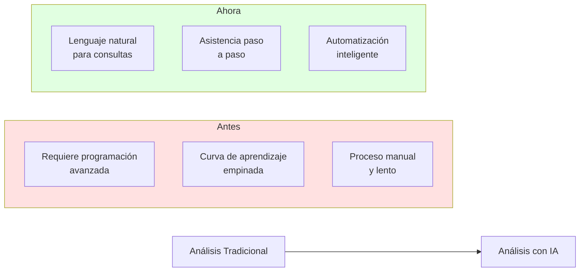
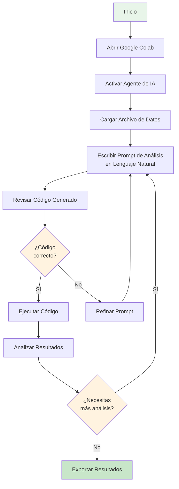
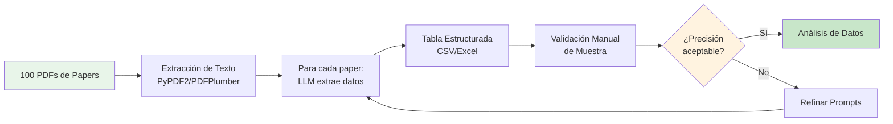
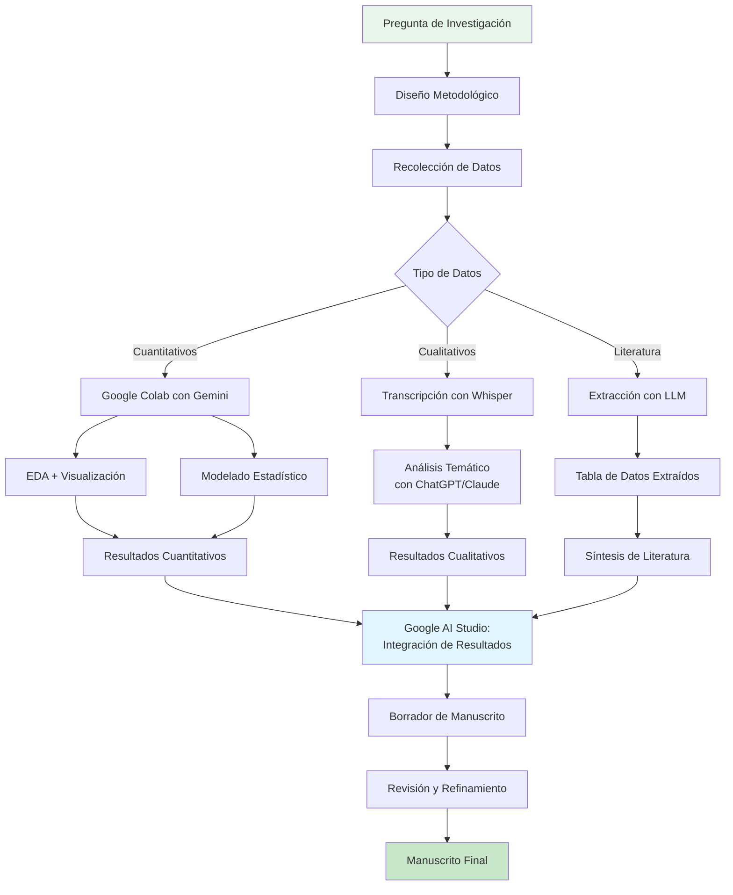

> [!warning] En construcción
# Capítulo 6: Análisis cuantitativo y cualitativo asistido con IA

---

## 6.1 Análisis de datos asistido con IA

> [!abstract] Introducción
> Tradicionalmente, el análisis de datos ha requerido habilidades técnicas especializadas: dominio de lenguajes de programación como Python o R, conocimiento de estadística avanzada, y experiencia con herramientas complejas de visualización. Esta barrera de entrada ha limitado significativamente quiénes pueden realizar análisis sofisticados de datos.
> 
> El análisis de datos constituye el corazón de la investigación empírica moderna. Es el proceso mediante el cual los datos crudos se transforman en información, conocimiento y, en última instancia, en respuestas a nuestras preguntas de investigación. Con la explosión en el volumen de datos disponibles —tanto estructurados como no estructurados— las técnicas tradicionales a menudo se quedan cortas. La Inteligencia Artificial emerge como un poderoso aliado, ofreciendo herramientas capaces de procesar, interpretar y visualizar grandes conjuntos de datos de maneras que antes eran impensables.

### 6.1.1 El Cambio de Paradigma

La IA está democratizando el acceso al análisis de datos mediante tres transformaciones fundamentales:



**1. Interfaces en Lenguaje Natural**

Ya no necesitas memorizar sintaxis compleja de programación. Puedes describir lo que quieres analizar en lenguaje natural y la IA genera el código correspondiente.

**2. Asistencia Contextual**

Los agentes de IA no solo ejecutan tu código, sino que explican qué hace cada paso, sugieren mejoras y ayudan a depurar errores.

**3. Automatización Inteligente**

Tareas repetitivas como limpieza de datos, generación de visualizaciones y creación de informes pueden automatizarse mientras mantienes el control sobre el proceso.

---

## 6.2 Google Colab potenciado con IA: El Laboratorio en la Nube

### 6.2.1 ¿Qué es Google Colab?

> [!info] Definición
> [[09-Glosario#Google Colab|Google Colaboratory]] (Colab) es un entorno de desarrollo gratuito basado en la nube que permite escribir y ejecutar código Python directamente desde el navegador. Es especialmente útil para proyectos de análisis de datos, aprendizaje automático y ciencia de datos en general, ya que no requiere ninguna configuración en tu máquina local y proporciona acceso gratuito a recursos computacionales como [[09-Glosario#GPU|GPUs]].

**Características principales:**

- **Basado en [[09-Glosario#Jupyter Notebooks|Jupyter Notebooks]]**: Combina código, texto explicativo y visualizaciones en un solo documento
- **Sin instalación**: Funciona completamente en el navegador
- **Hardware gratuito**: Acceso a GPUs y [[09-Glosario#TPU|TPUs]] para computación intensiva
- **Integración con Google Drive**: Guarda y comparte notebooks fácilmente
- **Colaboración en tiempo real**: Múltiples usuarios pueden trabajar simultáneamente

### 6.2.2 El Agente de IA de Colab: Gemini en Acción

La verdadera revolución llega con la integración de **agentes de IA como [[09-Glosario#Gemini|Gemini]]** dentro de Colab. Este asistente te permite generar y ejecutar código para analizar tus datos simplemente describiendo lo que necesitas en lenguaje natural.

> [!tip] Ventajas de Colab con Agente IA vs. un Chatbot General
>
> **1. Transparencia:**
> A diferencia de un chatbot que te da una respuesta directa, el agente de Colab genera el código Python que realiza el análisis. Puedes ver exactamente qué está haciendo, aprender de él y entender el proceso.
>
> **2. Modificabilidad:**
> Tienes control total. Puedes editar el código generado, ajustar parámetros, cambiar las visualizaciones, corregir errores y experimentar. Es un entorno de aprendizaje y trabajo interactivo, no una caja negra.
>
> **3. Reproducibilidad:**
> El código generado queda documentado en el notebook, permitiendo que otros repliquen tu análisis exactamente.
>
> **4. Iteración rápida:**
> Puedes refinar tu análisis con instrucciones adicionales sin empezar desde cero.

---

## 6.3 Tutorial: Análisis Exploratorio de Datos con Gemini en Colab

Realizar un **[[09-Glosario#Análisis Exploratorio de Datos (EDA)|análisis exploratorio de datos]]** (EDA, _Exploratory Data Analysis_) es fundamental para entender un conjunto de datos antes de aplicar modelos más complejos. Veamos cómo el agente de IA en Colab simplifica radicalmente este proceso.

### 6.3.1 Flujo de Trabajo General



### 6.3.2 Paso 1: Configuración Inicial

**1. Acceder a Google Colab:**
- Visita [colab.research.google.com](https://colab.research.google.com/)
- Inicia sesión con tu cuenta de Google
- Selecciona **Archivo > Nuevo cuaderno**

**2. Configurar el entorno:**
```python
# Este código se ejecuta automáticamente
import pandas as pd
import numpy as np
import matplotlib.pyplot as plt
import seaborn as sns

# Configuración para visualizaciones
%matplotlib inline
sns.set_style("whitegrid")
plt.rcParams['figure.figsize'] = (12, 6)
```

**3. Activar el agente de IA:**
- Busca el ícono de Gemini en la barra lateral derecha
- Haz clic para abrir el panel del asistente

### 6.3.3 Paso 2: Cargar tus Datos

**Opción A: Subir archivo desde tu computadora**

```python
# El asistente puede generar este código por ti
from google.colab import files
uploaded = files.upload()

# Si tu archivo se llama 'datos.csv'
df = pd.read_csv('datos.csv')
```

**Opción B: Cargar desde Google Drive**

```python
from google.colab import drive
drive.mount('/content/drive')

df = pd.read_csv('/content/drive/MyDrive/ruta/a/tu/archivo.csv')
```

**Opción C: Usar el agente de IA**

Simplemente escribe en el chat de Gemini:
```
"Carga el archivo CSV llamado Student_Depression_Dataset.csv que está en mi Drive"
```

El agente generará y ejecutará el código necesario automáticamente.

### 6.3.4 Paso 3: Análisis Exploratorio con Prompts en Lenguaje Natural

Aquí es donde ocurre la magia. En lugar de escribir código manualmente, describes lo que quieres hacer.

> [!example]- Ejemplo de Prompt Completo para EDA
>
> ```
> Realiza un análisis exploratorio completo del dataset cargado. Específicamente:
>
> 1. Muestra las primeras 5 filas para entender la estructura
> 2. Proporciona información general (tipos de datos, valores nulos, dimensiones)
> 3. Genera estadísticas descriptivas para todas las columnas numéricas
> 4. Crea un histograma para la columna 'Age' con título y etiquetas apropiadas
> 5. Genera un gráfico de barras para la distribución de 'Gender'
> 6. Calcula y muestra la matriz de correlación entre variables numéricas
> 7. Crea un heatmap de la matriz de correlación
> 8. Identifica y reporta valores atípicos en la columna 'Academic_Pressure'
> 9. Genera un boxplot para visualizar 'Stress_Level' por 'Gender'
> 10. Resume los insights principales encontrados
> ```

**Lo que sucede:**

1. Gemini lee tu prompt
2. Genera código Python estructurado para cada tarea
3. Ejecuta el código automáticamente (si das permiso)
4. Muestra los resultados: tablas, gráficos, estadísticas
5. Añade comentarios explicativos en el código

### 6.3.5 Paso 4: Interpretación y Refinamiento

**El código generado se verá similar a esto:**

```python
# 1. Primeras filas del dataset
print("=" * 50)
print("PRIMERAS 5 FILAS")
print("=" * 50)
print(df.head())

# 2. Información general
print("\n" + "=" * 50)
print("INFORMACIÓN GENERAL")
print("=" * 50)
print(f"Dimensiones: {df.shape[0]} filas x {df.shape[1]} columnas")
print("\nTipos de datos:")
print(df.dtypes)
print("\nValores nulos:")
print(df.isnull().sum())

# 3. Estadísticas descriptivas
print("\n" + "=" * 50)
print("ESTADÍSTICAS DESCRIPTIVAS")
print("=" * 50)
print(df.describe())

# 4. Histograma de Age
plt.figure(figsize=(10, 6))
plt.hist(df['Age'], bins=20, color='skyblue', edgecolor='black')
plt.title('Distribución de Edad', fontsize=16, fontweight='bold')
plt.xlabel('Edad', fontsize=12)
plt.ylabel('Frecuencia', fontsize=12)
plt.grid(axis='y', alpha=0.75)
plt.show()

# 5. Gráfico de barras para Gender
plt.figure(figsize=(8, 6))
gender_counts = df['Gender'].value_counts()
gender_counts.plot(kind='bar', color=['lightcoral', 'lightskyblue'])
plt.title('Distribución por Género', fontsize=16, fontweight='bold')
plt.xlabel('Género', fontsize=12)
plt.ylabel('Cantidad', fontsize=12)
plt.xticks(rotation=0)
plt.grid(axis='y', alpha=0.75)
plt.show()

# 6. Matriz de correlación
print("\n" + "=" * 50)
print("MATRIZ DE CORRELACIÓN")
print("=" * 50)
numeric_cols = df.select_dtypes(include=[np.number]).columns
correlation_matrix = df[numeric_cols].corr()
print(correlation_matrix)

# 7. Heatmap de correlación
plt.figure(figsize=(12, 10))
sns.heatmap(correlation_matrix, annot=True, fmt='.2f',
            cmap='coolwarm', center=0,
            square=True, linewidths=1)
plt.title('Mapa de Calor - Correlaciones', fontsize=16, fontweight='bold')
plt.tight_layout()
plt.show()

# ... (continúa con los otros puntos)
```

**Ventajas visibles:**

✅ Código bien comentado y estructurado
✅ Visualizaciones profesionales con títulos y etiquetas
✅ Estadísticas relevantes calculadas automáticamente
✅ Interpretación de resultados incluida

> [!tip] Iteración Inteligente
> Si los resultados no son exactamente lo que esperabas, simplemente conversa con el agente:
>
> - "Cambia el color del histograma a verde"
> - "Agrupa el boxplot también por nivel educativo, no solo género"
> - "Calcula el coeficiente de correlación específicamente entre Academic_Pressure y Stress_Level"
>
> El agente modificará el código existente en lugar de generar todo desde cero.

### 6.3.6 Paso 5: Análisis Estadístico Avanzado

Una vez completado el EDA básico, puedes solicitar análisis más sofisticados:

> [!example]- Prompts para Análisis Estadístico
>
> **Pruebas de Hipótesis:**
> ```
> "Realiza una prueba t de Student para comparar el nivel de estrés
> entre hombres y mujeres. Reporta el p-valor e interpreta el resultado
> con un nivel de significancia de 0.05"
> ```
>
> **Regresión:**
> ```
> "Ajusta un modelo de regresión lineal múltiple para predecir Stress_Level
> usando como predictores: Academic_Pressure, Age, y Study_Hours.
> Muestra los coeficientes, R², y evalúa los supuestos del modelo"
> ```
>
> **[[09-Glosario#Clustering|Clustering]]:**
> ```
> "Aplica K-means clustering con k=3 a las variables numéricas.
> Visualiza los clusters en un gráfico de dispersión usando PCA
> para reducir a 2 dimensiones. Describe las características de cada cluster"
> ```

### 6.3.7 Paso 6: Generación de Informes

El agente puede ayudarte a documentar tus hallazgos:

```
"Genera un resumen ejecutivo en formato Markdown de los principales
hallazgos del análisis, incluyendo:
- Descripción general del dataset
- Principales patrones identificados
- Correlaciones significativas
- Recomendaciones para análisis posteriores
"
```

---

## 6.4 Casos de Uso Avanzados en Investigación

### 6.4.1 Limpieza y Preprocesamiento de Datos

**Problema común:** Los datos del mundo real son desordenados

**Solución con IA:**

```
"Analiza el dataset y realiza las siguientes tareas de limpieza:
1. Identifica y reporta valores duplicados
2. Elimina duplicados manteniendo la primera ocurrencia
3. Para valores faltantes en columnas numéricas, imputa con la mediana
4. Para valores faltantes en columnas categóricas, imputa con la moda
5. Normaliza todas las columnas numéricas usando StandardScaler
6. Convierte las variables categóricas en variables dummy
7. Muestra un reporte antes/después de la limpieza
"
```

### 6.4.2 Visualizaciones Avanzadas

**Dashboards interactivos:**

```
"Crea un dashboard interactivo usando Plotly que incluya:
- Un gráfico de líneas mostrando la evolución temporal de la variable X
- Un gráfico de dispersión 3D con las variables X, Y, Z
- Un histograma interactivo con slider para filtrar por rango de fechas
- Asegúrate de que todos los gráficos tengan tooltips informativos
"
```

### 6.4.3 [[09-Glosario#Machine Learning|Machine Learning]] Supervisado

**Clasificación:**

```
"Construye y evalúa tres modelos de clasificación para predecir
'Depression' (Sí/No):

1. Regresión Logística
2. Random Forest
3. XGBoost

Para cada modelo:
- Divide datos en train/test (80/20)
- Aplica validación cruzada de 5 folds
- Reporta accuracy, precision, recall, F1-score
- Genera matriz de confusión
- Muestra las variables más importantes
- Recomienda cuál modelo usar y por qué
"
```

### 6.4.4 Análisis de Series Temporales

```
"Analiza la serie temporal de ventas mensuales:
1. Descompón la serie en tendencia, estacionalidad y residuos
2. Verifica estacionariedad con la prueba ADF
3. Si no es estacionaria, aplica diferenciación
4. Ajusta un modelo ARIMA y encuentra los mejores parámetros
5. Genera predicciones para los próximos 6 meses
6. Visualiza la serie original y las predicciones con intervalos de confianza
"
```

---

## 6.5 Análisis Cualitativo Asistido por LLM

Mientras que Google Colab brilla en análisis cuantitativo, los LLM están transformando también el **análisis cualitativo**, que busca interpretar datos no numéricos como entrevistas, textos o publicaciones en redes sociales.

### 6.5.1 El Desafío del Análisis Cualitativo Tradicional

El análisis cualitativo ha sido tradicionalmente:

❌ **Manual y lento**: Leer cientos de páginas de transcripciones
❌ **Difícil de escalar**: Imposible analizar miles de documentos
❌ **Subjetivo**: La codificación depende de la interpretación del investigador
❌ **Laborioso**: Identificar temas emergentes toma semanas o meses

> [!quote] Transformación con LLMs
> Los LLM ofrecen soluciones transformadoras a estos desafíos. Al ser entrenados con vastos conjuntos de datos, pueden "comprender" y generar texto con una calidad similar a la humana, permitiendo un análisis a una escala y velocidad sin precedentes.

### 6.5.2 Análisis Temático Inductivo de Entrevistas

El **[[09-Glosario#Análisis Temático|análisis temático]]** es una de las técnicas más comunes en la investigación cualitativa. El siguiente flujo de trabajo, adaptado de Mathis et al. (2024), muestra cómo los LLM pueden asistir en un análisis temático inductivo.

```mermaid
flowchart TD
    A[Grabaciones de Audio] --> B[Paso 1: [[09-Glosario#Transcripción|Transcripción]]<br/>[[09-Glosario#Whisper|Whisper]] AI]
    B --> C[Transcripciones de Texto]
    C --> D[Paso 2: Codificación Inicial<br/>LLM identifica temas]
    D --> E[Listado de Códigos Iniciales]
    E --> F[Paso 3: Agrupación de Temas<br/>LLM agrupa códigos]
    F --> G[Temas Principales]
    G --> H[Paso 4: Evaluación Crítica<br/>LLM como abogado del diablo]
    H --> I[Identificación de Fallas]
    I --> J[Paso 5: Refinamiento<br/>LLM resuelve inconsistencias]
    J --> K[Estructura Temática Final]

    style A fill:#e8f5e9
    style K fill:#c8e6c9
    style H fill:#fff3cd
```

#### Paso 1: [[09-Glosario#Transcripción|Transcripción]] Automática

**Herramienta:** [[09-Glosario#Whisper|Whisper]] de OpenAI

Whisper es un modelo de reconocimiento de voz de código abierto que convierte audio en texto con precisión cercana al humano.

**Implementación en Python:**

```python
import whisper

# Cargar el modelo
model = whisper.load_model("base")

# Transcribir archivo de audio
result = model.transcribe("entrevista_participante_01.mp3",
                          language="es",
                          task="transcribe")

# Guardar transcripción
with open("transcripcion_01.txt", "w", encoding="utf-8") as f:
    f.write(result["text"])

print("Transcripción completada")
```

> [!tip] Modelos de Whisper
> - **tiny**: Más rápido, menos preciso
> - **base**: Equilibrio velocidad/precisión (recomendado)
> - **small, medium, large**: Mayor precisión, más lentos

#### Paso 2: Generación de Códigos Iniciales

Una vez que tienes las transcripciones, el LLM puede identificar temas emergentes.

**Prompt para codificación inicial:**

```markdown
**Rol:** Actúa como un investigador cualitativo experto en análisis temático.

**Tarea:** Analiza la siguiente transcripción de entrevista e identifica
todos los temas emergentes.

**Transcripción:**
[Pegar aquí el texto de la entrevista]

**Formato de salida:**
Para cada tema identificado, proporciona:

| Tema | Descripción (max 50 palabras) | Cita de respaldo |
|------|-------------------------------|------------------|
| [Nombre del tema] | [Descripción condensada] | [Cita textual de la entrevista] |

**Instrucciones:**
- Identifica entre 8-15 temas
- Los nombres de temas deben ser concisos (máximo 5 palabras)
- Las descripciones deben capturar la esencia del tema
- Cada tema debe estar respaldado por al menos una cita directa
- Mantén los temas a nivel descriptivo, no interpretativo aún
```

**Ejemplo de salida:**

| Tema | Descripción | Cita de Respaldo |
|------|-------------|------------------|
| Estrés académico | Presión por calificaciones y expectativas | "Siento que nunca es suficiente, siempre hay otra tarea..." |
| Apoyo familiar | Rol de la familia en salud mental | "Mis papás no entienden por qué estoy tan estresado" |
| Estrategias de afrontamiento | Técnicas para manejar ansiedad | "Empecé a hacer meditación por las mañanas..." |

#### Paso 3: Agrupación de Temas

Una vez que tienes códigos de múltiples entrevistas (ej: 15 entrevistas = 150-200 códigos iniciales), necesitas agruparlos en **temas de orden superior**.

**Prompt para agrupación:**

```markdown
**Contexto:** Realicé 15 entrevistas sobre experiencias de estudiantes
universitarios con ansiedad. Cada entrevista generó 10-15 códigos
temáticos iniciales. A continuación, proporciono la lista completa de
códigos.

**Lista de todos los códigos:**
[Pegar aquí la lista completa de códigos de todas las entrevistas]

**Tarea:** Agrupa estos códigos en temas de orden superior.

**Criterios:**
- Los temas de orden superior deben capturar patrones transversales
- Un código puede estar en más de un grupo si es relevante
- Debe haber entre 5-8 temas de orden superior
- Cada grupo debe tener un nombre descriptivo y una justificación

**Formato de salida:**

## Tema de Orden Superior 1: [Nombre]

**Descripción:** [2-3 oraciones explicando este tema]

**Códigos incluidos:**
- Código A (de entrevista X)
- Código B (de entrevista Y)
- ...

**Justificación de agrupación:** [Explica por qué estos códigos van juntos]

---

[Repetir para cada tema de orden superior]
```

#### Paso 4: Evaluación Crítica

Aquí usamos el LLM como un **crítico** que identifica debilidades en nuestra agrupación.

**Prompt de crítica:**

```markdown
**Rol:** Actúa como un evaluador crítico ("devil's advocate") en
investigación cualitativa.

**Contexto:** A continuación está mi agrupación temática propuesta.

[Pegar aquí la agrupación del paso anterior]

**Tarea:** Identifica todos los problemas, inconsistencias y lógica
defectuosa en esta agrupación. Específicamente:

1. ¿Hay temas que se solapan demasiado y deberían fusionarse?
2. ¿Hay códigos mal ubicados que encajan mejor en otro tema?
3. ¿Hay códigos huérfanos que no encajan bien en ningún grupo?
4. ¿Los nombres de los temas realmente capturan su contenido?
5. ¿Hay sesgos evidentes en cómo se agruparon los datos?
6. ¿Se está forzando una estructura cuando los datos sugieren otra?

**Formato:** Lista numerada de problemas identificados, con ejemplos
específicos.
```

#### Paso 5: Refinamiento Final

Con los problemas identificados, pedimos al LLM que proponga una versión mejorada.

**Prompt de refinamiento:**

```markdown
**Contexto:**
- Agrupación inicial: [Pegar agrupación del paso 3]
- Crítica: [Pegar crítica del paso 4]

**Tarea:** Como un "resolutor" experto, mejora la agrupación temática
abordando los problemas identificados.

**Proceso:**
1. Fusiona temas redundantes
2. Re-ubica códigos mal clasificados
3. Renombra temas para mayor claridad
4. Justifica cada cambio realizado

**Formato de salida:**

## Estructura Temática Refinada

### Tema Principal 1: [Nombre mejorado]
- Descripción revisada
- Códigos incluidos (con justificación de cambios si aplicaron)

### Tema Principal 2: [Nombre mejorado]
...

## Resumen de Cambios Realizados
- Cambio 1: [Qué se modificó y por qué]
- Cambio 2: ...

## Insights Transversales
[Patrones que emergen al mirar todos los temas en conjunto]
```

### 6.5.3 Ventajas y Limitaciones del Análisis Cualitativo con LLM

**Ventajas:**

✅ **Velocidad**: Analizar 50 entrevistas en horas en lugar de meses
✅ **Consistencia**: Aplicación uniforme de criterios de codificación
✅ **Escalabilidad**: Manejar volúmenes masivos de datos textuales
✅ **Exploración exhaustiva**: Identificar patrones sutiles que podrían pasarse por alto
✅ **Transparencia**: Todo el proceso queda documentado (prompts + salidas)

**Limitaciones:**

⚠️ **Comprensión contextual limitada**: El LLM no entiende sutilezas culturales o contextuales profundas
⚠️ **Falta de experiencia vivida**: No tiene la comprensión experiencial que tiene un investigador humano
⚠️ **Sesgos del modelo**: Puede reproducir sesgos presentes en sus datos de entrenamiento
⚠️ **Requiere validación humana**: Los resultados deben ser revisados críticamente por expertos
⚠️ **Consideraciones éticas**: Uso de IA en investigación cualitativa es debatido en algunas disciplinas

> [!important] Principio Fundamental
> El análisis cualitativo asistido por LLM debe verse como una **colaboración humano-IA**, no un reemplazo. El investigador sigue siendo quien:
> - Formula las preguntas de investigación
> - Diseña el proceso de análisis
> - Interpreta críticamente los resultados
> - Valida los temas emergentes con teoría existente
> - Contextualiza los hallazgos en el marco más amplio

---

## 6.6 Extracción de Datos Estructurados de Literatura Científica

Otra aplicación poderosa es la **extracción de información específica de cientos o miles de documentos**, como artículos científicos. Este proceso, que tradicionalmente tomaba semanas, puede automatizarse significativamente con LLMs.

### 6.6.1 El Problema

Imagina que necesitas extraer información metodológica de 100 papers para una revisión sistemática:
- Diseño del estudio
- Tamaño de muestra
- Variables medidas
- Principales hallazgos
- Limitaciones reportadas

Hacerlo manualmente implica leer 100 papers y llenar una tabla, tomando aproximadamente 30-60 minutos por paper = **50-100 horas de trabajo**.

### 6.6.2 La Solución con LLMs

**Flujo de trabajo automatizado:**



**Implementación paso a paso:**

#### Paso 1: Preparar los PDFs

```python
import PyPDF2
import os

def extraer_texto_pdf(ruta_pdf):
    """
    Extrae todo el texto de un PDF
    """
    with open(ruta_pdf, 'rb') as file:
        reader = PyPDF2.PdfReader(file)
        texto = ""
        for pagina in reader.pages:
            texto += pagina.extract_text()
    return texto

# Procesar todos los PDFs en una carpeta
carpeta_pdfs = "papers_revision_sistematica/"
papers_texto = {}

for archivo in os.listdir(carpeta_pdfs):
    if archivo.endswith('.pdf'):
        ruta = os.path.join(carpeta_pdfs, archivo)
        papers_texto[archivo] = extraer_texto_pdf(ruta)

print(f"Procesados {len(papers_texto)} papers")
```

#### Paso 2: Diseñar el Prompt de Extracción

```markdown
**Rol:** Eres un asistente especializado en extracción de datos de
literatura científica médica.

**Tarea:** Extrae la siguiente información del texto del paper proporcionado:

1. **Diseño del estudio**: (RCT, cohorte, caso-control, transversal, cualitativo, etc.)
2. **Tamaño de muestra (N)**: Número de participantes
3. **Población**: Características demográficas principales
4. **Intervención/Exposición**: Si aplica, qué se evaluó
5. **Variable de resultado principal**: Qué se midió
6. **Principales hallazgos**: 2-3 oraciones resumiendo resultados clave
7. **Limitaciones**: Principales limitaciones reportadas por los autores

**Formato de salida:** JSON estructurado

```json
{
  "diseno_estudio": "...",
  "n_muestra": 123,
  "poblacion": "...",
  "intervencion": "...",
  "resultado_principal": "...",
  "hallazgos": "...",
  "limitaciones": "..."
}
```

**Si algún dato no está disponible, usa:** "No reportado"

**Texto del paper:**
[TEXTO COMPLETO DEL PAPER]
```

#### Paso 3: Automatizar la Extracción

```python
import anthropic  # o openai, según el modelo que uses
import json
import pandas as pd

client = anthropic.Anthropic(api_key="tu-api-key")

def extraer_datos_paper(texto_paper, nombre_archivo):
    """
    Usa Claude para extraer datos estructurados de un paper
    """
    prompt = f"""
    [Pegar aquí el prompt de extracción diseñado arriba]

    **Texto del paper:**
    {texto_paper[:10000]}  # Primeros 10K caracteres
    """

    mensaje = client.messages.create(
        model="claude-3-5-sonnet-20241022",
        max_tokens=1000,
        messages=[{"role": "user", "content": prompt}]
    )

    # Extraer el JSON de la respuesta
    respuesta = mensaje.content[0].text

    # Buscar el JSON en la respuesta
    inicio = respuesta.find('{')
    fin = respuesta.rfind('}') + 1
    json_str = respuesta[inicio:fin]

    datos = json.loads(json_str)
    datos['nombre_archivo'] = nombre_archivo

    return datos

# Procesar todos los papers
resultados = []
for i, (nombre, texto) in enumerate(papers_texto.items(), 1):
    print(f"Procesando {i}/{len(papers_texto)}: {nombre}")
    try:
        datos = extraer_datos_paper(texto, nombre)
        resultados.append(datos)
    except Exception as e:
        print(f"Error en {nombre}: {e}")
        continue

# Convertir a DataFrame
df_extraccion = pd.DataFrame(resultados)

# Guardar resultados
df_extraccion.to_csv('datos_extraidos_papers.csv', index=False)
df_extraccion.to_excel('datos_extraidos_papers.xlsx', index=False)

print(f"\n✓ Extracción completada: {len(resultados)} papers procesados")
print(f"✓ Archivo guardado: datos_extraidos_papers.csv")
```

#### Paso 4: Validación Humana

**Es crítico validar una muestra aleatoria:**

```python
# Seleccionar 10 papers aleatorios para validación manual
muestra_validacion = df_extraccion.sample(n=10, random_state=42)
print("Papers para validación manual:")
print(muestra_validacion[['nombre_archivo', 'diseno_estudio', 'n_muestra']])

# Exportar solo la muestra para revisión
muestra_validacion.to_excel('validacion_manual_10_papers.xlsx', index=False)
```

> [!tip] Criterio de Aceptación
> Si la precisión de la extracción en la muestra de validación es ≥ 90%, puedes confiar en los resultados automatizados para el resto. Si es menor, refina tus prompts y repite.

### 6.6.3 Ventajas de este Enfoque

✅ **Ahorro de tiempo**: De 100 horas a 5-10 horas (incluyendo validación)
✅ **Consistencia**: Criterios de extracción uniformes en todos los papers
✅ **Escalabilidad**: Fácil procesar 1,000 papers si es necesario
✅ **Reproducibilidad**: El proceso está documentado y automatizado
✅ **Análisis cuantitativo**: Los datos estructurados permiten análisis estadísticos

---

## 6.7 Google AI Studio: Tu Laboratorio Personal de IA

### 6.7.1 ¿Qué es [[09-Glosario#Google AI Studio|Google AI Studio]]?

> [!info] Definición
> [[09-Glosario#Google AI Studio|Google AI Studio]] es una plataforma web gratuita que permite experimentar con los modelos Gemini de Google mediante una interfaz gráfica intuitiva. A diferencia de usar APIs directamente, AI Studio ofrece un entorno visual para diseñar, probar y refinar prompts sin escribir código.

**Acceso:** [aistudio.google.com](https://aistudio.google.com)

### 6.7.2 Características Clave para Investigación

**1. [[09-Glosario#Multimodalidad|Multimodalidad]] Nativa**

Puedes combinar en un solo prompt:
- Texto
- Imágenes
- Audio
- Video
- Documentos PDF

**Ejemplo de uso:**
```
Prompt: "Analiza esta imagen de un diagrama de flujo de mi experimento
y transcribe todos los pasos del proceso. Luego, identifica posibles
puntos de falla metodológica."

[Adjuntar imagen del diagrama]
```

**2. Prompts Estructurados (System Instructions)**

AI Studio permite definir **instrucciones de sistema** que se aplican a toda la conversación, similar a configurar un "rol" permanente para el modelo.

**Ejemplo:**
```
System Instructions: "Eres un bioestadístico especializado en ensayos
clínicos. Siempre proporcionas respuestas con:
1. Explicación conceptual
2. Código R o Python si aplica
3. Interpretación de resultados
4. Advertencias sobre supuestos estadísticos

Usa un tono pedagógico pero riguroso."
```

**3. Ajuste de Parámetros**

Puedes modificar parámetros del modelo en tiempo real:

| Parámetro | Función | Recomendación para Investigación |
|---|---|---|
| **Temperature** | Creatividad vs Determinismo | 0.1-0.3 para análisis técnico<br/>0.7-0.9 para brainstorming |
| **Top-k** | Diversidad de tokens | 10-20 para precisión |
| **Top-p** | Sampling nucleus | 0.8-0.95 para balance |
| **Max Output Tokens** | Longitud de respuesta | 2048-8192 para análisis extensos |

**4. Historial y Versionado**

Todas tus conversaciones se guardan automáticamente, permitiendo:
- Comparar resultados de diferentes prompts
- Recuperar conversaciones anteriores
- Exportar interacciones completas

### 6.7.3 Casos de Uso Específicos en Investigación

#### Caso 1: Análisis de Imágenes Científicas

**Escenario:** Tienes micrografías de tejidos que necesitas clasificar

**Flujo de trabajo:**

1. Subir imagen de micrografía
2. Prompt:
```
Analiza esta imagen de tejido histológico teñido con H&E:

1. Identifica el tipo de tejido
2. Describe las estructuras celulares visibles
3. Señala cualquier anormalidad patológica evidente
4. Proporciona el grado de confianza en tu evaluación (bajo/medio/alto)

Si necesitas más contexto para un diagnóstico preciso, indica qué
información adicional requerirías.
```

#### Caso 2: Revisión de Literatura con PDFs

**Escenario:** Necesitas comparar rápidamente 3-4 papers sobre un tema

**Flujo de trabajo:**

1. Subir 3-4 PDFs de papers
2. Prompt:
```
He adjuntado 4 papers sobre [tema]. Realiza un análisis comparativo:

**Tabla Comparativa:**
| Paper | Metodología | N | Hallazgo Principal | Limitación Principal |
|-------|-------------|---|-------------------|----------------------|
| ... | ... | ... | ... | ... |

**Análisis de Convergencia:**
- ¿En qué coinciden todos los estudios?
- ¿Dónde hay desacuerdo o resultados contradictorios?

**Síntesis:**
Redacta 2 párrafos integrando estos estudios, señalando el estado
del conocimiento y las brechas existentes.

**Recomendación:**
Basándote en estos papers, ¿qué dirección de investigación sería
más prometedora?
```

#### Caso 3: Generación de Código para Análisis

**Escenario:** Necesitas código para un análisis estadístico pero no recuerdas la sintaxis

**Flujo de trabajo:**

```
Necesito realizar un ANOVA de medidas repetidas en R para analizar
el efecto de 3 condiciones experimentales (control, tratamiento A,
tratamiento B) medidas en 4 tiempos diferentes (baseline, semana 1,
semana 2, semana 4) en 30 participantes.

Mi dataframe se llama `datos` y tiene las columnas:
- participante_id
- condicion (factor con 3 niveles)
- tiempo (factor con 4 niveles)
- respuesta (variable continua)

Genera código R que:
1. Verifique supuestos (esfericidad, normalidad)
2. Ejecute el ANOVA de medidas repetidas
3. Realice comparaciones post-hoc si hay efectos significativos
4. Genere un gráfico de perfil de medias

Incluye comentarios explicativos en el código.
```

#### Caso 4: Traducción Técnica Contextual

**Escenario:** Necesitas traducir tu paper manteniendo precisión técnica

**Flujo de trabajo:**

```
Traduce el siguiente abstract de inglés a español académico,
manteniendo la precisión técnica:

[Pegar abstract en inglés]

Requisitos:
- Usa terminología estándar en español para términos técnicos
- Mantén el estilo formal académico
- Si un término técnico tiene múltiples traducciones aceptadas,
  proporciona alternativas entre paréntesis
- Respeta la estructura de oraciones del original

Después de la traducción, explica cualquier decisión de traducción
que consideres relevante.
```

---

## 6.8 Flujo de Trabajo Integrado: De la Recolección al Manuscrito

Integremos todas las herramientas de este capítulo en un flujo de investigación completo:



### 6.8.1 Ejemplo Integrado Completo

> [!example]- Proyecto: Impacto de Redes Sociales en Salud Mental Estudiantil
>
> **Diseño:** Mixto (cuantitativo + cualitativo)
>
> **Fase 1: Datos Cuantitativos (Colab)**
> - Encuesta a 500 estudiantes
> - Variables: Horas de uso de RRSS, medidas de ansiedad, depresión, autoestima
> - Análisis: Regresión múltiple, clustering, visualizaciones
> - Código generado por Gemini en Colab
>
> **Fase 2: Datos Cualitativos (Whisper + Claude)**
> - 20 entrevistas semi-estructuradas
> - Transcripción automática con Whisper
> - Análisis temático con Claude siguiendo metodología de 5 pasos
> - Temas emergentes: adicción digital, FOMO, comparación social, etc.
>
> **Fase 3: Revisión de Literatura (LLM Extraction)**
> - 80 papers sobre RRSS y salud mental
> - Extracción automatizada de metodologías, N, resultados principales
> - Tabla comparativa generada automáticamente
>
> **Fase 4: Integración (Google AI Studio)**
> - Subir: Resultados cuantitativos + Temas cualitativos + Síntesis de literatura
> - Prompt: "Integra estos tres componentes en una narrativa coherente para la sección de Discusión de mi paper. Identifica cómo los hallazgos cualitativos contextualizan los cuantitativos, y cómo ambos se relacionan con la literatura existente."
> - Resultado: Borrador de Discusión de 2,000 palabras con citas integradas
>
> **Fase 5: Refinamiento**
> - Revisión crítica humana
> - Verificación de todas las afirmaciones
> - Ajustes de tono y estructura
> - Manuscrito final listo para sometimiento

---

## 6.9 Mejores Prácticas y Consideraciones Éticas

### 6.9.1 Validación de Resultados

> [!warning] Regla de Oro
> **Nunca confíes ciegamente en los resultados generados por IA**. Siempre:
>
> 1. Valida una muestra aleatoria manualmente
> 2. Verifica que los resultados tengan sentido teórico
> 3. Compara con técnicas tradicionales cuando sea posible
> 4. Documenta cualquier discrepancia identificada

### 6.9.2 Transparencia Metodológica

Cuando uses IA en tu investigación, documenta:

✅ Qué herramientas de IA utilizaste (nombre, versión, fecha)
✅ Para qué tareas específicas se usó la IA
✅ Qué prompts o configuraciones se emplearon (si es relevante)
✅ Qué validaciones manuales se realizaron
✅ Qué limitaciones identificaste en el uso de IA

**Ejemplo de declaración metodológica:**

> "El análisis exploratorio de datos cuantitativos se realizó utilizando Google Colab con el asistente Gemini 2.5 (diciembre 2024) para generar código Python de visualización y análisis estadístico. Todo el código generado fue revisado por el equipo de investigación antes de su ejecución, y los resultados fueron validados mediante análisis independientes usando el software SPSS v.28. El análisis temático de las transcripciones de entrevistas fue asistido por Claude 3.5 Sonnet (Anthropic, 2024) siguiendo la metodología de cinco pasos propuesta por Mathis et al. (2024). Una muestra aleatoria del 30% de las codificaciones fue validada independientemente por dos codificadores humanos, alcanzando un acuerdo inter-codificador de κ = 0.87."

### 6.9.3 Consideraciones Éticas Específicas

#### Análisis Cuantitativo

⚠️ **Riesgo:** Interpretación incorrecta de resultados estadísticos generados por IA
✅ **Solución:** Siempre consulta con un estadístico si los resultados son críticos

#### Análisis Cualitativo

⚠️ **Riesgo:** Pérdida de matices contextuales y culturales en interpretación automatizada
✅ **Solución:** El investigador humano debe hacer la interpretación final, la IA solo asiste en codificación

#### Datos Sensibles

⚠️ **Riesgo:** Subir datos de participantes a plataformas de IA en la nube
✅ **Solución:**
- Anonimiza todos los datos antes de procesarlos con IA
- Usa modelos locales (ej: Whisper local) para datos muy sensibles
- Verifica las políticas de privacidad de las plataformas que uses

### 6.9.4 Limitaciones Reconocidas

| Herramienta | Limitación Principal | Mitigación |
|---|---|---|
| **Google Colab + Gemini** | Puede generar código con errores sutiles | Revisión cuidadosa del código, testing |
| **Whisper** | Precisión menor con acentos fuertes o términos técnicos | Revisión manual de transcripciones |
| **LLM para análisis temático** | Puede forzar interpretaciones basadas en patrones de entrenamiento | Triangulación con codificación humana |
| **Extracción automatizada de papers** | Puede malinterpretar información compleja | Validación de muestra aleatoria |

---

## 6.10 Conclusión del Capítulo: El Analista de Datos Aumentado

Las herramientas presentadas en este capítulo no buscan reemplazar al investigador o analista de datos, sino **aumentar sus capacidades** de manera exponencial.

> [!success] Transformación Lograda
>
> **Antes:**
> - Análisis limitado por habilidades técnicas de programación
> - Procesamiento manual lento de datos cualitativos
> - Dificultad para escalar análisis a grandes volúmenes
> - Curva de aprendizaje empinada para herramientas estadísticas
>
> **Ahora:**
> - Análisis sofisticados accesibles mediante lenguaje natural
> - Procesamiento rápido de cientos de entrevistas o documentos
> - Escalabilidad sin precedentes manteniendo rigor
> - Enfoque en interpretación y comprensión, no en sintaxis
> - Documentación automática del proceso analítico

**Principios para recordar:**

1. **La IA como colaboradora**: No delega el pensamiento crítico, sino las tareas repetitivas
2. **Validación es esencial**: Siempre verifica una muestra de resultados automatizados
3. **Transparencia metodológica**: Documenta el uso de IA en tus publicaciones
4. **Interpretación humana irreemplazable**: Los números y temas no hablan solos; el investigador da significado
5. **Aprendizaje continuo**: Las herramientas evolucionan rápido; mantente actualizado

> [!quote] Reflexión Final
> "El futuro del análisis de datos en investigación no es humano versus IA, sino humano con IA. Las herramientas de este capítulo nos permiten dedicar menos tiempo a la mecánica del análisis y más tiempo a lo que realmente importa: formular las preguntas correctas, interpretar críticamente los resultados y generar conocimiento que avance nuestra comprensión del mundo."

**Próximos pasos:**

En el siguiente capítulo abordaremos las **consideraciones éticas** del uso de IA en investigación: desde la propiedad intelectual y autoría, hasta los sesgos algorítmicos y la responsabilidad del investigador. Comprender estos aspectos es crucial para usar estas poderosas herramientas de manera responsable y éticamente fundamentada.

---

## 6.11 Recursos Adicionales

> [!tip] Para Profundizar
>
> **Tutoriales y Documentación:**
> - Google Colab: [colab.research.google.com](https://colab.research.google.com/)
> - Google AI Studio: [aistudio.google.com](https://aistudio.google.com/)
> - Whisper OpenAI: [github.com/openai/whisper](https://github.com/openai/whisper)
> - Documentación Gemini: [ai.google.dev](https://ai.google.dev/)
>
> **Cursos recomendados:**
> - "Data Analysis with Python" (freeCodeCamp)
> - "Qualitative Research with AI" (Coursera)
> - "Prompt Engineering for Data Science" (DeepLearning.AI)
>
> **Lecturas académicas:**
> - Mathis et al. (2024). "Assisted Thematic Analysis: Using Large Language Models for Qualitative Research"
> - Polak & Morgan (2024). "Extracting Structured Data from Research Papers with LLMs"
> - Chen et al. (2025). "AI-Assisted Data Analysis in Social Sciences: Opportunities and Pitfalls"
>
> **Comunidades:**
> - r/DataScience (Reddit)
> - Kaggle Discussions (kaggle.com/discussions)
> - AI for Research Discord


---

**🧭 Navegación:** [[05-Sistema-Integracion|⬅️ Capítulo 5]] | [[book_ia/07-Ética|Siguiente: Capítulo 7 ➡️]]

---
<div align="center">
  
  
</div>

