> [!warning] En construcción
# Capítulo 6: Análisis cuantitativo y cualitativo asistido con IA

Tradicionalmente, el análisis de datos ha requerido habilidades técnicas especializadas: dominio de lenguajes de programación como Python o R, conocimiento de estadística avanzada, y experiencia con herramientas complejas de visualización. Esta barrera de entrada ha limitado significativamente quiénes pueden realizar análisis sofisticados de datos.

El análisis de datos constituye el corazón de la investigación empírica moderna. Es el proceso mediante el cual los datos crudos se transforman en información, conocimiento y, en última instancia, en respuestas a nuestras preguntas de investigación. Con la explosión en el volumen de datos disponibles (tanto estructurados como no estructurados) las técnicas tradicionales a menudo se quedan cortas. La IS generativa emerge como un poderoso aliado, ofreciendo herramientas capaces de procesar, interpretar y visualizar grandes conjuntos de datos de maneras que antes eran impensables.

## 6.1 El cambio de paradigma

La IA generativa está apoyando en el análisis de datos mediante tres transformaciones fundamentales:


**1. Interfaces en Lenguaje Natural**

Ya no necesitas memorizar sintaxis compleja de programación. Puedes describir lo que quieres analizar en lenguaje natural y la IA generativa puede construir el código correspondiente.

**2. Asistencia contextual**

Los agentes de IA generativa no solo ejecutan tu código, sino que explican qué hace cada paso, sugieren mejoras y ayudan a depurar errores.

**3. Automatización ”inteligente”**

Tareas repetitivas como limpieza de datos, generación de visualizaciones y creación de informes pueden automatizarse mientras mantienes el control sobre el proceso.

## 6.2 Google Colab potenciado con IA generativa: El laboratorio en la Nube

### 6.2.1 ¿Qué es Google Colab?

> [!info] Definición
> Google Colaboratory (Colab) es un entorno de desarrollo gratuito basado en la nube que permite escribir y ejecutar código Python (o R) directamente desde el navegador. Es especialmente útil para proyectos de análisis de datos, aprendizaje automático y ciencia de datos en general, ya que no requiere ninguna configuración en tu máquina local y proporciona acceso gratuito a recursos computacionales como GPUs.

**Características principales:**

- **Basado en Jupyter Notebooks**: Combina código, texto explicativo y visualizaciones en un solo documento
- **Sin instalación**: Funciona completamente en el navegador
- **Hardware gratuito**: Acceso a GPUs y TPUs para computación intensiva
- **Integración con Google Drive**: Guarda y comparte notebooks fácilmente
- **Colaboración en tiempo real**: Múltiples usuarios pueden trabajar simultáneamente

### 6.2.2 El Agente de IA de Colab: Gemini en acción

La verdadera revolución llega con la integración de agentes de IA como Gemini dentro de Colab. Este asistente te permite generar y ejecutar código para analizar tus datos simplemente describiendo lo que necesitas en lenguaje natural.

> [!tip] Ventajas de Colab con Agente IA vs. un Chatbot General
>
> **1. Transparencia:**
> A diferencia de un chatbot que te da una respuesta directa, el agente de Colab genera el código Python que realiza el análisis. Puedes ver exactamente qué está haciendo, aprender de él y entender el proceso.
>
> **2. Modificabilidad:**
> Tienes control total. Puedes editar el código generado, ajustar parámetros, cambiar las visualizaciones, corregir errores y experimentar. Es un entorno de aprendizaje y trabajo interactivo.
>
> **3. Reproducibilidad:**
> El código generado queda documentado en el notebook, permitiendo que otros repliquen tu análisis exactamente.
>
> **4. Iteración rápida:**
> Puedes refinar tu análisis con instrucciones adicionales sin empezar desde cero.

## 6.3 Tutorial: Análisis Exploratorio de Datos con Gemini en Colab

Realizar un **análisis exploratorio de datos** (EDA, _Exploratory Data Analysis_) es fundamental para entender un conjunto de datos antes de aplicar modelos más complejos. Veamos cómo el agente de IA en Colab simplifica este proceso.

### 6.3.1 Flujo de trabajo general

```mermaid
flowchart TD
    A[Inicio] --> B[Abrir Google Colab]
    B --> C[Activar Agente de IA]
    C --> D[Cargar Archivo de Datos]
    D --> E[Escribir Prompt de Análisis<br/>en Lenguaje Natural]
    E --> F[Revisar Código Generado]
    F --> G{¿Código<br/>correcto?}
    G -->|Sí| H[Ejecutar Código]
    G -->|No| I[Refinar Prompt]
    I --> E
    H --> J[Analizar Resultados]
    J --> K{¿Necesitas<br/>más análisis?}
    K -->|Sí| E
    K -->|No| L[Exportar Resultados]

    style A fill:#e8f5e9
    style L fill:#c8e6c9
    style G fill:#fff3e0
    style K fill:#fff3e0
```



### 6.3.2 Paso 1: Configuración inicial

**1. Acceder a Google Colab:**
- Visita [colab.research.google.com](https://colab.research.google.com/)
- Inicia sesión con tu cuenta de Google
- Selecciona **Archivo > Nuevo cuaderno**

**2. Configurar el entorno:**
```python
# Este código se ejecuta automáticamente
import pandas as pd
import numpy as np
import matplotlib.pyplot as plt
import seaborn as sns

# Configuración para visualizaciones
%matplotlib inline
sns.set_style("whitegrid")
plt.rcParams['figure.figsize'] = (12, 6)
```

**3. Activar el agente de IA:**
- Busca el ícono de Gemini en la barra lateral derecha
- Haz clic para abrir el panel del asistente

### 6.3.3 Paso 2: Cargar tus Datos

**Opción A: Subir archivo desde tu computadora**

```python
# El asistente puede generar este código por ti
from google.colab import files
uploaded = files.upload()

# Si tu archivo se llama 'datos.csv'
df = pd.read_csv('datos.csv')
```

**Opción B: Cargar desde Google Drive**

```python
from google.colab import drive
drive.mount('/content/drive')

df = pd.read_csv('/content/drive/MyDrive/ruta/a/tu/archivo.csv')
```

**Opción C: Usar el agente de IA**

Simplemente escribe en el chat de Gemini:
```
"Carga el archivo CSV llamado Student_Depression_Dataset.csv que está en mi Drive"
```

El agente generará y ejecutará el código necesario automáticamente.

### 6.3.4 Paso 3: Análisis exploratorio con Prompts en Lenguaje Natural

Aquí es donde ocurre la magia. En lugar de escribir código manualmente, describes lo que quieres hacer.

> [!example]- Ejemplo de Prompt completo para EDA
>
> ```
> Realiza un análisis exploratorio completo del dataset cargado. Específicamente:
>
> 1. Muestra las primeras 5 filas para entender la estructura
> 2. Proporciona información general (tipos de datos, valores nulos, dimensiones)
> 3. Genera estadísticas descriptivas para todas las columnas numéricas
> 4. Crea un histograma para la columna 'Age' con título y etiquetas apropiadas
> 5. Genera un gráfico de barras para la distribución de 'Gender'
> 6. Calcula y muestra la matriz de correlación entre variables numéricas
> 7. Crea un heatmap de la matriz de correlación
> 8. Identifica y reporta valores atípicos en la columna 'Academic_Pressure'
> 9. Genera un boxplot para visualizar 'Stress_Level' por 'Gender'
> 10. Resume los insights principales encontrados
> ```

**Lo que sucede:**

1. Gemini lee tu prompt
2. Genera código Python estructurado para cada tarea
3. Ejecuta el código automáticamente (si das permiso)
4. Muestra los resultados: tablas, gráficos, estadísticas
5. Añade comentarios explicativos en el código

### 6.3.5 Paso 4: Interpretación y refinamiento

**El código generado se verá similar a esto:**

```python
# 1. Primeras filas del dataset
print("=" * 50)
print("PRIMERAS 5 FILAS")
print("=" * 50)
print(df.head())

# 2. Información general
print("\n" + "=" * 50)
print("INFORMACIÓN GENERAL")
print("=" * 50)
print(f"Dimensiones: {df.shape[0]} filas x {df.shape[1]} columnas")
print("\nTipos de datos:")
print(df.dtypes)
print("\nValores nulos:")
print(df.isnull().sum())

# 3. Estadísticas descriptivas
print("\n" + "=" * 50)
print("ESTADÍSTICAS DESCRIPTIVAS")
print("=" * 50)
print(df.describe())

# 4. Histograma de Age
plt.figure(figsize=(10, 6))
plt.hist(df['Age'], bins=20, color='skyblue', edgecolor='black')
plt.title('Distribución de Edad', fontsize=16, fontweight='bold')
plt.xlabel('Edad', fontsize=12)
plt.ylabel('Frecuencia', fontsize=12)
plt.grid(axis='y', alpha=0.75)
plt.show()

# 5. Gráfico de barras para Gender
plt.figure(figsize=(8, 6))
gender_counts = df['Gender'].value_counts()
gender_counts.plot(kind='bar', color=['lightcoral', 'lightskyblue'])
plt.title('Distribución por Género', fontsize=16, fontweight='bold')
plt.xlabel('Género', fontsize=12)
plt.ylabel('Cantidad', fontsize=12)
plt.xticks(rotation=0)
plt.grid(axis='y', alpha=0.75)
plt.show()

# 6. Matriz de correlación
print("\n" + "=" * 50)
print("MATRIZ DE CORRELACIÓN")
print("=" * 50)
numeric_cols = df.select_dtypes(include=[np.number]).columns
correlation_matrix = df[numeric_cols].corr()
print(correlation_matrix)

# 7. Heatmap de correlación
plt.figure(figsize=(12, 10))
sns.heatmap(correlation_matrix, annot=True, fmt='.2f',
            cmap='coolwarm', center=0,
            square=True, linewidths=1)
plt.title('Mapa de Calor - Correlaciones', fontsize=16, fontweight='bold')
plt.tight_layout()
plt.show()

# ... (continúa con los otros puntos)
```

**Ventajas visibles:**

✅ Código bien comentado y estructurado
✅ Visualizaciones profesionales con títulos y etiquetas
✅ Estadísticas relevantes calculadas automáticamente
✅ Interpretación de resultados incluida

> [!tip] Iteración Inteligente
> Si los resultados no son exactamente lo que esperabas, simplemente conversa con el agente:
>
> - "Cambia el color del histograma a verde"
> - "Agrupa el boxplot también por nivel educativo, no solo género"
> - "Calcula el coeficiente de correlación específicamente entre Academic_Pressure y Stress_Level"
>
> El agente modificará el código existente en lugar de generar todo desde cero.

### 6.3.6 Paso 5: Análisis Estadístico Avanzado

Una vez completado el EDA básico, puedes solicitar análisis más sofisticados:

> [!example]- Prompts para Análisis Estadístico
>
> **Pruebas de Hipótesis:**
> ```
> "Realiza una prueba t de Student para comparar el nivel de estrés
> entre hombres y mujeres. Reporta el p-valor e interpreta el resultado
> con un nivel de significancia de 0.05"
> ```
>
> **Regresión:**
> ```
> "Ajusta un modelo de regresión lineal múltiple para predecir Stress_Level
> usando como predictores: Academic_Pressure, Age, y Study_Hours.
> Muestra los coeficientes, R², y evalúa los supuestos del modelo"
> ```
>
> **Clustering:**
> ```
> "Aplica K-means clustering con k=3 a las variables numéricas.
> Visualiza los clusters en un gráfico de dispersión usando PCA
> para reducir a 2 dimensiones. Describe las características de cada cluster"
> ```

### 6.3.7 Paso 6: Generación de informes

El agente puede ayudarte a documentar tus hallazgos:

```
"Genera un resumen ejecutivo en formato Markdown de los principales
hallazgos del análisis, incluyendo:
- Descripción general del dataset
- Principales patrones identificados
- Correlaciones significativas
- Recomendaciones para análisis posteriores
"
```

## 6.4 Casos de uso avanzados en investigación

### 6.4.1 Limpieza y preprocesamiento de datos

**Problema común:** Los datos del mundo real son desordenados

**Solución con IA:**

```
"Analiza el dataset y realiza las siguientes tareas de limpieza:
1. Identifica y reporta valores duplicados
2. Elimina duplicados manteniendo la primera ocurrencia
3. Para valores faltantes en columnas numéricas, imputa con la mediana
4. Para valores faltantes en columnas categóricas, imputa con la moda
5. Normaliza todas las columnas numéricas usando StandardScaler
6. Convierte las variables categóricas en variables dummy
7. Muestra un reporte antes/después de la limpieza
"
```

### 6.4.2 Visualizaciones avanzadas

**Dashboards interactivos:**

```
"Crea un dashboard interactivo usando Plotly que incluya:
- Un gráfico de líneas mostrando la evolución temporal de la variable X
- Un histograma interactivo con slider para filtrar por rango de fechas
- Asegúrate de que todos los gráficos tengan tooltips informativos
"
```

### 6.4.3 Machine Learning Supervisado

**Clasificación:**

```
"Construye y evalúa tres modelos de clasificación para predecir
'Depression' (Sí/No):

1. Regresión Logística
2. Random Forest
3. XGBoost

Para cada modelo:
- Divide datos en train/test (80/20)
- Aplica validación cruzada de 5 folds
- Reporta accuracy, precision, recall, F1-score
- Genera matriz de confusión
- Muestra las variables más importantes
- Recomienda cuál modelo usar y por qué
"
```

### 6.4.4 Análisis de Series Temporales

```
"Analiza la serie temporal de ventas mensuales:
1. Descompón la serie en tendencia, estacionalidad y residuos
2. Verifica estacionariedad con la prueba ADF
3. Si no es estacionaria, aplica diferenciación
4. Ajusta un modelo ARIMA y encuentra los mejores parámetros
5. Genera predicciones para los próximos 6 meses
6. Visualiza la serie original y las predicciones con intervalos de confianza
"
```

---

## 6.5 Análisis Cualitativo asistido por IA generativa

Mientras que Google Colab brilla en análisis cuantitativo, la IA generativa está transformando también el análisis cualitativo, que busca interpretar datos no numéricos como entrevistas, textos o publicaciones en redes sociales.

### 6.5.1 El Desafío del Análisis Cualitativo tradicional

El análisis cualitativo ha sido tradicionalmente:

❌ **Manual**: Leer cientos de páginas de transcripciones
❌ **Difícil de escalar**: Imposible analizar miles de documentos
❌ **Subjetivo**: La codificación depende de la interpretación del investigador
❌ **Laborioso**: Identificar temas emergentes toma semanas o meses

> [!quote] Transformación con LLMs
> La IA generativa ofrece soluciones transformadoras a estos desafíos. Al ser entrenados con vastos conjuntos de datos, pueden estructurar y generar texto, permitiendo un análisis a una escala y velocidad sin precedentes.

### 6.5.2 Análisis temático inductivo de entrevistas

El **análisis temático** es una de las técnicas más comunes en la investigación cualitativa. El siguiente flujo de trabajo, adaptado de Mathis et al. (2024), muestra cómo los modelos generativos pueden asistir en un análisis temático inductivo.

```mermaid
flowchart TD
    A[Grabaciones de Audio] --> B[Paso 1: Transcripción<br/>Whisper AI]
    B --> C[Transcripciones de Texto]
    C --> D[Paso 2: Codificación Inicial<br/>LLM identifica temas]
    D --> E[Listado de Códigos Iniciales]
    E --> F[Paso 3: Agrupación de Temas<br/>LLM agrupa códigos]
    F --> G[Temas Principales]
    G --> H[Paso 4: Evaluación Crítica<br/>LLM como abogado del diablo]
    H --> I[Identificación de Fallas]
    I --> J[Paso 5: Refinamiento<br/>LLM resuelve inconsistencias]
    J --> K[Estructura Temática Final]

    style A fill:#e8f5e9
    style K fill:#c8e6c9
    style H fill:#fff3cd
```



#### Paso 1: Transcripción automática

**Herramienta:** Whisper de OpenAI

Whisper es un modelo de reconocimiento de voz de código abierto que convierte audio en texto con precisión cercana al humano.

**Implementación en Python:**

```python
import whisper

# Cargar el modelo
model = whisper.load_model("base")

# Transcribir archivo de audio
result = model.transcribe("entrevista_participante_01.mp3",
                          language="es",
                          task="transcribe")

# Guardar transcripción
with open("transcripcion_01.txt", "w", encoding="utf-8") as f:
    f.write(result["text"])

print("Transcripción completada")
```

> [!tip] Modelos de Whisper
> - **tiny**: Más rápido, menos preciso
> - **base**: Equilibrio velocidad/precisión (recomendado)
> - **large**: Mayor precisión, más lentos

#### Paso 2: Generación de códigos iniciales

Una vez que tienes las transcripciones, el modelo generativo puede identificar temas emergentes.

**Prompt para codificación inicial:**

```markdown
**Rol:** Actúa como un investigador cualitativo experto en análisis temático.

**Tarea:** Analiza la siguiente transcripción de entrevista e identifica
todos los temas emergentes.

**Transcripción:**
[Pegar aquí el texto de la entrevista]

**Formato de salida:**
Para cada tema identificado, proporciona:

| Tema | Descripción (max 50 palabras) | Cita de respaldo |
|------|-------------------------------|------------------|
| [Nombre del tema] | [Descripción condensada] | [Cita textual de la entrevista] |

**Instrucciones:**
- Identifica entre 8-15 temas
- Los nombres de temas deben ser concisos (máximo 5 palabras)
- Las descripciones deben capturar la esencia del tema
- Cada tema debe estar respaldado por al menos una cita directa
- Mantén los temas a nivel descriptivo, no interpretativo aún
```

**Ejemplo de salida:**

| Tema | Descripción | Cita de Respaldo |
|------|-------------|------------------|
| Estrés académico | Presión por calificaciones y expectativas | "Siento que nunca es suficiente, siempre hay otra tarea..." |
| Apoyo familiar | Rol de la familia en salud mental | "Mis papás no entienden por qué estoy tan estresado" |
| Estrategias de afrontamiento | Técnicas para manejar ansiedad | "Empecé a hacer meditación por las mañanas..." |

#### Paso 3: Agrupación de temas

Una vez que tienes códigos de múltiples entrevistas (ej: 15 entrevistas = 150-200 códigos iniciales), necesitas agruparlos en temas de orden superior.

**Prompt para agrupación:**

```markdown
**Contexto:** Realicé 15 entrevistas sobre experiencias de estudiantes
universitarios con ansiedad. Cada entrevista generó 10-15 códigos
temáticos iniciales. A continuación, proporciono la lista completa de
códigos.

**Lista de todos los códigos:**
[Pegar aquí la lista completa de códigos de todas las entrevistas]

**Tarea:** Agrupa estos códigos en temas de orden superior.

**Criterios:**
- Los temas de orden superior deben capturar patrones transversales
- Un código puede estar en más de un grupo si es relevante
- Debe haber entre 5-8 temas de orden superior
- Cada grupo debe tener un nombre descriptivo y una justificación

**Formato de salida:**

## Tema de Orden Superior 1: [Nombre]

**Descripción:** [2-3 oraciones explicando este tema]

**Códigos incluidos:**
- Código A (de entrevista X)
- Código B (de entrevista Y)
- ...

**Justificación de agrupación:** [Explica por qué estos códigos van juntos]

---

[Repetir para cada tema de orden superior]
```

#### Paso 4: Evaluación crítica

Aquí podemos usar un modelo generativo como un crítico que identifica debilidades en nuestra agrupación.

**Prompt de crítica:**

```markdown
**Rol:** Actúa como un evaluador crítico ("devil's advocate") en
investigación cualitativa.

**Contexto:** A continuación está mi agrupación temática propuesta.

[Pegar aquí la agrupación del paso anterior]

**Tarea:** Identifica todos los problemas, inconsistencias y lógica
defectuosa en esta agrupación. Específicamente:

1. ¿Hay temas que se solapan demasiado y deberían fusionarse?
2. ¿Hay códigos mal ubicados que encajan mejor en otro tema?
3. ¿Hay códigos huérfanos que no encajan bien en ningún grupo?
4. ¿Los nombres de los temas realmente capturan su contenido?
5. ¿Hay sesgos evidentes en cómo se agruparon los datos?
6. ¿Se está forzando una estructura cuando los datos sugieren otra?

**Formato:** Lista numerada de problemas identificados, con ejemplos
específicos.
```

#### Paso 5: Refinamiento final

Con los problemas identificados, pedimos a la IA generativa que proponga una versión mejorada.

**Prompt de refinamiento:**

```markdown
**Contexto:**
- Agrupación inicial: [Pegar agrupación del paso 3]
- Crítica: [Pegar crítica del paso 4]

**Tarea:** Como un "resolutor" experto, mejora la agrupación temática
abordando los problemas identificados.

**Proceso:**
1. Fusiona temas redundantes
2. Re-ubica códigos mal clasificados
3. Renombra temas para mayor claridad
4. Justifica cada cambio realizado

**Formato de salida:**

## Estructura Temática Refinada

### Tema Principal 1: [Nombre mejorado]
- Descripción revisada
- Códigos incluidos (con justificación de cambios si aplicaron)

### Tema Principal 2: [Nombre mejorado]
...

## Resumen de Cambios Realizados
- Cambio 1: [Qué se modificó y por qué]
- Cambio 2: ...

## Insights Transversales
[Patrones que emergen al mirar todos los temas en conjunto]
```

### 6.5.3 Ventajas y limitaciones del Análisis Cualitativo con modelos generativos

**Ventajas:**

✅ **Velocidad**: Analizar 50 entrevistas en horas en lugar de meses
✅ **Consistencia**: Aplicación uniforme de criterios de codificación
✅ **Escalabilidad**: Manejar volúmenes masivos de datos textuales
✅ **Exploración exhaustiva**: Identificar patrones sutiles que podrían pasarse por alto
✅ **Transparencia**: Todo el proceso queda documentado (prompts + salidas)

**Limitaciones:**

⚠️ **Comprensión contextual limitada**: El modelo generativo no entiende sutilezas culturales o contextuales profundas
⚠️ **Falta de experiencia vivida**: No tiene la comprensión experiencial que tiene un investigador humano
⚠️ **Sesgos del modelo**: Puede reproducir sesgos presentes en sus datos de entrenamiento
⚠️ **Requiere validación humana**: Los resultados deben ser revisados críticamente por expertos
⚠️ **Consideraciones éticas**: Uso de IA generativa en investigación cualitativa es debatido en algunas disciplinas

> [!important] Principio Fundamental
> El análisis cualitativo asistido por IA generativa debe verse como una colaboración humano-IA, no un reemplazo. El investigador sigue siendo quien:
> - Formula las preguntas de investigación
> - Diseña el proceso de análisis
> - Interpreta críticamente los resultados
> - Valida los temas emergentes con teoría existente
> - Contextualiza los hallazgos en el marco más amplio

## 6.6 Extracción de datos estructurados de literatura científica

Otra aplicación es la extracción de información específica de cientos o miles de documentos, como artículos científicos. Este proceso, que tradicionalmente tomaba semanas, puede automatizarse significativamente con los modelos generativos.

### 6.6.1 El Problema

Imagina que necesitas extraer información metodológica de 100 papers para una revisión sistemática:
- Diseño del estudio
- Tamaño de muestra
- Variables medidas
- Principales hallazgos
- Limitaciones reportadas

Hacerlo manualmente implica leer 100 papers y llenar una tabla, tomando aproximadamente 30-60 minutos por paper = **50-100 horas de trabajo**.

### 6.6.2 La solución con los modelos generativos

**Flujo de trabajo automatizado:**

```mermaid
flowchart LR
    A[100 PDFs de Papers] --> B[Extracción de Texto<br/>PyPDF2/PDFPlumber]
    B --> C[Para cada paper:<br/>LLM extrae datos]
    C --> D[Tabla Estructurada<br/>CSV/Excel]
    D --> E[Validación Manual<br/>de Muestra]
    E --> F{¿Precisión<br/>aceptable?}
    F -->|Sí| G[Análisis de Datos]
    F -->|No| H[Refinar Prompts]
    H --> C

    style A fill:#e8f5e9
    style G fill:#c8e6c9
    style F fill:#fff3e0
```



**Implementación paso a paso:**

#### Paso 1: Preparar los PDFs

```python
import PyPDF2
import os

def extraer_texto_pdf(ruta_pdf):
    """
    Extrae todo el texto de un PDF
    """
    with open(ruta_pdf, 'rb') as file:
        reader = PyPDF2.PdfReader(file)
        texto = ""
        for pagina in reader.pages:
            texto += pagina.extract_text()
    return texto

# Procesar todos los PDFs en una carpeta
carpeta_pdfs = "papers_revision_sistematica/"
papers_texto = {}

for archivo in os.listdir(carpeta_pdfs):
    if archivo.endswith('.pdf'):
        ruta = os.path.join(carpeta_pdfs, archivo)
        papers_texto[archivo] = extraer_texto_pdf(ruta)

print(f"Procesados {len(papers_texto)} papers")
```

#### Paso 2: Diseñar el Prompt de Extracción

```markdown
**Rol:** Eres un asistente especializado en extracción de datos de
literatura científica médica.

**Tarea:** Extrae la siguiente información del texto del paper proporcionado:

1. **Diseño del estudio**: (RCT, cohorte, caso-control, transversal, cualitativo, etc.)
2. **Tamaño de muestra (N)**: Número de participantes
3. **Población**: Características demográficas principales
4. **Intervención/Exposición**: Si aplica, qué se evaluó
5. **Variable de resultado principal**: Qué se midió
6. **Principales hallazgos**: 2-3 oraciones resumiendo resultados clave
7. **Limitaciones**: Principales limitaciones reportadas por los autores

**Formato de salida:** JSON estructurado

```json
{
  "diseno_estudio": "...",
  "n_muestra": 123,
  "poblacion": "...",
  "intervencion": "...",
  "resultado_principal": "...",
  "hallazgos": "...",
  "limitaciones": "..."
}
```

**Si algún dato no está disponible, usa:** "No reportado"

**Texto del paper:**
[TEXTO COMPLETO DEL PAPER]
```

#### Paso 3: Automatizar la Extracción

```python
import anthropic  # o openai, según el modelo que uses
import json
import pandas as pd

client = anthropic.Anthropic(api_key="tu-api-key")

def extraer_datos_paper(texto_paper, nombre_archivo):
    """
    Usa Claude para extraer datos estructurados de un paper
    """
    prompt = f"""
    [Pegar aquí el prompt de extracción diseñado arriba]

    **Texto del paper:**
    {texto_paper[:10000]}  # Primeros 10K caracteres
    """

    mensaje = client.messages.create(
        model="claude-3-5-sonnet-20241022",
        max_tokens=1000,
        messages=[{"role": "user", "content": prompt}]
    )

    # Extraer el JSON de la respuesta
    respuesta = mensaje.content[0].text

    # Buscar el JSON en la respuesta
    inicio = respuesta.find('{')
    fin = respuesta.rfind('}') + 1
    json_str = respuesta[inicio:fin]

    datos = json.loads(json_str)
    datos['nombre_archivo'] = nombre_archivo

    return datos

# Procesar todos los papers
resultados = []
for i, (nombre, texto) in enumerate(papers_texto.items(), 1):
    print(f"Procesando {i}/{len(papers_texto)}: {nombre}")
    try:
        datos = extraer_datos_paper(texto, nombre)
        resultados.append(datos)
    except Exception as e:
        print(f"Error en {nombre}: {e}")
        continue

# Convertir a DataFrame
df_extraccion = pd.DataFrame(resultados)

# Guardar resultados
df_extraccion.to_csv('datos_extraidos_papers.csv', index=False)
df_extraccion.to_excel('datos_extraidos_papers.xlsx', index=False)

print(f"\n✓ Extracción completada: {len(resultados)} papers procesados")
print(f"✓ Archivo guardado: datos_extraidos_papers.csv")
```

#### Paso 4: Validación humana

**Es crítico validar una muestra aleatoria:**

```python
# Seleccionar 10 papers aleatorios para validación manual
muestra_validacion = df_extraccion.sample(n=10, random_state=42)
print("Papers para validación manual:")
print(muestra_validacion[['nombre_archivo', 'diseno_estudio', 'n_muestra']])

# Exportar solo la muestra para revisión
muestra_validacion.to_excel('validacion_manual_10_papers.xlsx', index=False)
```

> [!tip] Criterio de Aceptación
> Si la precisión de la extracción en la muestra de validación es ≥ 90%, puedes confiar en los resultados automatizados para el resto. Si es menor, refina tus prompts y repite.

### 6.6.3 Ventajas de este enfoque

✅ **Ahorro de tiempo**: De 100 horas a 5-10 horas (incluyendo validación)
✅ **Consistencia**: Criterios de extracción uniformes en todos los papers
✅ **Escalabilidad**: Fácil procesar 1,000 papers si es necesario
✅ **Reproducibilidad**: El proceso está documentado y automatizado
✅ **Análisis cuantitativo**: Los datos estructurados permiten análisis estadísticos


## 6.7 Consideraciones Éticas Específicas

#### Análisis Cuantitativo

⚠️ **Riesgo:** Interpretación incorrecta de resultados estadísticos generados por IA generativa
✅ **Solución:** Siempre consulta con un estadístico si los resultados son críticos

#### Análisis Cualitativo

⚠️ **Riesgo:** Pérdida de matices contextuales y culturales en interpretación automatizada
✅ **Solución:** El investigador humano debe hacer la interpretación final, la IA solo asiste en codificación

#### Datos Sensibles

⚠️ **Riesgo:** Subir datos de participantes a sistemas de IA generativa en la nube
✅ **Solución:**
- Anonimiza todos los datos antes de procesarlos con IA
- Usa modelos locales (ej: Whisper local) para datos muy sensibles
- Verifica las políticas de privacidad de las plataformas que uses

### 6.9.4 Limitaciones Reconocidas

| Herramienta | Limitación Principal | Mitigación |
|---|---|---|
| **Google Colab + Gemini** | Puede generar código con errores sutiles | Revisión cuidadosa del código, testing |
| **Whisper** | Precisión menor con acentos fuertes o términos técnicos | Revisión manual de transcripciones |
| **LLM para análisis temático** | Puede forzar interpretaciones basadas en patrones de entrenamiento | Triangulación con codificación humana |
| **Extracción automatizada de papers** | Puede malinterpretar información compleja | Validación de muestra aleatoria |

## 6.8 Conclusión 

Las herramientas presentadas en este capítulo no buscan reemplazar al estudiante, docente e investigador, sino aumentar sus herramientas de uso diario.

> [!success] Transformación lograda
>
> **Antes:**
> - Análisis limitado por habilidades técnicas de programación
> - Procesamiento manual lento de datos cualitativos
> - Dificultad para escalar análisis a grandes volúmenes
> - Curva de aprendizaje empinada para herramientas estadísticas
>
> **Ahora:**
> - Análisis sofisticados accesibles mediante lenguaje natural
> - Procesamiento rápido de cientos de entrevistas o documentos
> - Escalabilidad sin precedentes manteniendo rigor
> - Enfoque en interpretación y comprensión, no en sintaxis
> - Documentación automática del proceso analítico

**Principios para recordar:**

1. **La IA generativa como colaboradora**: No delega el pensamiento crítico, sino las tareas repetitivas
2. **Validación es esencial**: Siempre verifica una muestra de resultados automatizados
3. **Transparencia metodológica**: Documenta el uso de IA generativa en tus publicaciones
4. **Interpretación humana irreemplazable**: Los números y temas no hablan solos; el investigador da significado
5. **Aprendizaje continuo**: Las herramientas evolucionan rápido; mantente actualizado

> [!quote] Reflexión Final
> "El futuro del análisis de datos en investigación no es humano versus IA, sino humano con IA. Las herramientas de este capítulo nos permiten automatizar ciertos procesos de análisis y dedicar más tiempo a formular las preguntas correctas, interpretar críticamente los resultados y generar conocimiento que avance nuestra comprensión del mundo."

**Próximos pasos:**

En el siguiente capítulo abordaremos las consideraciones éticas del uso de IA generativa en investigación: desde la propiedad intelectual y autoría, hasta los sesgos algorítmicos y la responsabilidad del investigador. Comprender estos aspectos es crucial para usar estas  herramientas de manera responsable y éticamente fundamentada.


## 6.9 Recursos Adicionales

> [!tip] Para Profundizar
>
> **Tutoriales y Documentación:**
> - Google Colab: [colab.research.google.com](https://colab.research.google.com/)
> - Google AI Studio: [aistudio.google.com](https://aistudio.google.com/)
> - Whisper OpenAI: [github.com/openai/whisper](https://github.com/openai/whisper)
> - Documentación Gemini: [ai.google.dev](https://ai.google.dev/)
>
> **Cursos recomendados:**
> - "Data Analysis with Python" (freeCodeCamp)
> - "Qualitative Research with AI" (Coursera)
> - "Prompt Engineering for Data Science" (DeepLearning.AI)
>
> **Lecturas académicas:**
> - Mathis et al. (2024). "Assisted Thematic Analysis: Using Large Language Models for Qualitative Research"
> - Polak & Morgan (2024). "Extracting Structured Data from Research Papers with LLMs"
> - Chen et al. (2025). "AI-Assisted Data Analysis in Social Sciences: Opportunities and Pitfalls"
>
> **Comunidades:**
> - r/DataScience (Reddit)
> - Kaggle Discussions (kaggle.com/discussions)
> - AI for Research Discord

---


**🧭 Navegación:** [[05-Sistema-Integracion|⬅️ Capítulo 5]] | [[07-Ética|Siguiente: Capítulo 7 ➡️]]

---

<div align="center">
  
  
</div>
