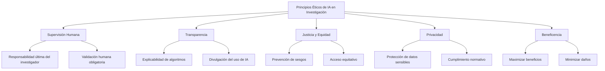
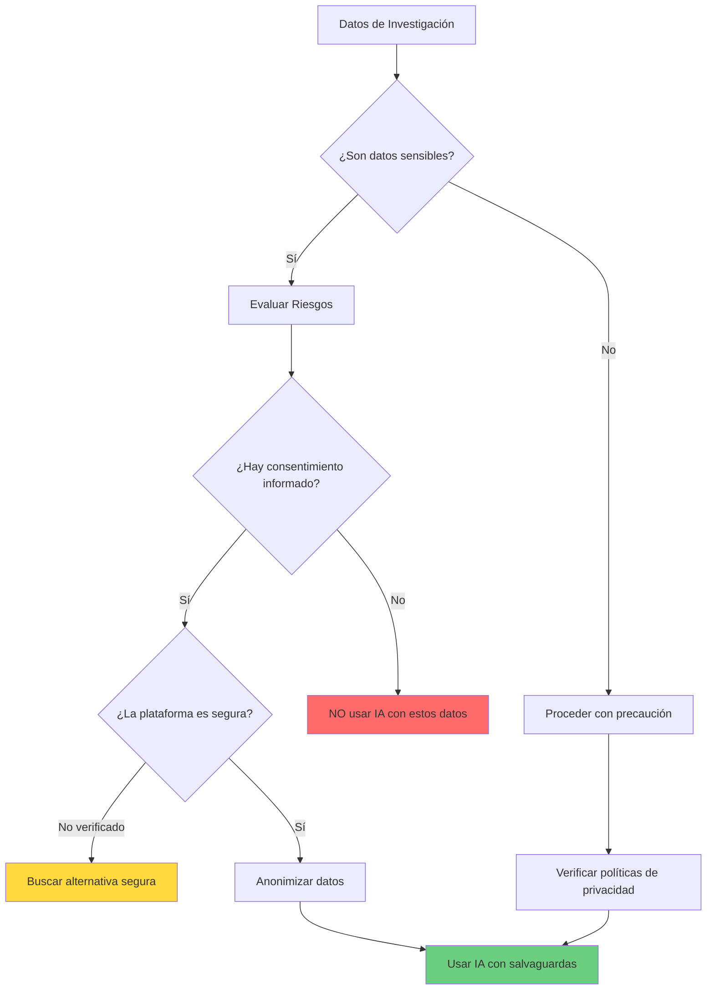
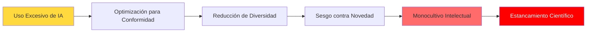
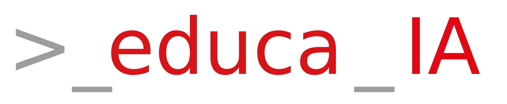

# Capítulo 7: Ética del uso de herramientas de IA para la Investigación

La IA generativa se ha consolidado como una tecnología transformadora en el panorama científico contemporáneo, presentando una naturaleza dual que redefine los límites tradicionales de la investigación académica. Por un lado, esta tecnología puede acelerar el descubrimiento científico a una velocidad sin precedentes, procesando vastos conjuntos de datos y revelando patrones que antes resultaban inaccesibles para el intelecto humano. Por otro lado, esta misma capacidad introduce profundos desafíos éticos que ponen a prueba los cimientos de la integridad académica.

La adopción de herramientas de la IA generativa en la investigación científica promete revolucionar la forma en que generamos conocimiento, pero también trae consigo dilemas éticos que no pueden ignorarse. Estos sistemas, especialmente los modelos generativos, pueden alucinar, reproducir y amplificar sesgos existentes, poner en riesgo la privacidad de datos sensibles y desafiar principios básicos de integridad académica [[08-Referencias#(UNESCO, 2021)|(UNESCO, 2021)]].

> [!warning] El desafío Ético 
> La UNESCO ha advertido que, sin _"barreras éticas"_, la IA corre el riesgo de reproducir prejuicios y discriminación, alimentar divisiones sociales y amenazar derechos humanos fundamentales. En el contexto de la investigación académica, esto implica que un uso no regulado de la IA generativa podría minar la credibilidad de la ciencia y agravar desigualdades preexistentes.

La discusión central gira en torno a una tensión fundamental: cómo aprovechar el poder de la IA generativa para mejorar la investigación sin comprometer los valores académicos esenciales de integridad, confiabilidad y rigor. El ritmo vertiginoso del desarrollo tecnológico está superando la creación de las salvaguardias éticas necesarias, lo que genera una necesidad urgente de directrices claras y aplicables.

En contextos como Latinoamérica, donde la brecha digital y las desigualdades estructurales son marcadas, esta necesidad se vuelve aún más apremiante [[08-Referencias#(CLACSO, 2023)|(CLACSO, 2023)]]. Por tanto, contar con una "brújula ética" para el uso de IA generativa en la investigación no es opcional, sino indispensable para garantizar que estas herramientas se utilicen de manera responsable en favor del conocimiento y el bien común.

Este capítulo tiene como objetivo proporcionar un marco integral para navegar este nuevo terreno. Exploraremos desde los principios éticos fundamentales que deben sustentar el uso de la IA en la investigación, hasta las directrices prácticas para el trabajo diario, equipando a los investigadores con el conocimiento necesario para utilizar estas poderosas herramientas de manera responsable.

## 7.1 Principios éticos fundamentales para la IA en la Investigación

### 7.1.1 Adaptando marcos clásicos para una nueva era

Aunque la IA generativa es una tecnología novedosa, los principios éticos que rigen su uso en la investigación no surgen de la nada; están profundamente arraigados en marcos éticos establecidos. El _Informe Belmont_, con sus principios fundamentales de Respeto por las Personas, Beneficencia y Justicia, ha sido durante mucho tiempo la piedra angular de la ética en la investigación con sujetos humanos. Este informe sirve como un modelo pionero para desarrollar directrices éticas integrales para la IA generativa en el ámbito académico [[08-Referencias#(Belmont Report, 1979)|(Belmont Report, 1979)]].

Existen marcos internacionales que establecen principios éticos para guiar el desarrollo y uso de la IA, los cuales son altamente relevantes para su aplicación en la investigación académica. La _Recomendación sobre la Ética de la Inteligencia Artificial_ de la UNESCO (aprobada por 193 países en 2021) es uno de los referentes globales clave. En ella, la protección de los derechos humanos y la dignidad se erige como piedra angular, junto con valores de transparencia, equidad, inclusión y responsabilidad en los sistemas de IA [[08-Referencias#(UNESCO, 2021)|(UNESCO, 2021)]].

### 7.1.2 Los pilares de una IA responsable

A partir de estos fundamentos clásicos, ha surgido un consenso en torno a un conjunto de principios básicos adaptados específicamente a los desafíos de la IA. Estos principios forman el núcleo de un enfoque ético para la investigación asistida por IA:



#### 1. Supervisión humana y rendición de cuentas

Este es el principio no negociable que subyace a todos los demás. Las y los investigadores humanos son, en última instancia, responsables de todos los aspectos de su trabajo, incluida la precisión, la integridad y las implicaciones éticas del contenido generado o analizado por la IA generativa. La supervisión humana]] es fundamental para garantizar el uso ético de estas tecnologías.

> [!important] Principio Fundamental 
> La IA debe ser considerada una herramienta para aumentar el juicio humano, no para reemplazarlo. La responsabilidad final no puede ser delegada a una máquina.

En la práctica, esto significa que las herramientas de IA generativa _no pueden figurar como autoras_ de trabajos científicos y que los autores humanos deben garantizar la integridad de todo el contenido presentado [[08-Referencias#(Elsevier, 2025)|(Elsevier, 2025)]]. Siempre debe haber control humano sobre los sistemas de IA generativa, y una asignación clara de responsabilidad. Las decisiones asistidas por IA en la investigación requieren validación humana, ya que los humanos (no las máquinas) son quienes deben responder por los resultados.

#### 2. Transparencia y explicabilidad

Los algoritmos deben ser comprensibles y auditables, evitando las _"cajas negras"_ cuyo funcionamiento opaco es. La [[09-Glosario#Transparencia|transparencia]] en el contexto de la investigación se traduce en varios requisitos concretos:

- Los científicos deben saber y poder explicar cuándo y cómo se ha usado la IA generativa en sus trabajos
- Debe proporcionarse información clara sobre qué sistemas de IA generativa se utilizaron y para qué propósitos
- Los métodos asistidos por IA generativa deben documentarse adecuadamente para permitir la reproducibilidad
- La divulgación del uso de la IA generativa es esencial para la evaluación por pares y la confianza en los resultados

La transparencia no es solo una cuestión de honestidad académica; es una condición necesaria para la rendición de cuentas. Sin una comprensión clara de cómo un sistema de IA llega a una conclusión, es imposible responsabilizar a nadie por sus errores.

#### 3. Justicia, Equidad y No Discriminación

La IA generativa no debe perpetuar desigualdades ni tratamientos sesgados por raza, género, idioma u origen. La UNESCO enfatiza la necesidad de prevenir usos discriminatorios y evitar que la IA refuerce inequidades estructurales existentes.

> [!note]- Contexto Latinoamericano 
> En Latinoamérica, un aspecto ético importante es la ampliación de la brecha entre quienes tienen acceso y capacitación para usar IA en la investigación y quienes no. Las instituciones con más recursos podrían beneficiarse más, dejando rezagados a académicos de entornos con menor infraestructura tecnológica [[08-Referencias#(CLACSO, 2023)|(CLACSO, 2023)]].
> 
> También existe el riesgo de una "colonización digital" si la mayoría de herramientas de IA generativa provienen de países del norte global sin adaptarse al contexto local (idioma, cultura, necesidades regionales). Un uso ético de la IA demanda esfuerzos por democratizar su acceso y adaptarla a idiomas como el español y lenguas locales.

Para los investigadores, esto implica:

- Ser conscientes de posibles sesgos en los datos o modelos generativos utilizados
- Prestar especial atención cuando trabajan con poblaciones minoritarias o contenido de regiones subrepresentadas
- Evaluar críticamente si las herramientas de IA generativas utilizadas han sido entrenadas con conjuntos de datos diversos y representativos

#### 4. Privacidad y Protección de Datos

El respeto a la privacidad es fundamental. Los investigadores tienen la obligación ética de no exponer datos sensibles o personales al usar plataformas de IA, a menos que cuenten con las autorizaciones y medidas de seguridad apropiadas.

Esto incluye:

- Cumplir con regulaciones como GDPR u otras leyes locales de protección de datos
- Entender las políticas de privacidad de las herramientas utilizadas (por ejemplo, verificar si el servicio de IA almacena o entrena con los datos proporcionados)
- Implementar una gobernanza de datos responsable en todas las etapas del proceso investigativo
- No introducir datos confidenciales de participantes o información protegida en sistemas de IA basados en la nube sin las salvaguardas apropiadas

#### 5. Beneficencia y No Maleficencia

Este principio exige que la IA se utilice para el bien de la comunidad investigadora y la sociedad en general. Implica una obligación moral de:

- **Maximizar los beneficios**: mejorar el aprendizaje, acelerar el descubrimiento científico, ampliar las capacidades de investigación
- **Minimizar los riesgos**: evaluar y mitigar cuidadosamente los daños potenciales como violaciones de la privacidad, difusión de información falsa, o impactos negativos en la sociedad

#### 6. Respeto por la Autonomía

Extraído directamente del Informe Belmont, este principio defiende el derecho de las personas a tomar decisiones informadas** sobre sus interacciones con los sistemas de IA. En el contexto de la investigación, esto es especialmente relevante para los sujetos humanos, cuyos datos pued de IA y que deben dar su [[09-Glosario#Consentimiento Informado|consentimiento informado]] para dicho uso.

### La interconexión de los principios Éticos

> [!info] Sistema Interconectado 
> Estos principios éticos no operan de forma aislada, sino que forman un sistema interconectado donde la debilidad en uno compromete a los demás.

Por ejemplo:

- La transparencia es una condición necesaria para la rendición de cuentas
- El principio abstracto de justicia solo puede lograrse mediante la implementación concreta de la equidad y la no discriminación en el diseño y evaluación de algoritmos
- Un modelo de "caja negra" que viola la transparencia hace imposible detectar sesgos (violando la equidad) o asignar la responsabilidad por resultados perjudiciales (violando la rendición de cuentas)

Por lo tanto, cualquier marco ético eficaz para la IA en la investigación debe ser holístico, reconociendo que un fallo en un principio a menudo desencadena un fallo en cascada en todo el sistema.

## Desafíos éticos en el uso de la IA generativa en la investigación

Al integrar la IA generativa en las distintas etapas de la investigación académica (búsqueda bibliográfica, análisis de datos, generación de texto, etc.), emergen desafíos éticos específicos que deben ser atendidos con cuidado. Comprender estos desafíos es el primer paso para desarrollar estr### 1. Sesgos algorítmicos y equidad

Los modelos de IA pueden contener [[09-Glosario#Sesgos Algorítmicos|sesgos algorítmicos]] derivados de sus datos de entrenamiento, reflejando prejuicios culturales o evitando perspectivas minoritarias. Este problema se manifiesta de múltiples formas en la investigación:

**En la revisión de literatura:**

- Privilegiar estudios en inglés o de ciertos países dominantes
- Subrepresentar investigaciones de regiones del Sur Global
- Favorecer ciertas metodologías o enfoques teóricos sobre otros

**En el análisis de datos:**

- Reproducir patrones discriminatorios presentes en datos históricos
- Generar conclusiones que refuerzan estereotipos o inequidades

> [!warning] Riesgo de Discriminación Algorítmica 
> Existe el riesgo de _"racismo algorítmico"_ u otras formas de discriminación automatizada [[08-Referencias#(CLACSO, 2023)|(CLACSO, 2023)]]. El desafío ético es identificar y mitigar estos sesgos para no perpetuar desigualdades en el conocimiento científico.

**Estrategias de mitigación:**

- Evaluar críticamente la diversidad de los datos de entrenamiento de las herramientas utilizadas
- Complementar búsquedas asistidas por IA con métodos tradicionales para asegurar cobertura completa
- Ser especialmente vigilante cuando se trabaja con poblaciones o contextos subrepresentados
- Validar resultados con múltiples fuentes y perspecncialidad de datos

Muchos investigadores manejan datos sensibles (personales, clínicos, empresariales). La [[09-Glosario#Privacidad de Datos|privacidad de datos]] es crucial cuando se utilizan sistemas de IA generativos basados en la nube, ya que podría haber fugas o usos no autorizados de la información.



**Imperativos éticos:**

- Respetar la confidencialidad de participantes y fuentes
- Asegurarse de que la utilización de la IA generativa no viole acuerdos de privacidad ni derechos de los sujetos investigados
- Entender las políticas de las plataformas (GDPRsan para entrenamiento?, ¿dónde residen los servidores?)
- Implementar técnicas de anonimización cuando sea necesario
- Cumplir con regulacionrio#GDPR|rnacionales de protección de datos

### 3. Integridad académica y plagio

Un tema crítico es garantizar que el uso de IA no derive en [[09-Glosario#Plagio|plagio]] o fraude académico. La [[09-Glosario#Integridad Académica|integridad académica]] es fundamental. Dado que los modelos generativos producen texto a partir de patrones de entrenamiento, existen múltiples preocupaciones:

**El problema del "plagio automatizado":**

- Un modelo podría generar párrafos similares a fuentes existentes sin citarlas
- El contenido generadoamente material protegido por derechos de autor
- No queda claro dónde termina la contribución del investigador y comienza la de la máquina

**El problema de las "alucinaciones":**

- Las herramientas como ChatGPT pueden presentar [[09-Glosario#Alucinaciones|alucinaciones]], generando referencias bibliográficas inventadas
- Pueden presentar datos o estadísticas ficticios con apariencia de autenticidad
- Pueden generar afirmaciones que suenan plausibles pero son factualmente incorrectas

> [!danger] Imperativo de Verificación 
> El reto ético es doble: por un lado, evitar presentar como propio un contenido generado por IA sin la debida atribución; por otro, verificar cualquier información proporcionada por la IA contra fuentes confiables, para no propagar datos falsos.

**Buenas prácticas:**

- Nunca confiar ciegamente en referencias proporcionadas por IA; siempre verificarlas
- No presentar texto generado por IA como escritura propia sin revisión sustancial y apropiación intelectual
- Ser transparente sobrroceso de investigación
- Mantener registros de cómo se utilizó la IA para fines de trazabilidad

### 4. Autoría y atribución del mérito

La incorporación de IA en la redacción de artículos difumina la línea de quién hizo una contribución intelectual. El concepto de [[09-Glosario#Autoría|autoría]] plantea desafíos éticos que tienen varias dimensiones:

**Consenso de la comunidad académica:** Por consenso de la comunidad académica, las IA no pueden ser autoras de trabajos científicos, ya que no pueden asumir responsabilidad legal ni ética por el contenido [[08-Referencias#(Elsevier, 2025)|(Elsevier, 2025)]]. La cuestión de si una IA puede ser considerada autora o inventora ha provocado un intenso debate legal y filosófico que llega al corazón de lo que significa la creatividad y la propiedad intelectual.

**Postura legal y filosófica:** El precedente legal actual, tanto en el Reino Unido como en Estados Unidos, sostiene que la autoría y la invención requieren una "persona física". El argumento se centra en la distinción fundamental entre computación y conciencia. Los sistemas de IA, aunque capaces de generar resultados complejos, carecen de la intencionalidad, la experiencia vivida y la agencia moral que la legislación sobre propiedad intelectual reconoce como elementos centrales de la creatividad humana [[08-Referencias#(UK & US Copyright Law, 2024)|(UK & US Copyright Law, 2024)]].

> [!info]- Implicaciones para Derechos de Autor 
> En la práctica, esto significa que una obra generada puramente por IA sin una intervención humana significativa se considera actualmente **no protegible por derechos de autor** y, por tanto, pertenece al dominio público en jurisdicciones como la estadounidense.
> 
> Sin embargo, la ley sí reconoce la creatividad humana en la interacción con la IA. Un ser humano que modifica, selecciona o dispone de forma creativa el contenido generado por IA puede reclamar derechos de autor sobre sus propias contribuciones originales.

**Preguntas éticas persistentes:**

- ¿Cuánto de la escritura o análisis debe provenir del investigador vs. la máquina?
- ¿Cómo atribuir el mérito cuando la IA realiza contribuciones sustanciales?
- ¿Qué nivel de transformación humana es necesario para considerar el trabajo como propio?

**Directrices actuales:** Éticamente, los investigadores deben conservar una contribución sustancial de cosecha propia en cualquier trabajo asistido por IA [[08-., 2024)|(Porsdam Mann et al., 2024)]]. Asimismo, debe reconocerse el uso de la IA en los agradecimientos o secciones de metodología del documento, para mantener la transparencia sobre cómo se produjo el trabajo.

### 5. Transparencia y Reproducibilidad

La ciencia prospera con la [[09-Glosario#Reproducibilidad|reproducibilidad]] y la trazabilidad de los métodos. Si un artículo científico se apoyó en una IA para ciertos pasos (por ejemplo, analizar un gran corpus de textos, generar código, traducir entrevistas, o sintetizar literatura), los demás científicos necesitan saberlo para poder evaluar, replicar o comprender plenamente los hallazgos.

**Desafíos para la reproducibilidad:**

- Los modelos de IA evolucionan constantemente; una consulta hoy puede dar resultados diferentes mañana
- Muchos sistemas son propietarios y no permiten acceso completo a su funcionamiento interno
- La naturaleza estocástica de algunos modelos significa que pueden generar respuestas diferentes ante el mismo prompt

**Consecuencias de la falta de transparencia:**

- Dificulta la evaluación por pares efectiva
- Mina la confianza en los resultados
- Impide la replicación de estudios
- Obstaculiza el progreso científico acumulativo

**Requisitos de transparencia:**

- Especificar qué herramienta de IA se usó (nombre, versión, fecha de uso)
- Describir cómo se utilizó (qué tareas realizó)
- Documentar prompts o parámetros relevantes cuando sea posible
- Explicar cómo se validaron los resultados generados por IA

### 6. Responsabilidad y rendición de cuentas

Relacionado con la autoría, está la cuestión de quién responde ante eventuales errores o daños. Un modelo de IA podría cometer errores de análisis que lleven a conclusiones incorrectas en un estudio, pero la responsabilidad última recae en los investigadores que decidieron usarlo.

> [!important] Principio de Responsabilidad Humana 
> Cualquier contenido generado por IA debe ser revisado y aprobado conscientemente por al menos un autor humano. Los humanos (no las máquinas) deben responder por los resultados.

Esto obliga a:

- Delinear claramente roles y responsabilidades en proyectos que usan IA
- No delegar decisiones críticas exclusivamente a la IA
- Mantener supervisión humana en todas las etapas del proceso
- Establecer protocolos de validación rigurosos

### 7. Propiedad Intelectual y Derechos de Autor

El uso de IA también suscita interrogantes sobre copyright y propiedad intelectual:

**Por el lado del input (datos de entrenamiento):**

- Los modelos entrenados con textos o imágenes podrían estar reutilizando material protegido
- Existen preocupaciones sobre si el entrenamiento de IA constituye "uso justo" del material original

**Por el lado del output (contenido generado):**

- El resultado generado (texto, código, imágenes) puede no estar claramente cubierto por las leyes tradicionales de autoría
- Persiste incertidumbre legal sobre quién posee los derechos del contenido generado

**En la práctica investigativa:**

- Se debe tener cuidado de no infringir derechos al generar contenido
- No pedir a la IA que reproduzca secciones de libros o artículos fuera del uso legítimo
- Verificar que imágenes o gráficos generados por IA no introduzcan material protegido
- Muchas políticas editoriales prohíben crear imágenes de resultados científicos con IA, salvo que sea parte explícita de la metodología y se documente apropiadamente [[08-Referencias#(Elsevier, 2025)|(Elsevier, 2025)]]

### 8. Impacto Social y Brecha Digital

En contextos como Latinoamérica, un aspecto ético crucial es la ampliación de desigualdades en el acceso y uso de herramientas de IA para la investigación.

**Dimensiones de la brecha:**

- **Acceso tecnológico**: Diferencias en infraestructura de internet, hardware, y acceso a plataformas premium
- **Capacitación**: Disparidades en formación sobre uso efectivo y ético de IA
- **Recursos institucionales**: Instituciones con más recursos se benefician más, dejando rezagados a académicos de entornos con menor infraestructura

**Riesgo de "colonización digital":**

- La mayoría de herramientas de IA provienen de empresas de países desarrollados
- Pueden no estar adaptadas al contexto local (idioma, cultura, necesidades regionales)
- Potencial sesgo contra perspectivas, idiomas y epistemologías del Sur Global

> [!note] Hacia una IA Inclusiva 
> Un uso ético de la IA demanda esfuerzos por democratizar su acceso y adaptarla a idiomas como el español y lenguas locales, de modo que sus beneficios sean inclusivos y no se concentren solo en ciertos países o élites académicas [[08-Referencias#(CLACSO, 2023)|(CLACSO, 2023)]].

## Directrices y buenas prácticas para un uso ético de la IA

Afortunadamente, la comunidad académica, las instituciones y las empresas tecnológicas están articulando buenas prácticas y directrices para enfrentar los desafíos éticos. A continuación, se presenta un manual práctico para utilizar herramientas de IA de forma ética en la investigación científica.

### Vigilancia y verificación humana

**Principio fundamental:** Nunca se debe confiar ciegamente en los resultados generados por IA.

> [!important] Regla de Oro
>  _Al menos un autor humano debe revisar detalladamente_ todo contenido o análisis provisto por una IA antes de integrarlo a un trabajo académico.

Esta práctica de vetting humano garantiza la exactitud e integridad de cada afirmación y dato [[08-Referencias#(Porsdam Mann et al., 2024)|(Porsdam Mann et al., 2024)]]. En otras palabras, la IA puede asistir, pero la validación final recae en el investigador.

**Prácticas concretas:**

- Verificar todas las referencias bibliográficas generadas por IA contra fuentes originales
- Comprobar datos y estadísticas con fuentes primarias confiables
- Evaluar críticamente la lógica y coherencia de argumentos generados
- No aceptar "alucinaciones" como hechos verificados

### Transparencia en el Uso de IA

La **divulgación honesta** sobre el uso de herramientas de IA es esencial para mantener la confianza y permitir la reproducibilidad científica.

**Qué divulgar:**

1. **Herramientas específicas** utilizadas (nombre, versión, proveedor)
2. **Propósitos** para los que se empleó la IA (revisión de literatura, análisis de datos, redacción de secciones, generación de código, etc.)
3. **Alcance del uso**: qué partes del trabajo fueron asistidas por IA
4. **Proceso de validación**: cómo se verificaron los resultados generados

**Dónde divulgar:**

- En la sección de **Metodología** (cuando la IA fue parte integral del proceso investigativo)
- En los **Agradecimientos** (cuando fue una herramienta auxiliar)
- En **declaraciones específicas** que algunas revistas ahora requieren

```markdown
Ejemplo de declaración:
"Se utilizó ChatGPT (OpenAI, GPT-4, versión de octubre 2024) para 
asistir en la revisión inicial de literatura y la traducción de 
algunas citas. Todo el contenido fue verificado contra fuentes 
originales y revisado exhaustivamente por los autores."
```

### Protección de Datos y Privacidad

**Regla de oro:** No introducir datos sensibles, confidenciales o de identificación personal en herramientas de IA basadas en la nube sin las salvaguardas apropiadas.

**Pasos para proteger la privacidad:**

1. **Evaluación de riesgos:**
    
    - Clasificar los datos según su nivel de sensibilidad
    - Identificar regulaciones aplicables (GDPR, leyes locales)
    - Evaluar las políticas de privacidad de la herramienta de IA
2. **Anonimización:**
    
    - Eliminar identificadores personales antes de usar IA
    - Aplicar técnicas de desidentificación cuando sea posible
    - Agregar o generalizar datos sensibles
3. **Consentimiento informado:**
    
    - Asegurar que los participantes hayan consentido el uso de IA en el análisis
    - Actualizar protocolos de investigación para incluir el uso de IA
    - Informar claramente sobre cómo se utilizarán sus datos
4. **Selección de herramientas seguras:**
    
    - Preferir versiones institucionales con políticas claras de no almacenamiento
    - Verificar certificaciones de seguridad y ubicación de servidores
    - Considerar herramientas de código abierto alojadas localmente para datos muy sensibles

> [!warning]- Advertencia sobre Datos Sensibles 
> Muchos servicios de IA gratuitos pueden almacenar las conversaciones y usar los datos para mejorar sus modelos. Para datos de investigación confidenciales, esto representa un **riesgo inaceptable**.

### Mitigación de sesgos algorítmicos

Ser consciente de que las herramientas de IA pueden contener sesgos y tomar medidas proactivas para mitigarlos.

**Estrategias prácticas:**

1. **Diversificación de fuentes:**
    - No depender únicamente de una herramienta de IA
    - Complementar con búsquedas manuales y bases de datos especializadas
    - Incluir deliberadamente perspectivas de regiones y comunidades subrepresentadas

2. **Evaluación crítica:**
    - Preguntarse: ¿qué perspectivas podrían estar faltando?
    - Verificar la representación geográfica, lingüística y cultural en los resultados
    - Ser especialmente vigilante en investigaciones sobre poblaciones marginadas

3. **Documentación:**
    - Registrar las limitaciones identificadas en el uso de IA
    - Discutir potenciales sesgos en las secciones de limitaciones del estudio

4. **Búsqueda activa de contraejemplos:**
    - Formular consultas deliberadamente diversas
    - Buscar activamente literatura en múltiples idiomas
    - Consultar bases de datos regionales y especializadas

### Políticas Institucionales y Editoriales

Familiarizarse y cumplir con las políticas específicas de instituciones y revistas es crucial.

**Políticas editoriales comunes:**

|Editorial/Revista|Postura Principal|
|---|---|
|Nature, Science|Requieren divulgación; IA no puede ser autora|
|Elsevier|Transparencia obligatoria; sin imágenes de resultados generadas por IA|
|APA|Citar herramientas de IA usadas; responsabilidad total del autor|
|IEEE|Permitido con restricciones; validación humana requerida|

> [!info]- Declaraciones de Editoriales Principales
> La mayoría de las principales editoriales científicas han adoptado una postura consistente:
> 
> 1. **La IA no puede ser autora** de trabajos científicos
> 2. El uso de IA debe ser **divulgado transparentemente**
> 3. Los **autores humanos son responsables** de la exactitud y integridad de todo el contenido
> 4. No se permite usar IA para crear **datos o resultados fabricados** [[08-Referencias#(Elsevier, 2025)|(Elsevier, 2025)]]

**Recomendaciones:**

- Consultar las guías específicas de las revistas objetivo antes de usar IA en un manuscrito
- Verificar las políticas de financiadores sobre el uso de IA
- Conocer las directrices de comités de ética de la propia institución

### Formación continua y pensamiento crítico

Dado el ritmo acelerado de desarrollo de la IA, el **aprendizaje continuo** es esencial.

**Áreas clave de desarrollo:**

1. **Alfabetización en IA:**
    - Comprender cómo funcionan los modelos de lenguaje
    - Conocer sus capacidades y limitaciones
    - Entender conceptos como alucinaciones, sesgos y ventanas de contexto

2. **Pensamiento crítico:**
    - Desarrollar escepticismo saludable hacia salidas de IA
    - Cultivar habilidades de verificación y validación
    - Mantener criterio independiente


3. **Ética aplicada:**
    - Reflexionar sobre implicaciones éticas del uso de IA
    - Considerar impactos más amplios en la comunidad científica
    - Participar en discusiones sobre mejores prácticas

4. **Actualización constante:**
    - Seguir desarrollos en políticas institucionales
    - Mantenerse informado sobre nuevas herramientas y sus características
    - Participar en talleres y capacitaciones

### Uso responsable en diferentes etapas de la investigación

La IA puede utilizarse éticamente en múltiples fases del proceso investigativo, siempre que se apliquen las salvaguardias apropiadas:

#### En la Revisión de Literatura

**Usos apropiados:**
- Identificación inicial de literatura relevante
- Síntesis de grandes volúmenes de texto
- Traducción de resúmenes para acceder a literatura en otros idiomas

**Salvaguardias:**

- Verificar todas las referencias contra bases de datos académicas
- Complementar con búsquedas manuales sistemáticas
- No depender exclusivamente de IA para revisiones sistemáticas

#### En el Análisis de Datos

**Usos apropiados:**

- Procesamiento de grandes conjuntos de datos cualitativos
- Identificación de patrones iniciales
- Generación de código para análisis estadísticos

**Salvaguardias:**

- Validar el código generado antes de usarlo
- Verificar resultados con métodos alternativos
- Comprender la lógica de los análisis, no solo ejecutarlos

#### En la Redacción

**Usos apropiados:**

- Superar el "bloqueo del escritor" con borradores iniciales
- Mejora de claridad y gramática
- Traducción y corrección de estilo

**Salvaguardias:**

- Reescribir sustancialmente cualquier texto generado
- Asegurar que la voz y argumentación sean propias
- Nunca presentar texto generado por IA como escritura original sin transformación significativa

#### En la Generación de Hipótesis

**Usos apropiados:**

- Exploración de conexiones entre diferentes áreas de conocimiento
- Generación de ideas iniciales para investigación
- Identificación de gaps en la literatura

**Salvaguardias:**

- Evaluar críticamente la plausibilidad y novedad de ideas generadas
- Fundamentar hipótesis en revisión de literatura rigurosa
- Mantener criterio científico independiente

## El futuro de la Ética en la Investigación con IA

### Redefiniendo la Comunicación Científica

La integración de IA en la ciencia está transformando fundamentalmente cómo se produce, evalúa y comunica el conocimiento científico. Esta transformación plantea preguntas profundas sobre el futuro de prácticas establecidas.

#### El futuro de la revisión por pares

El sistema tradicional de revisión por pares, pilar de la validación científica, se enfrenta a una crisis. El aumento exponencial de las publicaciones ha provocado una "fatiga del revisor", con una carga de trabajo inmensa y no remunerada para la comunidad académica. La IA se presenta como una posible solución, pero también como una nueva amenaza.

**La IA como asistente de revisión:**

Beneficios potenciales:

- Acelerar la selección de revisores mediante emparejamiento inteligente
- Comprobar automáticamente fallos metodológicos y errores estadísticos
- Detectar plagio y manipulación de imágenes
- Reducir la carga de trabajo técnico de los revisores

**La IA como amenaza:**

Riesgos importantes:

- **Violación de confidencialidad** si se usan herramientas públicas de IA para revisar manuscritos
- **"Alucinaciones"** que introducen críticas espurias o incorrectas
- Posible **sesgo contra investigación novedosa** si la IA está entrenada con literatura existente
- Erosión de la **confianza** en el proceso de revisión

> [!note] Consenso emergente: Modelo Híbrido 
> El futuro de la revisión por pares parece dirigirse hacia un _Modelo Híbrido_ en el que la IA actúe como una poderosa ayuda para los revisores humanos, mientras que los expertos humanos conservan el juicio final y la responsabilidad.

#### El riesgo de "Monocultivos del Saber"

La dependencia excesiva de la IA en todo el ciclo de vida de la investigación entraña un riesgo sistémico profundo: la creación de "monocultivos del saber" que podrían sofocar la creatividad y estrechar el ámbito de la investigación científica.

Este riesgo se manifiesta de dos maneras:

1. **Ilusión de amplitud exploratoria:**
    - Los investigadores podrían priorizar preguntas y métodos que mejor se adaptan a herramientas de IA
    - Ignorar otros modos de indagación válidos que no se prestan fácilmente a automatización
    - Reducción de la diversidad metodológica y epistemológica

2. **Ilusión de objetividad:**
    
    - Si los sistemas de IA llegan a ser vistos como árbitros más objetivos de la verdad
    - Podrían sustituir las diversas perspectivas de la comunidad científica
    - Crear un único punto de vista autoritario pero inherentemente sesgado



> [!warning] Implicación Profunda
>  La ciencia avanza no solo a través de la eficiencia, sino también de la creatividad, la serendipia y el desafío a los paradigmas establecidos. Un futuro en el que la IA optimice todo el proceso de investigación podría, sin querer, optimizar para la conformidad, lo que llevaría a una ciencia altamente productiva pero intelectualmente estancada.

### Desafíos emergentes

A medida que la tecnología evoluciona, surgen nuevos desafíos éticos que requerirán atención:

1. **Modelos multimodales avanzados:**
    - IA capaz de analizar simultáneamente texto, imágenes, audio y video
    - Nuevas preocupaciones sobre autenticidad y manipulación de datos
    - Necesidad de protocolos de verificación más sofisticados

2. **Agentes autónomos:**
    - Sistemas de IA capaces de realizar tareas de investigación completas de forma autónoma
    - Preguntas sobre supervisión y control humano
    - Riesgos de pérdida de comprensión profunda del proceso investigativo

3. **Acceso desigual a IA avanzada:**
    - Brecha creciente entre instituciones con recursos y aquellas sin ellos
    - Potencial concentración del poder científico
    - Necesidad de democratización del acceso

4. **Evolución regulatoria:**
    - Desarrollo de marcos legales específicos para IA en investigación
    - Armonización internacional de estándares
    - Equilibrio entre innovación y protección

## Recomendaciones para un marco ético integral

El análisis de la ética de la IA en la investigación revela un panorama complejo, lleno de promesas y peligros. Afrontar estos desafíos requiere un esfuerzo proactivo y coordinado de todas las partes interesadas en el ecosistema de la investigación.

> [!important] Principio Rector 
> Prohibir la IA no es la respuesta; su potencial para acelerar el descubrimiento es demasiado grande como para ignorarlo. En su lugar, el camino a seguir exige un equilibrio cuidadoso entre la innovación y la responsabilidad, integrando estas poderosas herramientas de una manera que amplifique el intelecto humano sin comprometer los fundamentos éticos de la ciencia.

### Para investigadores individuales

La responsabilidad comienza a nivel individual. Se insta a los investigadores a:

1. **Adoptar una cultura de uso crítico:**
    - Emplear IA con escepticismo saludable
    - Verificar rigurosamente todos los resultados
    - Mantener criterio independiente

2. **Comprometerse con el aprendizaje continuo:**
    - Comprender capacidades y limitaciones de las herramientas
    - Mantenerse actualizado sobre mejores prácticas
    - Participar en formación sobre ética de IA

3. **Practicar transparencia absoluta:**
    - Divulgar uso de IA en publicaciones
    - Documentar métodos y procesos
    - Compartir experiencias con la comunidad

4. **Aceptar responsabilidad final:**
    - Reconocer que los humanos responden por todo el trabajo
    - No delegar juicio crítico a las máquinas
    - Mantener supervisión activa en todas las etapas

### Para Instituciones y Universidades

Las instituciones académicas deben pasar de la reacción a la proactividad:

1. **Desarrollar políticas claras:**
    - Guías específicas sobre uso aceptable de IA
    - Protocolos para protección de datos
    - Procedimientos para casos de uso inapropiado

2. **Proporcionar infraestructura segura:**
    - Acceso a entornos de IA protegidos
    - Herramientas que respeten confidencialidad de datos
    - Alternativas institucionales a servicios públicos

3. **Ofrecer formación robusta:**
    - Talleres sobre uso ético de IA
    - Capacitación en detección de sesgos
    - Educación sobre mejores prácticas

4. **Fomentar diálogo ético:**
    - Espacios para discusión de dilemas
    - Comités de ética que incluyan consideraciones de IA
    - Comunidades de práctica sobre investigación con IA

### Para Editoriales y Agencias de Financiación

Estos guardianes del ecosistema científico tienen un papel crucial:

1. **Armonizar políticas:**
    
    - Mayor consistencia en requisitos sobre IA
    - Reducir confusión para investigadores
    - Coordinar estándares internacionalmente
2. **Desarrollar herramientas de detección:**
    
    - Sistemas sofisticados para detectar uso inapropiado
    - Tecnologías para identificar contenido generado por IA
    - Mecanismos para combatir fraude a escala industrial
3. **Reevaluar estructuras de incentivos:**
    
    - Cuestionar la cultura de "publicar o perecer"
    - Valorar calidad sobre cantidad
    - Reconocer transparencia y reproducibilidad
4. **Liderar conversaciones sobre el futuro:**
    
    - Anticipar desafíos emergentes
    - Desarrollar marcos adaptativos
    - Promover colaboración internacional

### Para la Comunidad Científica Global

1. **Desarrollar estándares compartidos:**
    - Consenso sobre mejores prácticas
    - Definición de uso apropiado vs. inapropiado
    - Criterios para evaluación de trabajos asistidos por IA

2. **Promover equidad y acceso:**
    - Democratización de herramientas de IA
    - Apoyo a regiones con menos recursos
    - Desarrollo de herramientas multilingües y culturalmente sensibles

3. **Mantener vigilancia ética:**
    - Monitoreo continuo de impactos
    - Evaluación de consecuencias no intencionales
    - Adaptación de prácticas según surgen desafíos

4. **Preservar valores fundamentales:**
    - Creatividad e innovación
    - Diversidad de perspectivas
    - Rigor y integridad científica


## Conclusión

La integración de la IA en la investigación científica no es simplemente una cuestión tecnológica, sino un profundo desafío ético y cultural. Requiere una colaboración continua para garantizar que, a medida que nuestras herramientas se vuelven más capaces, nosotros, como comunidad científica, nos volvemos más sabios y responsables en su uso.

El camino ético hacia adelante requiere reconocer que la IA es una herramienta extraordinariamente poderosa, pero sigue siendo eso: una herramienta o como otros investigadores le han llamado una tecnología normal (https://substack.com/home/post/p-173147197). Su valor está en aumentar las capacidades humanas, no en reemplazar el juicio, la creatividad y la responsabilidad que definen la empresa científica.

> [!quote] Reflexión Final 
> La pregunta central no es si debemos usar IA en la investigación, sino cómo debemos usarla. La respuesta a este "cómo" debe estar fundamentada en principios éticos sólidos, prácticas transparentes, supervisión humana rigurosa y un compromiso inquebrantable con los valores fundamentales de la ciencia: la búsqueda de la verdad, la integridad intelectual y el servicio al bien común.

Al navegar esta nueva frontera, debemos recordar que la integridad científica no es un obstáculo para la innovación, sino su fundamento. Una ciencia que sacrifica sus principios éticos en aras de la eficiencia o la velocidad está construyendo sobre arena. En contraste, una ciencia que da la bienvenida a las herramientas de IA mientras mantiene firmemente sus compromisos éticos está preparada para un futuro de descubrimientos sin precedentes, realizados con responsabilidad y dirigidos hacia el florecimiento humano.

La brújula ética que este capítulo ha intentado proporcionar no es un mapa completo (el territorio de la IA aún se está formando) sino un conjunto de principios orientadores que pueden ayudarnos a navegar con integridad a través de un paisaje que cambia rápidamente. Al final, la responsabilidad recae en cada uno de nosotros: estudiantes, docentes, investigadores, instituciones, editoriales y la comunidad científica en su conjunto, para asegurar que la revolución de la IA en la investigación sea una que eleve la ciencia en lugar de comprometerla.


---

**🧭 Navegación:** [[06-Análisis-Cuantitativo-Cualitativo|⬅️ Capítulo 6]] | [[08-Referencias|Siguiente: Referencias ➡️]]


---
<div align="center">
  
  
</div>
