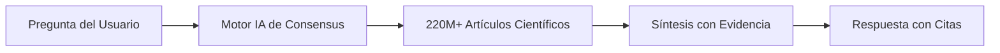
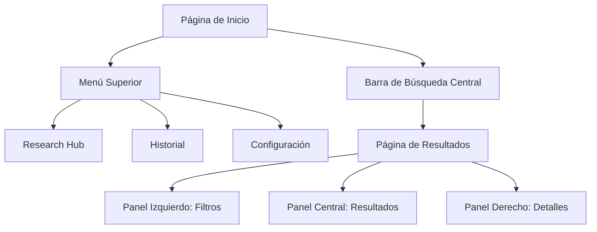

#  Consensus

> [!INFO] Información General
>  **Consensus** es un motor de búsqueda académica potenciado por IA que indexa más de 220 millones de artículos científicos revisados por pares. Su objetivo es democratizar el acceso al conocimiento científico y proporcionar respuestas basadas en evidencia de manera rápida y confiable.

---

## 🌐 Acceso y Plataformas

### Acceso Web

- **URL oficial:** [consensus.app](https://consensus.app/)
- **Compatibilidad:** Funciona en navegadores modernos (Chrome, Firefox, Safari, Edge)
- **Sistemas operativos:** Windows, macOS, Linux
- **Sin instalación:** Completamente basado en la web

### Acceso Móvil

> [!TIP] Alternativa Móvil Aunque no existe una app nativa para iOS/Android, puedes:
> 
> - Usar la versión web optimizada para móviles
> - Añadir Consensus a la pantalla de inicio de tu teléfono para simular una app

### Registro

|Opción|Características|
|---|---|
|**Sin registro**|Búsquedas básicas limitadas|
|**Cuenta gratuita**|Historial de búsquedas, listas guardadas, acceso a funcionalidades adicionales|
|**Planes pagos**|Funcionalidades avanzadas ilimitadas|

> [!NOTE] Se recomienda crear una cuenta gratuita para aprovechar todas las funcionalidades y monitorear los límites mensuales.

---

## 🎯 Definición y Casos de Uso

### ¿Qué es Consensus?

**Consensus** es un motor de búsqueda académica de última generación que utiliza inteligencia artificial para encontrar respuestas basadas en evidencia en literatura científica. A diferencia de buscadores generales, se enfoca **exclusivamente en fuentes académicas revisadas por pares**.

### Casos de Uso Principales

#### 1. 🔬 Investigación Académica

- Acelera revisiones de literatura
- Identifica vacíos de investigación
- Sintetiza rápidamente estudios relevantes
- **Ejemplo:** Estudiante de posgrado ahorra horas obteniendo resúmenes de decenas de artículos sobre su tesis

#### 2. 🏥 Toma de Decisiones Clínicas

- Encuentra respuestas confiables a preguntas clínicas
- Proporciona evidencia respaldada con citas
- Soporta decisiones de tratamiento
- **Ejemplo:** Médico consulta efectividad de medicamento en población específica

#### 3. 📰 Comunicación Científica y Periodismo

- Proporciona datos verificados con citas
- Mejora la precisión de reportajes
- Acceso a fuentes primarias
- **Ejemplo:** Periodista científico obtiene consenso sobre cambio climático con fuentes primarias

#### 4. 🎓 Educación y Aprendizaje

- Acceso a conocimiento científico actualizado
- Resúmenes generados por IA para temas complejos
- Útil para materiales didácticos
- **Ejemplo:** Profesor prepara clase con explicaciones simplificadas y referencias

#### 5. 🏛️ Formulación de Políticas

- Obtiene consenso científico sobre temas clave
- Fundamenta políticas en evidencia sólida
- Análisis rápido de intervenciones
- **Ejemplo:** Analista consulta efectividad de intervenciones sociales

---

## ⚡ Características Clave

### 1. Cobertura Masiva

> [!SUCCESS] Base de Datos Extensa
> 
> - **220+ millones** de artículos académicos
> - Todos los campos científicos
> - Fuentes: Semantic Scholar, PubMed, etc.
> - Solo literatura **revisada por pares**

### 2. Búsqueda Inteligente con Lenguaje Natural

- Procesamiento de preguntas en lenguaje cotidiano
- No requiere sintaxis especializada
- Comprende intención del usuario
- Sinónimos y contexto automático

**Ejemplos de preguntas:**

- ❌ "effects meditation stress cortisol levels" (sintaxis de buscador tradicional)
- ✅ "¿Ayuda la meditación a reducir el estrés?" (lenguaje natural)

### 3. Consensus Meter (Medidor de Consenso)

Visualización del estado del consenso científico:

|Estado|Descripción|Visual|
|---|---|---|
|**Sí**|Mayoría de estudios apoyan|Barra verde dominante|
|**No**|Mayoría de estudios refutan|Barra roja dominante|
|**Posiblemente**|Evidencia mixta|Balance entre colores|

### 4. Snapshots (Resúmenes Instantáneos)

- Resúmenes generados por IA de cada artículo
- 2-3 oraciones con hallazgos clave
- Ahorra tiempo de lectura
- Disponible sin abrir el PDF

### 5. Filtros Avanzados

- **Por tipo de estudio:** Ensayos clínicos, metaanálisis, revisiones sistemáticas, etc.
- **Por año de publicación**
- **Por ámbito:** Humanos, animales, in vitro
- **Por tipo de muestra:** Humanos, animales, células, etc.
- **Por dominio:** Medicina, psicología, ciencias sociales, etc.

### 6. Modos de Análisis Potenciados por IA

#### Pro Analysis

- Respuestas detalladas en 2-3 minutos
- Lista con viñetas de hallazgos clave
- Citas numeradas en superíndice
- Análisis de ~7 estudios relevantes

#### Deep Research

- Investigación exhaustiva automatizada
- 10-20 minutos de análisis
- Informe extenso (varias páginas)
- Analiza 20-30+ estudios
- Estructura: Introducción, hallazgos, conclusión

### 7. Ask Paper (Chat con PDFs)

- Sube tus propios PDFs
- Haz preguntas específicas
- IA responde basándose en el contenido
- Hasta 5 PDFs simultáneos

### 8. Research Hub (Centro de Investigación)

- Organiza búsquedas en listas
- Historial completo de búsquedas
- Marca favoritos
- Añade notas personales

---

## 💰 Planes y Precios

### Plan Gratuito (Free)

|Característica|Límite|
|---|---|
|Búsquedas simples|Ilimitadas|
|Consensus Meter|Ilimitado|
|Snapshots|Ilimitados|
|Filtros|Completos|
|Pro Analysis|**10 consultas/mes**|
|Deep Research|**3 consultas/mes**|
|Ask Paper|**10 consultas/mes**|

> [!WARNING] Límites del Plan Gratuito Si alcanzas el límite mensual de funciones avanzadas, deberás esperar al siguiente mes o actualizar tu plan.

### Plan Premium (Pro)

|Característica|Beneficio|
|---|---|
|Pro Analysis|**Ilimitado**|
|Deep Research|**Ilimitado**|
|Ask Paper|**Ilimitado**|
|Precio|~$8.99 USD/mes (verificar en la plataforma)|

### Planes Institucionales

- **Teams:** Para grupos pequeños (10-50 usuarios)
- **Enterprise:** Para organizaciones grandes (50+ usuarios)
- Características: Panel administrativo, facturación centralizada, soporte prioritario

> [!TIP] Recomendación Comienza con el plan gratuito para familiarizarte. Si usas frecuentemente funciones avanzadas, considera actualizar al plan Pro.

---

## 🖥️ Anatomía de la Interfaz (GUI)

### Estructura Principal

### Componentes Clave

#### 1. Barra de Búsqueda

- **Ubicación:** Centro de la página inicial
- **Función:** Ingresa tu pregunta en lenguaje natural
- **Características:**
    - Sugerencias automáticas mientras escribes
    - Historial de búsquedas recientes
    - Botones de modo: Simple / Pro / Deep

#### 2. Panel de Resultados (Centro)

Elementos que verás por cada resultado:

- **Título del artículo** (enlace al estudio completo)
- **Snapshot** (resumen generado por IA)
- **Metadatos:** Autores, año, revista, citas
- **Indicadores visuales:** Icono de tipo de estudio
- **Acciones:** Guardar, citar, ver detalles

#### 3. Panel de Filtros (Izquierda)

Organizado en secciones colapsables:

- Tipo de estudio
- Año de publicación
- Ámbito (humanos/animales)
- Dominio científico
- Disponibilidad de texto completo

#### 4. Panel de Detalles (Derecha)

Se abre al hacer clic en un resultado:

- Abstract completo
- Metodología resumida
- Hallazgos clave
- Enlace al PDF (si disponible)
- Opción para citar
- Botón para Ask Paper

#### 5. Consensus Meter

- **Ubicación:** Parte superior de resultados
- **Visual:** Barra horizontal con gradiente de colores
    - 🟢 Verde = Sí
    - 🔴 Rojo = No
    - 🟡 Amarillo = Posiblemente
- **Información:** Porcentaje y número de estudios

#### 6. Research Hub

- **Acceso:** Icono de carpeta en menú superior
- **Contenido:**
    - Listas guardadas
    - Búsquedas recientes
    - PDFs subidos
    - Notas de investigación

---

## 📖 Tutorial de Funcionalidades

### A. Realizar una Búsqueda Básica

#### 1. **Acceder a la plataforma:**

- Abre tu navegador y ve a [consensus.app](https://consensus.app/)
- Si tienes cuenta, inicia sesión para acceder a todas las funcionalidades

#### 2. **Formular tu pregunta:**

- Localiza la barra de búsqueda en el centro de la pantalla
- Escribe tu pregunta en lenguaje natural, como si se la hicieras a un colega
- **Ejemplos efectivos:**
    - "¿El café aumenta la presión arterial?"
    - "¿La meditación reduce la ansiedad?"
    - "¿Funcionan las dietas bajas en carbohidratos para perder peso?"

> [!TIP] Mejores Prácticas para Búsquedas
> 
> - Sé específico pero natural
> - Usa preguntas cerradas (sí/no) para mejor Consensus Meter
> - Incluye variables clave (población, intervención, resultado)
> - Ejemplo: "¿La vitamina D previene resfriados en adultos?" (mejor que solo "vitamina D")

#### 3. **Presionar Enter o hacer clic en el botón de búsqueda:**

- La búsqueda se ejecuta en modo simple por defecto
- Verás una pantalla de carga mientras Consensus procesa tu consulta

#### 4. **Revisar los resultados iniciales:**

- Observa el **Consensus Meter** en la parte superior
- Lee los primeros **Snapshots** para tener una idea rápida
- Nota cuántos resultados se encontraron (esquina superior)

---

### B. Interpretar el Consensus Meter

#### 1. **Localizar el medidor:**

- Se encuentra en la parte superior de la página de resultados
- Es una barra horizontal con gradiente de colores

#### 2. **Entender los colores:**

- **Verde (izquierda):** Estudios que responden "Sí"
- **Rojo (derecha):** Estudios que responden "No"
- **Amarillo/Naranja (centro):** Estudios con resultados mixtos o "Posiblemente"

#### 3. **Leer los porcentajes:**

- Ejemplo: "65% Sí, 20% No, 15% Posiblemente"
- El número total de estudios analizados aparece abajo del medidor

#### 4. **Interpretar el consenso:**

|Escenario|Interpretación|
|---|---|
|>70% en un color|Consenso fuerte|
|50-70% dominante|Consenso moderado|
|<50% disperso|No hay consenso claro|

> [!WARNING] Consideraciones Importantes
> 
> - El medidor es solo una guía inicial
> - Siempre revisa los estudios individuales
> - Considera la calidad y diseño de los estudios
> - Un consenso fuerte no equivale a verdad absoluta

#### 5. **Hacer clic en las secciones del medidor:**

- Puedes hacer clic en cada sección (Sí/No/Posiblemente)
- Los resultados se filtrarán para mostrar solo esos estudios
- Útil para explorar evidencia específica

---

### C. Aplicar Filtros Avanzados

#### 1. **Abrir el panel de filtros:**

- Localiza el panel en el lado izquierdo de la pantalla
- Si está colapsado, haz clic en "Filters" o el icono de embudo

#### 2. **Filtrar por tipo de estudio:**

- Expande la sección "Study Type"
- Opciones disponibles:
    - **Randomized Controlled Trial (RCT):** El estándar de oro
    - **Meta-analysis:** Síntesis cuantitativa de múltiples estudios
    - **Systematic Review:** Revisión estructurada de literatura
    - **Observational Study:** Estudios sin intervención
    - **Case Study:** Informes de casos individuales
- Marca las casillas de los tipos que te interesan
- Los resultados se actualizan automáticamente

> [!EXAMPLE] Ejemplo Práctico Si investigas efectividad de tratamiento médico, prioriza **RCTs** y **Meta-análisis** para evidencia de mayor calidad.

#### 3. **Filtrar por año de publicación:**

- Usa el control deslizante "Year Published"
- Puedes establecer un rango (ej: 2020-2025)
- O seleccionar un año mínimo (ej: después de 2018)
- Útil para obtener solo investigación reciente

#### 4. **Filtrar por ámbito (Domain):**

- Selecciona el campo científico relevante:
    - Medicine / Health Sciences
    - Psychology
    - Social Sciences
    - Biology
    - Computer Science
    - Y más...
- Ayuda a eliminar resultados irrelevantes de otras disciplinas

#### 5. **Filtrar por tipo de sujetos:**

- **Human Studies:** Solo estudios en humanos
- **Animal Studies:** Estudios en animales (útil para ciencia básica)
- **In Vitro/Lab:** Estudios de laboratorio

#### 6. **Filtrar por disponibilidad:**

- **Free Full Text:** Solo artículos con PDF gratuito disponible
- **Open Access:** Artículos de acceso abierto
- Útil si no tienes acceso institucional a journals

#### 7. **Combinar múltiples filtros:**

- Puedes activar varios filtros simultáneamente
- Cada filtro adicional refina más los resultados
- El contador de resultados se actualiza en tiempo real

#### 8. **Limpiar filtros:**

- Usa el botón "Clear all filters" para reiniciar
- O desmarca casillas individuales
- Experimenta con diferentes combinaciones

---

### D. Examinar Resultados en Detalle

#### 1. **Seleccionar un resultado de interés:**

- Escanea los títulos y snapshots
- Identifica estudios que parezcan relevantes para tu pregunta

#### 2. **Hacer clic en el título del artículo:**

- Se abre el panel de detalles en el lado derecho
- O se expande una tarjeta con información completa

#### 3. **Leer el Abstract completo:**

- Aparece en la parte superior del panel de detalles
- Proporciona más contexto que el snapshot
- Incluye objetivo, metodología, y conclusiones del estudio

#### 4. **Revisar los metadatos:**

- **Autores:** Principales investigadores
- **Año:** Fecha de publicación
- **Journal:** Revista donde se publicó
- **Citations:** Número de veces citado (indicador de impacto)
- **DOI:** Identificador digital del artículo

#### 5. **Verificar la metodología:**

- Busca la sección "Study Design" o "Methods"
- Identifica:
    - Tamaño de muestra (n = ?)
    - Tipo de estudio (experimental, observacional, etc.)
    - Duración del estudio
    - Medidas de resultado principales

#### 6. **Leer los hallazgos clave:**

- Consensus destaca los resultados más importantes
- Busca cifras específicas (estadísticas, p-values)
- Identifica si hay limitaciones mencionadas

#### 7. **Acceder al PDF completo:**

- Busca el botón "View PDF" o "Full Text"
- Si está disponible gratuitamente, se abre directamente
- Si requiere acceso institucional, verás un enlace al publisher

#### 8. **Usar la función Ask Paper:**

- Si tienes preguntas específicas sobre el estudio
- Haz clic en "Chat with this paper"
- Formula tu pregunta en lenguaje natural
- La IA te responderá basándose en el contenido del PDF

#### 9. **Guardar para más tarde:**

- Haz clic en el icono de marcador o estrella
- El estudio se añade a tu Research Hub
- Puedes organizarlo en listas específicas

#### 10. **Copiar la cita:**

- Busca el botón "Cite" o icono de comillas
- Selecciona el formato (APA, MLA, Chicago, etc.)
- Copia la referencia formateada
- Pégala en tu gestor de referencias o documento

---

### E. Usar Pro Analysis

#### 1. **Iniciar el modo Pro:**

- En la barra de búsqueda, selecciona el botón **"Pro"** antes de buscar
- O en una búsqueda existente, haz clic en **"Get Pro Analysis"**
- Verifica que tienes créditos disponibles (10/mes en plan gratuito)

#### 2. **Esperar el análisis:**

- El proceso toma entre 2-3 minutos
- Verás un indicador de progreso
- La IA está analizando ~7 estudios relevantes

#### 3. **Revisar la respuesta estructurada:**

- Aparece un texto con viñetas organizadas temáticamente
- Cada afirmación tiene números en superíndice (ejemplo: ^1^, ^2^)
- Estos números corresponden a estudios específicos

#### 4. **Seguir las citas:**

- Haz clic en un número de superíndice
- Te lleva directamente al estudio que respalda esa afirmación
- Puedes verificar la fuente original

#### 5. **Interpretar los hallazgos:**

- Pro Analysis agrupa la información lógicamente:
    - Resultados principales
    - Efectos secundarios o consideraciones
    - Mecanismos biológicos (si aplica)
    - Limitaciones de la evidencia
- Lee todas las secciones para una comprensión completa

> [!NOTE] Ventajas de Pro Analysis
> 
> - Ahorra horas de lectura manual
> - Síntesis imparcial de múltiples fuentes
> - Transparencia total con citas numeradas
> - Formato fácil de copiar para tu trabajo

#### 6. **Exportar la respuesta:**

- Haz clic en **"Export"** al final de la respuesta
- Opciones:
    - **Copy with citations:** Copia el texto con superíndices
    - **Export as PDF:** Descarga un documento formateado
- Pega en tu documento de trabajo

#### 7. **Explorar estudios individuales:**

- Debajo de la respuesta Pro aparece la lista de estudios usados
- Haz clic en cualquiera para ver detalles completos
- Útil si quieres profundizar en algún aspecto

#### 8. **Guardar la búsqueda Pro:**

- El análisis Pro se guarda automáticamente en tu historial
- Accede desde Research Hub > Search History
- Puedes consultarlo sin gastar otro crédito

---

### F. Ejecutar Deep Research

#### 1. **Acceder al modo Deep:**

- En la barra de búsqueda, selecciona **"Deep"**
- O en resultados existentes, haz clic en **"Get Deep Research"**
- Confirma que tienes créditos disponibles (3/mes en plan gratuito)

> [!WARNING] Tiempo de Espera Deep Research toma **10-20 minutos**. No cierres la pestaña durante el proceso.

#### 2. **Monitorear el progreso:**

- Verás una barra de progreso con etapas:
    - Buscando literatura relevante...
    - Analizando estudios clave...
    - Sintetizando hallazgos...
    - Generando informe...
- Puedes minimizar y hacer otras tareas, pero no cierres la pestaña

#### 3. **Revisar el informe completo:**

- Una vez terminado, aparece un documento extenso (3-10 páginas)
- Estructura típica:
    - **Introducción:** Contexto de tu pregunta
    - **Hallazgos principales:** 20-30+ estudios sintetizados
    - **Subtemas:** Diferentes aspectos de tu pregunta
    - **Conclusión:** Síntesis del consenso científico
    - **Referencias:** Lista completa numerada

#### 4. **Navegar por secciones:**

- El informe tiene índice clickeable al inicio
- Salta a la sección que te interesa
- Cada sección tiene múltiples párrafos con citas

#### 5. **Verificar las citas:**

- Los números en superíndice están por todo el documento
- Haz clic para ir a la referencia al final
- Cada referencia tiene:
    - Título completo
    - Autores
    - Año y journal
    - Enlace directo al estudio

#### 6. **Analizar tablas y resúmenes:**

- Deep Research a veces incluye tablas comparativas
- Ejemplo: Comparación de diferentes intervenciones
- Facilita visualizar patrones y diferencias

#### 7. **Exportar el informe:**

- Botón **"Export"** al final del documento
- **Export as PDF:** Descarga con formato profesional
    - Mantiene tablas y citas
    - Perfecto para adjuntar a emails o imprimir
- **Copy with citations:** Copia todo el texto

#### 8. **Usar como base para escritura:**

- El informe Deep es excelente punto de partida para:
    - Marco teórico de tesis
    - Sección de introducción de artículo
    - Reporte de investigación
    - Presentación académica
- NO copies textualmente, usa como referencia y escribe con tus propias palabras

#### 9. **Explorar estudios citados:**

- Debajo del informe hay lista de todos los estudios
- Haz clic en cualquiera para ver detalles completos
- Útil para citas adicionales o lectura profunda

#### 10. **Guardar en Research Hub:**

- El informe Deep se guarda automáticamente
- Accede desde Research Hub > Deep Searches
- Puedes volver a consultarlo sin gastar otro crédito

---

### G. Organizar Investigación con Research Hub

#### 1. **Acceder al Research Hub:**

- Haz clic en el icono de carpeta en el menú superior
- O ve a la sección "My Research" desde tu perfil

#### 2. **Ver tu historial de búsquedas:**

- Pestaña **"Search History"**
- Lista cronológica de todas tus búsquedas
- Incluye búsquedas simples, Pro y Deep
- Haz clic en cualquiera para revisitarla

#### 3. **Crear una lista nueva:**

- Haz clic en **"Create New List"** o botón "+"
- Dale un nombre descriptivo:
    - Ejemplo: "Tesis - Capítulo 2"
    - Ejemplo: "Artículo sobre Diabetes"
    - Ejemplo: "Revisión de literatura - Q1 2025"
- Opcionalmente añade una descripción

#### 4. **Añadir estudios a una lista:**

- Desde los resultados de búsqueda, haz clic en el icono de marcador junto a un estudio
- Selecciona **"Add to list"**
- Elige la lista destino o crea una nueva
- El estudio se guarda instantáneamente

#### 5. **Organizar estudios dentro de una lista:**

- Abre una lista desde el Research Hub
- Verás todos los estudios guardados
- Puedes:
    - Reordenarlos arrastrando y soltando
    - Eliminar estudios que ya no necesitas
    - Añadir notas personales a cada estudio

#### 6. **Añadir notas a estudios:**

- Haz clic en un estudio guardado
- Busca el campo **"Add note"**
- Escribe tus observaciones:
    - "Usar para la sección de metodología"
    - "Datos clave en la Tabla 3"
    - "Contactar a estos autores"
- Las notas son privadas y solo tú las ves

#### 7. **Compartir listas (si aplica):**

- Algunas versiones permiten compartir listas con colaboradores
- Busca el botón **"Share"** en la lista
- Genera un enlace o invita por email
- Útil para proyectos en equipo

#### 8. **Exportar listas:**

- Puedes exportar toda una lista como:
    - **PDF:** Documento con todos los artículos y notas
    - **CSV/Excel:** Tabla con metadatos de cada estudio
- Útil para análisis en otras herramientas

#### 9. **Gestionar PDFs subidos:**

- Pestaña **"Uploaded Papers"** en Research Hub
- Lista de todos los PDFs que subiste para Ask Paper
- Puedes:
    - Eliminar PDFs que ya no necesitas
    - Re-analizar PDFs con nuevas preguntas
    - Descargar los PDFs originales

#### 10. **Usar etiquetas (si disponible):**

- Algunas listas permiten etiquetar estudios
- Ejemplo de etiquetas: #clave #leer #citado #pendiente
- Facilita encontrar estudios específicos después

---

### H. Utilizar Ask Paper (Chat con PDFs)

#### 1. **Acceder a Ask Paper:**

- Desde Research Hub, haz clic en **"Upload Papers"**
- O desde el detalle de un resultado, haz clic en **"Chat with this paper"**

#### 2. **Subir tu(s) PDF(s):**

- Haz clic en **"Upload PDF"** o arrastra archivos
- Selecciona hasta 5 PDFs de tu computadora
- Espera a que se carguen (indicador de progreso)
- Consensus procesa el texto de los documentos

> [!TIP] Tipos de PDFs Compatibles
> 
> - Artículos científicos
> - Libros académicos
> - Reportes técnicos
> - Tesis y disertaciones
> - Documentos con texto seleccionable (no imágenes escaneadas)

#### 3. **Formular tu pregunta:**

- Una vez cargado, aparece un cuadro de chat
- Escribe tu pregunta específica sobre el contenido
- Ejemplos:
    - "¿Cuál fue el tamaño de muestra del estudio?"
    - "Resume los hallazgos principales"
    - "¿Qué limitaciones mencionan los autores?"
    - "Compara las metodologías de estos dos papers"

#### 4. **Recibir la respuesta:**

- La IA procesa tu pregunta (10-30 segundos)
- Aparece una respuesta con:
    - Información específica extraída del PDF
    - Citas textuales cuando sea relevante
    - Referencias a páginas específicas

#### 5. **Hacer preguntas de seguimiento:**

- Puedes continuar la conversación
- La IA mantiene el contexto de preguntas anteriores
- Ejemplo de secuencia:
    1. "Resume este paper"
    2. "¿Qué dice sobre la metodología?"
    3. "¿Hay alguna tabla con resultados estadísticos?"

#### 6. **Comparar múltiples PDFs:**

- Si subiste varios PDFs, pregunta cosas como:
    - "¿Qué diferencias hay entre estos estudios?"
    - "¿Coinciden en sus conclusiones?"
    - "¿Cuál tiene el diseño metodológico más robusto?"
- La IA analiza todos los documentos simultáneamente

#### 7. **Solicitar extractos específicos:**

- Puedes pedir tablas, figuras o secciones:
    - "Muéstrame los resultados de la Tabla 2"
    - "¿Qué dice la sección de discusión?"
    - "Extrae las referencias más citadas"

#### 8. **Gestionar límites:**

- Plan gratuito: 10 consultas Ask Paper/mes
- Cada pregunta cuenta como 1 consulta
- Monitorea tu uso en el perfil
- Si llegas al límite, espera al siguiente mes o actualiza a Pro

#### 9. **Descargar el historial de chat:**

- Puedes exportar la conversación con el PDF
- Útil para documentar tus hallazgos
- Botón **"Export chat"** (si disponible)

#### 10. **Eliminar o reemplazar PDFs:**

- Desde Research Hub > Uploaded Papers
- Haz clic en ⋮ (tres puntos) junto al PDF
- Opciones: Ver, Descargar, Eliminar
- Los PDFs eliminados liberan espacio para nuevos

---

### I. Exportar y Citar Correctamente

#### 1. **Copiar respuestas Pro/Deep con citas:**

- Al final de cualquier respuesta Pro o Deep, busca **"Export"**
- Selecciona **"Copy with citations"**
- El texto se copia con números de superíndice intactos
- Pega en tu documento de trabajo (Word, Google Docs, etc.)

#### 2. **Descargar como PDF:**

- En el mismo menú Export, elige **"Export as PDF"**
- Se genera un PDF profesional con:
    - Respuesta formateada
    - Tablas y gráficas (si hay)
    - Referencias numeradas al final
- Descarga automáticamente o se abre en nueva pestaña

#### 3. **Exportar tabla de resultados:**

- Si estás en vista de tabla comparativa:
    - **Opción 1:** Selecciona la tabla con el ratón y copia (Ctrl+C)
    - Pega en Excel o Google Sheets
    - Ajusta formato según necesites
- **Opción 2:** Usa "Imprimir" del navegador → "Guardar como PDF"

#### 4. **Obtener cita individual de un estudio:**

- Abre el panel de detalles del artículo
- Busca el botón **"Cite"** o icono de comillas
- Selecciona el formato de cita deseado:
    - APA
    - MLA
    - Chicago
    - Harvard
    - Vancouver
- Copia la referencia formateada

#### 5. **Exportar múltiples citas:**

- Desde una lista guardada en Research Hub
- Opción de exportar todas las referencias en bloque
- Formatos: BibTeX, RIS, EndNote XML
- Importa directamente a tu gestor de referencias

#### 6. **Integrar con gestores de referencia:**

- **Zotero:**
    - Instala el conector de navegador de Zotero
    - Desde la página del artículo en Consensus, haz clic en el icono de Zotero
    - El artículo se importa automáticamente
- **Mendeley/EndNote:**
    - Usa la función de exportar a RIS
    - Importa el archivo .ris en tu gestor
- **Manual:**
    - Copia la referencia en formato BibTeX
    - Pégala en tu archivo .bib

#### 7. **Crear bibliografía en tu documento:**

- Estructura recomendada:
    1. Copia las citas que usaste durante tu investigación
    2. Pégalas en la sección de "Referencias" de tu documento
    3. Ordénalas alfabéticamente (APA, MLA) o por orden de aparición (Vancouver)
    4. Asegúrate que los números de superíndice coincidan

#### 8. **Citar a Consensus (si corresponde):**

- En sección de metodología, puedes mencionar:
    
    > "La búsqueda de literatura se realizó utilizando Consensus (consensus.app), un motor de búsqueda académica potenciado por IA, accedido en noviembre 2025."
    
- **Importante:** Cita las fuentes originales, NO a Consensus como fuente de información

#### 9. **Verificar exactitud de citas:**

- Antes de finalizar, revisa cada cita:
    - ✅ Nombres de autores correctos y completos
    - ✅ Año de publicación correcto
    - ✅ Título del artículo exacto
    - ✅ Nombre de la revista o journal
    - ✅ DOI incluido (si aplica)
- Corrige errores de formato que puedan aparecer al copiar

#### 10. **Mantener trazabilidad:**

- Guarda un documento separado con:
    - Tu pregunta de búsqueda original
    - Fecha de búsqueda
    - Filtros aplicados
    - Lista de estudios consultados
- Útil para transparencia metodológica en tu investigación

---

## 💡 Consejos Finales y Mejores Prácticas

> [!SUCCESS] Maximiza tu Uso de Consensus
> 
> 1. **Comienza amplio, luego refina:** Primera búsqueda general, después aplica filtros
> 2. **Usa el Consensus Meter como guía, no como verdad absoluta**
> 3. **Prioriza calidad sobre cantidad:** RCTs y meta-análisis son más confiables
> 4. **Mantén tu Research Hub organizado:** Crea listas temáticas desde el inicio
> 5. **Aprovecha los 10 créditos gratuitos sabiamente:** Usa Pro/Deep para preguntas clave
> 6. **Verifica siempre las fuentes originales:** No confíes ciegamente en resúmenes de IA
> 7. **Combina Consensus con lectura tradicional:** La herramienta acelera, no reemplaza tu criterio
> 8. **Actualiza búsquedas periódicamente:** La ciencia avanza, revisa cada 3-6 meses

> [!WARNING] Precauciones
> 
> - La IA puede cometer errores; verifica información crítica
> - No todas las áreas tienen igual cantidad de estudios
> - Sesgos de publicación pueden afectar el consenso aparente
> - Literatura en idiomas no ingleses puede estar subrepresentada

> [!QUOTE] Filosofía de Uso "Consensus democratiza el acceso al conocimiento científico. Úsala como tu asistente de investigación, pero mantén siempre tu pensamiento crítico activo. La tecnología acelera el camino hacia el conocimiento, pero la sabiduría sigue siendo humana."

---

## 📚 Recursos Adicionales

|Recurso|Descripción|Enlace|
|---|---|---|
|**Centro de Ayuda**|Tutoriales oficiales y FAQs|help.consensus.app|
|**Blog de Consensus**|Casos de uso y mejores prácticas|consensus.app/home/blog|
|**Actualizaciones**|Changelog de nuevas funcionalidades|Research Hub → Updates|
|**Soporte**|Contacto para problemas técnicos|support@consensus.app|

---

## ✅ Checklist de Dominio de Consensus

Marca cada item cuando lo domines:

- [ ] He realizado al menos 5 búsquedas básicas
- [ ] Entiendo cómo interpretar el Consensus Meter
- [ ] Puedo aplicar filtros avanzados efectivamente
- [ ] He usado Pro Analysis al menos 3 veces
- [ ] He ejecutado un Deep Research completo
- [ ] Tengo al menos 2 listas organizadas en mi Research Hub
- [ ] He usado Ask Paper para chatear con un PDF
- [ ] Puedo exportar y citar correctamente
- [ ] Entiendo los límites de mi plan
- [ ] Sé cuándo actualizar a Pro si lo necesito

---

**¡Felicidades!** Ahora dominas Consensus y puedes aprovechar todo su potencial para acelerar tu investigación académica. Recuerda: la práctica hace al maestro. Cuanto más uses la herramienta, más eficiente serás en encontrar exactamente la evidencia que necesitas. 🚀📖