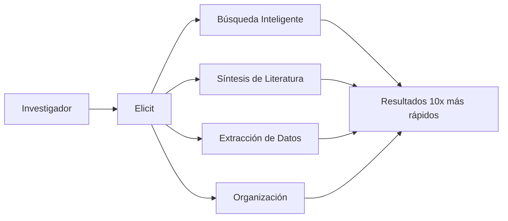
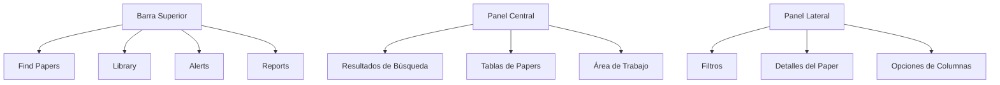
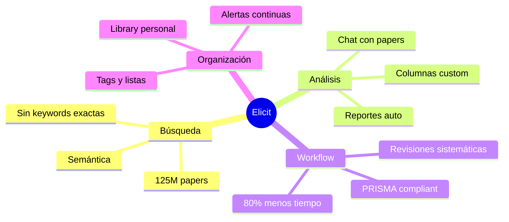

> [!warning] En construcción

# Elicit 

## 1. Acceso y Plataformas

**Elicit** es una aplicación web accesible exclusivamente a través de navegadores modernos en **[elicit.com](https://elicit.com/)**.

> [!INFO] Requisitos de Acceso
> 
> - **Navegadores compatibles:** Chrome, Firefox, Safari, Edge
> - **Sistemas operativos:** Windows, MacOS
> - **Tipo de acceso:** Solo web (no hay apps nativas)
> - **Registro:** Necesario (admite login con Google o Github)

> [!WARNING] Limitación Importante Elicit **no cuenta con aplicaciones** nativas para escritorio ni móviles. Todo el trabajo se realiza en línea a través del navegador.

---

## 2. Definición y Casos de Uso

### ¿Qué es Elicit?

**Elicit** es un **asistente de investigación científica impulsado por inteligencia artificial** que automatiza partes fundamentales del flujo de trabajo académico mediante modelos de lenguaje avanzados.



### Problemas que Resuelve

|Problema|Solución Elicit|
|---|---|
|**Búsqueda ineficiente**|Búsqueda semántica en +125M de papers sin palabras clave exactas|
|**Revisión lenta de literatura**|Síntesis automática de hallazgos con citas verificables|
|**Revisiones sistemáticas laboriosas**|Automatización que reduce hasta **80%** del tiempo requerido|
|**Extracción manual de datos**|Columnas personalizadas para extraer datos específicos masivamente|
|**Análisis de papers complejos**|Chat interactivo con documentos para hacer preguntas directas|
|**Desactualización**|Alertas automáticas de nuevos papers relevantes|

> [!SUCCESS] Objetivo Principal Hacer al investigador **"10 veces más fundamentado en evidencia"** mediante automatización inteligente del proceso de investigación.

---

## 3. Características Clave

### Funcionalidades Distintivas

> [!FEATURE] Búsqueda Semántica Inteligente
> 
> - Base de datos: **125-138 millones de artículos** académicos
> - Fuentes: Semantic Scholar, PubMed, OpenAlex
> - Capacidad: Encuentra resultados relevantes **sin términos exactos**
> - Alcance: Todas las disciplinas científicas

> [!FEATURE] Resumen Automático con Citas
> 
> - Genera síntesis consolidada de ~8 artículos más relevantes
> - **Cada afirmación incluye su referencia** exacta a la fuente
> - Reduce riesgo de "alucinaciones" de la IA
> - Verificación transparente de información

> [!FEATURE] Reportes de Investigación Automatizados
> 
> - Estructura completa: introducción, hallazgos, discusión, referencias
> - Inspirados en revisiones sistemáticas
> - Exportables en **PDF o Word**
> - Generación en minutos vs. semanas de trabajo manual

> [!FEATURE] Extracción de Datos Personalizada
> 
> - Columnas customizables para extraer información específica
> - Ejemplos: tamaño de muestra, metodología, resultados, conclusiones
> - Procesamiento masivo de múltiples estudios
> - Ideal para meta-análisis

> [!FEATURE] Chat con Papers
> 
> - Diálogo interactivo con uno o varios documentos
> - Preguntas sobre métodos, resultados, comparaciones
> - Respuestas citadas del contenido original
> - Como "preguntar al autor directamente"

> [!FEATURE] Revisiones Sistemáticas Aceleradas
> 
> - Flujo completo: búsqueda → cribado → extracción
> - Herramientas dedicadas para cada etapa
> - Reducción de tiempo: hasta **80%**
> - Capacidad para procesar cientos de estudios

> [!FEATURE] Biblioteca Personal y Alertas
> 
> - Organización con etiquetas personalizadas
> - Alertas por email sobre nuevos papers
> - Monitoreo continuo de temas de interés
> - Integración con gestores de referencias (Zotero, etc.)

---

## 4. Planes y Precios

### Comparativa de Planes

|Característica|**Basic (Gratis)**|**Plus ($10/mes)**|**Pro ($42/mes)**|**Team & Enterprise**|
|---|---|---|---|---|
|**Créditos mensuales**|5,000|12,000|50,000|Personalizado|
|**Búsquedas Find Papers**|✓ Limitadas|✓ Extendidas|✓ Ilimitadas|✓ Ilimitadas|
|**Research Reports**|✗|✓|✓|✓|
|**Extract (columnas custom)**|✗|✓|✓|✓|
|**Chat con Papers**|✗|✓|✓|✓|
|**Revisiones Sistemáticas**|✗|✗|✓|✓|
|**Alertas de Literatura**|✗|✗|✓ (hasta 10)|✓ Ilimitadas|
|**Papers subidos**|Hasta 10|Sin límite|Sin límite|Sin límite|
|**Exportar a Zotero/BibTeX**|✗|✓|✓|✓|
|**Soporte prioritario**|✗|✗|✓|✓|

> [!TIP] Sistema de Créditos
> 
> - Cada acción consume créditos (búsqueda, columna, chat, etc.)
> - Los créditos se renuevan mensualmente
> - Uso típico: **Plus** para estudiantes/investigadores ocasionales, **Pro** para trabajo intensivo

> [!NOTE] Planes Institucionales Los planes **Team y Enterprise** incluyen facturación centralizada, gestión de usuarios, SSO, y soporte dedicado. Ideal para universidades y centros de investigación.

---

## 5. Anatomía de la Interfaz (GUI)

### Navegación Principal



### Elementos de la Interfaz

> [!INFO] Barra de Navegación Superior
> 
> - **Find Papers:** Búsqueda principal de literatura
> - **Library:** Biblioteca personal de papers guardados
> - **Alerts:** Gestión de alertas configuradas
> - **Reports:** Reportes de investigación generados
> - **Perfil:** Configuración, créditos, suscripción

> [!INFO] Área de Trabajo Principal
> 
> - **Caja de búsqueda:** Input para preguntas en lenguaje natural
> - **Tabla de resultados:** Papers con columnas de información
> - **Vista de síntesis:** Resumen consolidado arriba de resultados
> - **Botones de acción:** Guardar, exportar, agregar columnas

> [!INFO] Panel Lateral Derecho
> 
> - **Filtros:** Por año, tipo de estudio, acceso abierto, etc.
> - **Detalles:** Vista completa del paper seleccionado
> - **Opciones:** Configuración de columnas y visualización

### Tipos de Vista

1. **Vista de Búsqueda (Find Papers):** Tabla con papers y columnas extraídas
2. **Vista de Chat:** Interfaz conversacional con documentos
3. **Vista de Reporte:** Documento estructurado con secciones
4. **Vista de Revisión Sistemática:** Flujo de trabajo por etapas

---

## 6. Tutorial de Funcionalidades

### A. Búsqueda de Papers (Find Papers)

La funcionalidad principal de Elicit es encontrar literatura académica relevante mediante búsqueda semántica.

#### 1. **Iniciar una búsqueda básica**

Navega a la pestaña **"Find Papers"** en la barra superior. Verás una caja de búsqueda prominente con el texto "Ask a research question or search by keyword".

> [!TIP] Tipos de Consulta Puedes buscar de **tres formas**:
> 
> - **Pregunta de investigación:** "¿El ejercicio reduce la ansiedad en adolescentes?"
> - **Palabras clave:** "machine learning cancer diagnosis"
> - **Híbrido:** Combina ambos enfoques

#### 2. **Escribir la consulta**

Escribe tu pregunta o palabras clave en lenguaje natural. **No necesitas usar operadores booleanos** ni términos MeSH exactos, aunque puedes hacerlo si lo deseas.

**Ejemplo efectivo:**

```
"What are the effects of mindfulness meditation on chronic pain?"
```

> [!NOTE] Búsqueda Semántica Elicit comprende la **intención** de tu pregunta, no solo las palabras exactas. Encontrará papers relevantes aunque usen terminología diferente.

#### 3. **Ejecutar la búsqueda**

Presiona **Enter** o haz clic en el botón de búsqueda. Elicit procesará tu consulta y en segundos mostrará:

- **Síntesis consolidada** en la parte superior (resumen de hallazgos clave)
- **Tabla de papers** con los resultados más relevantes
- **Columnas predeterminadas:** Título, Autores, Año, Resumen, Citas

#### 4. **Interpretar los resultados**

Cada fila representa un paper. Las columnas muestran información extraída:

- **Relevance Score:** Qué tan relacionado está con tu pregunta (no siempre visible)
- **Abstract:** Resumen del artículo
- **Year:** Año de publicación
- **Cites:** Número de citaciones que tiene el paper

> [!SUCCESS] Síntesis con Citas La síntesis superior incluye **referencias numéricas** (ej: [1], [2]) que corresponden a los papers listados abajo. Haz clic en ellas para ir directo al paper fuente.

#### 5. **Refinar con filtros**

En el **panel lateral derecho**, aplica filtros para delimitar resultados:

- **Year:** Rango de años (ej: 2018-2024)
- **Study Type:** RCT, Systematic Review, Meta-analysis, etc.
- **Open Access:** Solo papers de acceso abierto
- **Journal/Conference:** Publicaciones específicas
- **Keywords adicionales:** Términos que deben aparecer

#### 6. **Guardar papers relevantes**

Para cada paper interesante:

- Haz clic en el **ícono de estrella** o checkbox a la izquierda del título
- El paper se guardará automáticamente en tu **Library**
- También puedes agregarlo a una lista personalizada

---

### B. Extracción de Datos con Columnas Personalizadas

Las columnas permiten extraer información específica de múltiples papers simultáneamente.

#### 1. **Agregar una columna básica**

Con resultados de búsqueda en pantalla, haz clic en **"+ Add column"** (parte superior derecha de la tabla).

#### 2. **Elegir tipo de columna**

Aparecerá un menú con opciones:

- **Predefined columns:** Columnas precargadas comunes
    
    - Sample size
    - Methodology
    - Study design
    - Population
    - Intervention
    - Outcomes
    - Findings
    - Limitations
- **Custom column:** Define tu propia pregunta de extracción
    

#### 3. **Usar una columna predefinida**

Selecciona una, por ejemplo **"Sample size"**. Elicit procesará cada paper y extraerá el tamaño de muestra, llenando la columna automáticamente.

> [!INFO] Procesamiento Esto consume **créditos** (típicamente 1-5 por paper según complejidad). Los usuarios Basic tienen límites estrictos.

#### 4. **Crear una columna personalizada**

Si ninguna columna predefinida se ajusta:

- Selecciona **"Custom column"**
- Escribe una **pregunta clara** que quieres responder para cada paper

**Ejemplos de preguntas custom:**

```
"What was the primary outcome measure?"
"Did the study control for confounding variables?"
"What statistical test was used?"
"Was there a placebo group?"
```

#### 5. **Ejecutar la extracción**

Haz clic en **"Extract"** o "Apply". Elicit:

- Lee el contenido de cada paper
- Busca la respuesta a tu pregunta
- Llena la columna con las respuestas extraídas
- **Cita de dónde obtuvo la información** (cuando es posible)

#### 6. **Revisar y validar**

> [!WARNING] Verificación Crítica Aunque Elicit es preciso, **siempre verifica** las extracciones importantes consultando el paper original. Haz clic en cualquier celda para ver la fuente.

#### 7. **Exportar los datos**

Una vez tengas todas las columnas necesarias:

- Clic en **"Export"** (esquina superior derecha)
- Elige formato: **CSV, BibTeX, RIS, Excel**
- El archivo contendrá todos los papers y columnas para análisis posterior (ej: en Excel, R, Python)

> [!TIP] Estrategia de Extracción
> 
> - Empieza con pocas columnas en papers de prueba
> - Valida la calidad antes de procesar cientos de papers
> - Usa lenguaje específico en preguntas custom
> - Para datos numéricos, especifica unidades esperadas

---

### C. Chat con Papers

Esta funcionalidad permite hacer preguntas conversacionales directamente a uno o varios documentos.

#### 1. **Acceder al Chat**

Desde los resultados de Find Papers, selecciona **uno o varios papers** (checkbox). Luego:

- Haz clic en **"Chat"** (botón que aparece al seleccionar)
- O abre un paper y dentro verás el botón **"Chat with paper"**

Se abrirá una interfaz de chat con el/los documento(s) cargados.

#### 2. **Subir papers propios (opcional)**

Si quieres chatear con PDFs que no están en Elicit:

- Ve a tu **Library**
- Clic en **"Upload papers"**
- Sube el archivo PDF (debe ser texto, no imagen escaneada)
- Una vez procesado, ábrelo y haz clic en **"Chat"**

> [!INFO] Límites de Subida
> 
> - **Basic:** Hasta 10 papers
> - **Plus/Pro/Enterprise:** Sin límite de uploads

#### 3. **Hacer preguntas al paper**

En la caja de chat, escribe preguntas sobre el contenido:

**Ejemplos de preguntas efectivas:**

```
"What was the main hypothesis of this study?"
"Summarize the methodology in 3 bullet points"
"What were the limitations mentioned by the authors?"
"Compare the results of studies [Paper A] and [Paper B]"
"What statistical significance did they find for X?"
```

#### 4. **Recibir respuestas citadas**

Elicit responderá basándose en el contenido del paper y:

- **Citará pasajes específicos** del documento
- Incluirá **referencias numéricas** a secciones relevantes
- Te permitirá **hacer clic** en las citas para ir al texto completo

> [!SUCCESS] Ventaja del Chat Es como tener una conversación con el autor. Puedes profundizar, pedir clarificaciones, o comparar múltiples estudios sin leer todo manualmente.

#### 5. **Chat con múltiples papers**

Si seleccionaste varios documentos, Elicit puede:

- **Comparar** hallazgos entre estudios
- **Sintetizar** información común
- **Contrastar** metodologías o resultados
- **Identificar** consensos o discrepancias

**Ejemplo de pregunta multi-paper:**

```
"Which of these studies had the largest effect size and why?"
"Do all these papers agree on the mechanism of action?"
```

#### 6. **Seguir la conversación**

El chat es **contextual**. Puedes:

- Hacer preguntas de seguimiento
- Pedir elaboración en puntos específicos
- Cambiar de tema dentro del mismo documento

**Ejemplo de conversación:**

```
Usuario: "What was the sample size?"
Elicit: "The study included 150 participants..."
Usuario: "Were they randomized?"
Elicit: "Yes, participants were randomized into..."
```

#### 7. **Exportar o compartir el chat**

Al finalizar:

- **Copia** las respuestas relevantes para tus notas
- **Guarda** el paper en tu biblioteca para referencia futura
- El historial del chat permanece accesible mientras el paper esté en tu Library

> [!TIP] Mejores Prácticas para Chat
> 
> - Haz preguntas **específicas** y **directas**
> - Si la respuesta es vaga, **reformula** con más detalle
> - Usa el chat para **comprender** metodologías complejas
> - **Siempre verifica** citando el paper original para info crítica

---

### D. Generación de Reportes de Investigación

Los Research Reports son documentos automatizados que sintetizan literatura sobre una pregunta.

#### 1. **Iniciar un nuevo reporte**

Ve a la pestaña **"Reports"** en la barra superior. Haz clic en **"Create new report"**.

#### 2. **Definir la pregunta de investigación**

Escribe una **pregunta clara y enfocada** que guiará el reporte.

**Ejemplos:**

```
"What is the effectiveness of cognitive behavioral therapy for treating insomnia?"
"How does climate change affect crop yields in developing countries?"
```

> [!TIP] Preguntas Efectivas
> 
> - Usa preguntas **específicas** pero no demasiado estrechas
> - Incluye contexto si es necesario (población, intervención, outcome)
> - Evita preguntas sí/no; prefiere "cómo", "qué", "cuáles"

#### 3. **Configurar parámetros (opcional)**

Antes de generar:

- **Número de papers:** ¿Cuántos estudios quieres que analice? (ej: 10-20)
- **Filtros:** Año, tipo de estudio, acceso abierto
- **Profundidad:** Algunos planes permiten reportes breves vs. extensos

#### 4. **Generar el reporte**

Haz clic en **"Generate report"**. Elicit:

1. Ejecuta la búsqueda semántica
2. Selecciona los papers más relevantes
3. Lee y analiza cada uno
4. **Estructura el reporte** en secciones
5. **Incluye citas** verificables

> [!INFO] Tiempo de Generación Usualmente toma **5-15 minutos** dependiendo de la complejidad y número de papers. Recibirás una notificación cuando esté listo.

#### 5. **Revisar el reporte generado**

El reporte incluirá típicamente:

**Estructura estándar:**

1. **Introducción**
    - Contexto del tema
    - Importancia de la pregunta
2. **Hallazgos Clave**
    - Síntesis de resultados principales
    - Evidencia agrupada por temas
3. **Metodologías Comunes**
    - Diseños de estudio utilizados
    - Poblaciones estudiadas
4. **Discusión**
    - Interpretación de hallazgos
    - Limitaciones de la evidencia
    - Áreas de consenso/desacuerdo
5. **Referencias**
    - Lista completa de papers citados
    - Enlaces a cada fuente

> [!SUCCESS] Transparencia Total Cada afirmación en el reporte **cita su fuente** con referencia numérica. Puedes hacer clic para ver el paper original.

#### 6. **Editar y personalizar**

Los reportes son **editables** (en planes Plus/Pro):

- Modifica secciones que necesiten ajustes
- Agrega tu propia interpretación o contexto
- Reorganiza contenido según tu estructura preferida
- Incluye gráficos o tablas externas

#### 7. **Exportar el reporte**

Opciones de exportación:

- **PDF:** Para impresión o compartir
- **Word (.docx):** Para edición avanzada
- **Markdown:** Para integración con otras herramientas

Haz clic en **"Export"** y selecciona el formato deseado.

#### 8. **Uso estratégico de reportes**

> [!TIP] Casos de Uso Ideales
> 
> - **Onboarding** rápido en un tema nuevo
> - **Revisiones de literatura** preliminares
> - **Propuestas de investigación** para contexto teórico
> - **Presentaciones** ejecutivas con evidencia respaldada
> - **Enseñanza** para estudiantes (lectura previa estructurada)

> [!WARNING] No Reemplaza Revisión Manual Los reportes son un **punto de partida excelente**, pero no sustituyen la lectura crítica de papers clave ni el análisis experto. Úsalos para ganar velocidad, no como producto final.

---

### E. Revisiones Sistemáticas con Elicit Pro

Esta funcionalidad avanzada automatiza el flujo completo de una revisión sistemática.

#### 1. **Acceder al workflow de Revisiones Sistemáticas**

En Elicit Pro, ve a la pestaña **"Systematic Reviews"** o crea una desde Find Papers seleccionando **"Start systematic review workflow"**.

#### 2. **Definir la pregunta PICO**

Una revisión sistemática sigue el framework **PICO**:

- **P (Population):** ¿Qué población? (ej: adultos con diabetes tipo 2)
- **I (Intervention):** ¿Qué intervención? (ej: dieta mediterránea)
- **C (Comparison):** ¿Comparado con qué? (ej: dieta estándar)
- **O (Outcome):** ¿Qué resultado mides? (ej: control glucémico)

Ingresa estos elementos en los campos correspondientes.

> [!TIP] Pregunta PICO Clara Una pregunta bien estructurada facilita la búsqueda precisa y el cribado posterior.

#### 3. **Ejecutar la búsqueda exhaustiva**

Elicit realizará una búsqueda amplia usando:

- Términos PICO
- Sinónimos automáticos
- Múltiples bases de datos (Semantic Scholar, PubMed, etc.)

Obtendrás una **lista inicial grande** de estudios potencialmente relevantes (puede ser cientos o miles).

#### 4. **Cribado de títulos y abstracts (Screening)**

Fase crítica donde determinas qué estudios incluir:

- **Definir criterios de inclusión/exclusión:** Elicit ofrece plantillas o puedes personalizarlos
    
    - Ej. Inclusión: "Estudios en humanos, publicados en inglés, 2015-2024"
    - Ej. Exclusión: "Estudios en animales, sin grupo control"
- **Screening automatizado:** Elicit **pre-evalúa** cada estudio con IA:
    
    - Sugiere **"Include"**, **"Exclude"** o **"Maybe"**
    - Proporciona **razonamiento** de cada decisión
- **Revisión manual:** Tú revisas las sugerencias:
    
    - Acepta, rechaza o modifica cada decisión
    - Puedes hacer **doble cribado** (dos revisores independientes) si tienes plan Team

> [!SUCCESS] Reducción de Tiempo Esta fase que normalmente toma **semanas** se reduce a **horas** con asistencia de IA.

#### 5. **Extracción de datos de estudios incluidos**

Para los estudios que pasaron el cribado:

- **Define variables de extracción:** Usa columnas custom (como vimos antes)
    
    - Ej: "Sample size", "Intervention duration", "Primary outcome", "Effect size"
- **Extracción automatizada:** Elicit llena una tabla con datos de cada estudio
    
- **Validación:** Revisa la precisión, especialmente datos numéricos críticos
    

> [!INFO] Tabla de Evidencia Obtendrás una tabla estructurada lista para meta-análisis (exportable a Excel/R/Stata).

#### 6. **Evaluar calidad/riesgo de sesgo**

Elicit puede asistir en evaluación de calidad:

- **Herramientas:** Cochrane Risk of Bias, Newcastle-Ottawa, GRADE
- **Columnas específicas:** "Was randomization adequate?", "Blinding?", "Attrition rate?"
- IA sugiere respuestas; tú las validas

#### 7. **Síntesis y análisis**

Con la data extraída:

- **Síntesis narrativa:** Usa los reportes de Elicit para describir hallazgos
- **Meta-análisis:** Exporta datos a software estadístico (RevMan, R, Stata)
- **Gráficos de Forest plots:** Créalos externamente con los datos extraídos

#### 8. **Documentación del proceso**

Elicit registra automáticamente:

- Términos de búsqueda usados
- Número de estudios en cada etapa
- Criterios de inclusión/exclusión aplicados
- Esto genera el **PRISMA flow diagram** fácilmente

> [!TIP] PRISMA Compliance Elicit facilita seguir las guías PRISMA para reportar revisiones sistemáticas transparentemente.

#### 9. **Colaboración en Team/Enterprise**

Si usas plan Team:

- **Múltiples revisores** pueden trabajar simultáneamente
- **Consenso de screening:** Resuelve discrepancias entre revisores
- **Control de versiones:** Rastrea cambios en criterios y datos

#### 10. **Exportar resultados finales**

- **Tabla de estudios incluidos:** Excel/CSV con todas las columnas
- **Referencias:** BibTeX/RIS para gestor de referencias
- **Reporte PRISMA:** Documento con metodología completa
- **Anexos:** Listas de estudios excluidos con razones

> [!SUCCESS] Ahorro de Tiempo Una revisión sistemática que tomaba **6-12 meses** puede completarse en **6-8 semanas** con Elicit Pro, manteniendo rigor metodológico.

---

### F. Organización en la Biblioteca (Library)

Tu biblioteca personal centraliza todos los papers que guardas.

#### 1. **Acceder a Library**

Haz clic en **"Library"** en la barra superior. Verás todos tus papers guardados.

#### 2. **Guardar papers desde búsquedas**

Mientras buscas en Find Papers:

- Haz clic en la **estrella** ⭐ junto a cualquier paper
- Se guardará automáticamente en tu Library
- También puedes seleccionar varios y hacer **"Save selected"**

#### 3. **Subir papers propios**

Para agregar PDFs de tu computadora:

- En Library, clic en **"Upload"**
- Selecciona uno o varios archivos PDF
- Elicit los procesará (extrae metadatos automáticamente)
- Estarán disponibles para chat, columnas, etc.

> [!INFO] Procesamiento de PDFs
> 
> - Solo acepta PDFs con texto (no escaneados sin OCR)
> - Extrae autor, título, año, abstract cuando está disponible
> - Papers sin metadata pueden tener info incompleta

#### 4. **Organizar con Listas/Tags**

Crea estructura personalizada:

- **Listas temáticas:** "Mi tesis", "Papers de referencia", "Por leer"
- **Tags:** Etiquetas como #metodología, #revisión-2024, #importante
- Asigna papers a múltiples listas o tags

**Cómo crear una lista:**

- Clic en **"New list"**
- Nombra la lista (ej: "Depression interventions")
- Arrastra papers a esa lista o selecciónalos y elige **"Add to list"**

#### 5. **Buscar dentro de Library**

Caja de búsqueda en Library para:

- Buscar por **título, autor o palabras clave**
- Filtrar por **lista, tag, año**
- Ver solo **papers con notas** o **sin leer**

#### 6. **Agregar notas personales**

Para cada paper:

- Abre el paper (clic en título)
- Ve a la sección **"Notes"**
- Escribe tus **reflexiones, citas importantes, críticas**
- Las notas son **privadas** y **buscables**

> [!TIP] Sistema de Notas Efectivo
> 
> - Anota **por qué** guardaste el paper
> - Resalta **hallazgos clave** con tus palabras
> - Marca **dudas** para consultar después
> - Facilita redactar luego sin releer todo

#### 7. **Exportar desde Library**

Selecciona papers y exporta:

- **Referencias bibliográficas:** BibTeX, RIS (para Zotero, Mendeley, EndNote)
- **Metadata completa:** CSV con todos los campos
- **PDFs:** Descarga los archivos originales (si los subiste)

**Integración con Zotero:**

- Usa la extensión de navegador de Elicit (cuando esté disponible)
- O exporta a BibTeX e importa en Zotero manualmente

#### 8. **Sincronización y backup**

> [!INFO] Almacenamiento Cloud
> 
> - Tu biblioteca está en **la nube** de Elicit
> - Accesible desde cualquier dispositivo con tu cuenta
> - Elicit **no borra** papers que guardes (incluso en plan Basic)

> [!WARNING] Backup Recomendado Exporta regularmente tus referencias y notas como backup externo, especialmente para proyectos críticos.

---

### G. Configuración de Alertas de Investigación (Literature Alerts)

Las alertas monitorizan continuamente la literatura y te notifican sobre nuevos papers.

> [!NOTE] Disponibilidad Alertas están disponibles en planes **Pro, Team y Enterprise**.

#### 1. **Crear una nueva alerta**

Desde la pantalla principal o menú **"Alerts"**:

- Clic en **"Create an alert"**
- Se abre interfaz similar a Find Papers

#### 2. **Definir la consulta de la alerta**

Escribe la pregunta o keywords que deseas monitorizar:

**Ejemplos de consultas para alertas:**

```
"machine learning medical imaging"
"new treatments for Alzheimer's disease"
"climate change adaptation strategies"
```

> [!TIP] Consultas Focalizadas
> 
> - No uses consultas demasiado amplias (recibirás ruido)
> - Tampoco muy específicas (no encontrarás nada nuevo)
> - Busca balance entre precisión y recall

#### 3. **Aplicar filtros permanentes (opcional)**

Establece filtros que siempre se aplicarán:

- **Year:** Por ejemplo, "últimos 2 años"
- **Journal:** Solo ciertas publicaciones
- **Author:** Papers de autores específicos que sigues
- **Study type:** Solo RCTs, por ejemplo

#### 4. **Activar la alerta**

Haz clic en **"Create alert"** o "Apply". La alerta quedará guardada y activa.

#### 5. **¿Qué ocurre después?**

Elicit ejecuta periódicamente tu búsqueda:

- **Frecuencia:** Generalmente **semanal** (puede variar)
- **Detección:** Cuando hay **nuevos papers** que no estaban antes
- **Notificación:** Recibes **email** con resumen de hallazgos

**Contenido del email de alerta:**

- Número de nuevos papers encontrados
- Títulos y abstracts breves
- Link directo a Elicit para ver detalles completos

#### 6. **Gestionar alertas existentes**

En la sección **"Alerts"** verás todas tus alertas activas. Puedes:

- **Ver historial:** Papers detectados en alertas pasadas
- **Pausar alerta:** Desactiva temporalmente sin eliminar
- **Editar consulta:** Modifica keywords o filtros
- **Eliminar alerta:** Borra si ya no la necesitas

> [!INFO] Límites de Alertas
> 
> - **Pro:** Hasta **10 alertas simultáneas**
> - **Enterprise:** Alertas ilimitadas

#### 7. **Procesar nuevos papers de alertas**

Cuando recibes notificación:

- Haz clic en el **link del email** (te lleva a Elicit)
- Revisa rápidamente los títulos
- **Guarda a Library** los que parezcan relevantes
- Puedes aplicarles columnas, chat, o agregarlos a revisiones

#### 8. **Uso estratégico de alertas**

> [!SUCCESS] Casos de Uso Ideales
> 
> - **Tesis/disertación:** Alerta sobre tu tema principal durante años
> - **Vigilancia tecnológica:** Monitorea avances en tu campo
> - **Revisión sistemática continua:** Actualiza tu revisión con nueva evidencia
> - **Seguimiento de autores:** Papers de investigadores que admiras
> - **Tendencias emergentes:** Detecta temas "hot" tempranamente

**Ejemplo de estrategia multi-alerta:**

```
Alerta 1: "artificial intelligence drug discovery" (tendencias generales)
Alerta 2: "deep learning protein folding" (tema específico)
Alerta 3: Autor: "Demis Hassabis" (seguimiento de investigador clave)
```

#### 9. **Integración con workflow**

Las alertas se integran con otras funcionalidades:

- Papers detectados por alertas → Guardar en Library
- Library → Agregar a Revisión Sistemática en curso
- Revisión → Actualizar periódicamente con alertas
- **Flujo continuo** de investigación actualizada

> [!TIP] Mejor Práctica Configura alertas al **inicio** de proyectos largos (tesis, grants, vigilancia). Así no perderás papers importantes que salgan durante tu trabajo.

---

## 7. Consejos Finales y Mejores Prácticas

### Optimización del Uso

> [!TIP] Estrategias de Búsqueda
> 
> - **Empieza amplio, refina después:** Primera búsqueda general, luego filtra
> - **Usa lenguaje natural:** No necesitas jerga técnica forzada
> - **Combina enfoques:** Pregunta + keywords para mejor precisión
> - **Experimenta:** Reformula si los resultados no son óptimos

> [!TIP] Gestión de Créditos
> 
> - **Plan Basic:** Prioriza búsquedas sobre extracciones masivas
> - **Plan Plus:** Usa columnas custom estratégicamente
> - **Plan Pro:** Aprovecha revisiones sistemáticas completas
> - Monitorea tu **uso de créditos** en el dashboard

> [!TIP] Organización Efectiva
> 
> - Usa **listas temáticas** en Library (por proyecto/tema)
> - Etiqueta papers con **tags descriptivos**
> - Escribe **notas inmediatas** al guardar un paper
> - Exporta **backups regulares** de tu biblioteca

### Limitaciones a Considerar

> [!WARNING] Acceso a Texto Completo
> 
> - No todos los papers tienen texto completo disponible
> - Papers muy recientes pueden tener metadata limitada
> - Algunos journals detrás de paywall limitan extracción
> - **Efecto:** Resúmenes/columnas pueden ser incompletos

> [!WARNING] Idioma
> 
> - Elicit funciona **mejor en inglés**
> - Otros idiomas tienen rendimiento limitado
> - Traducciones automáticas no siempre disponibles
> - **Recomendación:** Busca en inglés cuando sea posible

> [!WARNING] Verificación Necesaria
> 
> - IA puede cometer **errores ocasionales**
> - Datos críticos **siempre deben verificarse** en fuente original
> - No confíes ciegamente en extracciones numéricas
> - **Regla:** Elicit acelera, tú validas

### Ética y Citación

> [!IMPORTANT] Uso Responsable
> 
> - **Cita a Elicit** como herramienta en tu metodología
> - **Cita los papers originales** que uses en tu trabajo
> - No presentes outputs de IA como si fueran análisis manual
> - Mantén **transparencia** sobre uso de herramientas automatizadas

**Ejemplo de citación de Elicit:**

```
"La búsqueda de literatura se realizó utilizando Elicit (https://elicit.com),
un asistente de investigación con IA, para identificar estudios relevantes
sobre [tema]. Se revisaron manualmente los resultados para verificar relevancia."
```

### Mantenerse Actualizado

> [!INFO] Actualizaciones Frecuentes
> 
> - Elicit lanza **mejoras semanales**
> - Revisa el **Changelog** regularmente
> - Sigue su **canal de YouTube** para tutoriales
> - Únete a la **comunidad de usuarios** para tips

**Recursos oficiales:**

- Documentación: [support.elicit.com](https://support.elicit.com/)
- Tutoriales video: Canal de YouTube de Elicit
- Blog: [elicit.com/blog](https://elicit.com/blog)
- Changelog: Novedades semanales en su sitio

---

## Conclusión

**Elicit** es una herramienta transformadora para la investigación académica que combina:

✅ **Búsqueda inteligente** en millones de papers  
✅ **Automatización** de tareas repetitivas  
✅ **Transparencia** con citas verificables  
✅ **Colaboración** en equipos de investigación  
✅ **Actualización continua** con alertas



> [!SUCCESS] Impacto en tu Investigación Con Elicit, pasas de **buscar papers** a **comprender ciencia** más rápido. La herramienta te hace **10x más eficiente** sin sacrificar rigor académico.

> [!QUOTE] Principio Fundamental _"Elicit acelera el trabajo mecánico para que dediques más tiempo al pensamiento crítico y la innovación científica."_

---

### Próximos Pasos

1. **Regístrate** en [elicit.com](https://elicit.com/) (empieza con plan Basic gratuito)
2. **Prueba una búsqueda** sobre tu tema de interés actual
3. **Experimenta** con columnas custom y chat
4. **Evalúa** si un plan de pago se justifica para tu volumen de trabajo
5. **Integra** Elicit en tu flujo habitual de investigación

> [!TIP] Curva de Aprendizaje Dedica **2-3 horas** explorando las funcionalidades principales. La inversión inicial se recupera rápidamente en productividad ganada.

**¡Éxito en tu investigación con Elicit! 🚀📚**